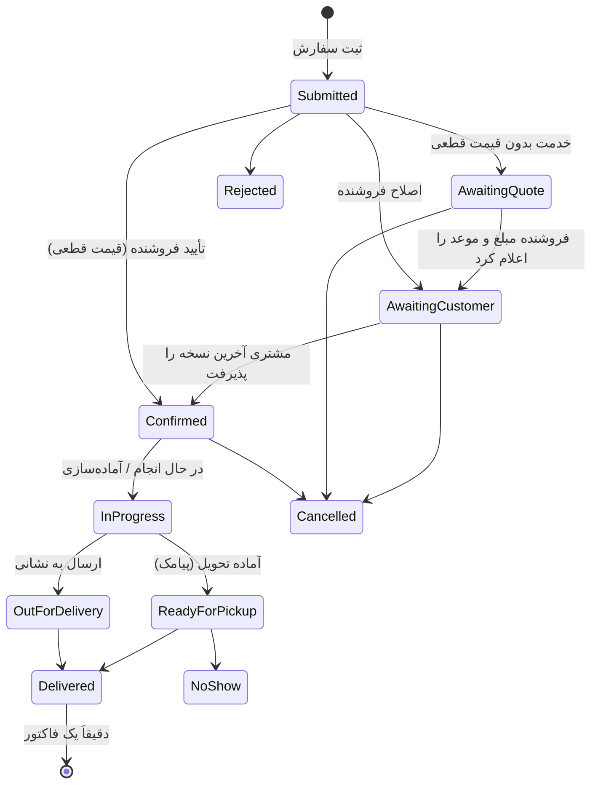

# خدمت، عضویت فروشگاه، سفارش و سفارش خدماتی (پرینت)

> بازنگری اسناد 2.5.0 — ۱۴۰۵/۰۷/۰۵ (2026-09-27). منبع: تصمیم مالک محصول در همین تاریخ.
> این سند قواعد تازه را با شناسه‌های پایدار ثبت می‌کند. اثر آن روی بک‌اند در [`../backend/change-requests.md`](../backend/change-requests.md) و روی فرانت در [`../architecture/frontend-architecture.md`](../architecture/frontend-architecture.md) آمده است.

## خلاصه تصمیم‌ها

| موضوع | تصمیم |
|---|---|
| بارکد | شرط حضور در فاکتور نیست. فقط یکی از راه‌های پیداکردن قلم است |
| خدمت | مثل کالا یک ردیف فاکتور دارد: عنوان، تعداد، واحد، قیمت واحد، مبلغ نهایی. با نام یا میان‌بر انتخاب می‌شود |
| مبلغ | Decimal، یک واحد پول در کل سامانه، بدون تبدیل ریال و تومان (جزئیات در BIZ-MNY-01) |
| ورود مشتری | سه مسیر (QR فروشگاه، لینک پیامکی خرید، فروشگاه‌های اطراف در آینده) که همه به صفحه همان فروشگاه می‌رسند |
| عضویت | «عضویت در فروشگاه» با «مشتری ثبت‌شده توسط فروشنده» یکی نیست. عضویت رضایت پیامک تبلیغاتی نیست |
| روش دریافت | دو روش: **تحویل از فروشگاه** و **ارسال به نشانی** |
| پیش‌سفارش | نوع سفارش با موعد آینده است، نه روش دریافت |
| کارت‌به‌کارت | فیش به همان سفارش پیوست می‌شود؛ وضعیت «در انتظار بررسی پرداخت»؛ بارگذاری فیش سفارش را پرداخت‌شده نمی‌کند |
| سفارش خدماتی | پرینت خدمتی است با مشخصات سفارش و فایل پیوست؛ قیمت‌گذاری دوحالته (محاسبه خودکار یا «در انتظار قیمت‌گذاری») |
| وضعیت پرداخت | مستقل از وضعیت اجرای سفارش نگهداری می‌شود |
| هزینه مواد | واحد صورتحساب با واحد مصرف مواد یکی نیست؛ صفحه چاپ، نسخه و برگ مصرفی جدا محاسبه می‌شوند |
| نسخه محصول | همه این‌ها در نسخه **سفارش مشتری (۳.۰)** با سبد مشترک کالا و خدمت طراحی می‌شوند؛ «فروشگاه‌های اطراف» بعداً. قاعده خدمت در فاکتور فروش حضوری (BIZ-SRV-01 تا 04) از ۱.۰ معتبر است |

---

## ۱. پول (BIZ-MNY)

**BIZ-MNY-01.** همه مبلغ‌ها در دامنه، API و UI از نوع **Decimal** هستند و سامانه فقط **یک واحد پول** دارد. هیچ تبدیل «ریال به تومان» یا تقسیم بر ۱۰ در هیچ لایه‌ای انجام نمی‌شود. برچسب نمایش واحد یک تنظیم سراسری است (پیش‌فرض: «تومان»، مطابق فیگما) و فقط در لایه نمایش کنار عدد می‌آید.

- محاسبه با float ممنوع است. در فرانت مقدار canonical یک رشته Decimal است و محاسبه پیش‌نمایش با کتابخانه Decimal انجام می‌شود؛ جمع قطعی همیشه از سرور می‌آید.
- دقت ذخیره: `numeric(18,2)` پیشنهادی. گردکردن فقط با قاعده صریح (گام و جهت) در قیمت‌گذاری، نه ضمنی.

پذیرش: مبلغ `410000` در API همان «۴۱۰٬۰۰۰ تومان» در UI است؛ هیچ صفحه‌ای عدد را ضرب یا تقسیم نمی‌کند.

## ۲. خدمت در فاکتور (BIZ-SRV)

**BIZ-SRV-01 — نوع قلم.** هر قلم فروشگاه یکی از دو نوع است: **کالا** (`Goods`) یا **خدمت** (`Service`). خدمت موجودی، رسید خرید، بهای موجودی، شمارش و هشدار کمبود ندارد.

**BIZ-SRV-02 — ردیف فاکتور خدمت.** خدمت مثل کالا یک ردیف فاکتور دارد با عنوان، تعداد، واحد، قیمت واحد، تخفیف ردیف و مبلغ نهایی. مثال: «پرینت سیاه‌وسفید A4 — ۲۰ صفحه × ۳٬۰۰۰ = ۶۰٬۰۰۰». واحد خدمت از فهرست واحدها انتخاب می‌شود (صفحه، برگ، عدد، ساعت، …).

**BIZ-SRV-03 — بارکد شرط نیست.** بارکد فقط یکی از راه‌های پیداکردن قلم است. کالا یا خدمت بدون بارکد کاملاً قابل فروش است. خدمت با **نام** یا **میان‌بر** (کد کوتاه فروشگاه، مثل `P1`) یا دکمه دسترسی سریع انتخاب می‌شود. هیچ صفحه‌ای ثبت یا فروش را به داشتن بارکد مشروط نمی‌کند.

**BIZ-SRV-04 — اثر مالی.** فروش خدمت در فروش، دریافت، نسیه، تخفیف، گزارش فروش و سود حساب می‌شود. سود خدمت: اگر «بهای تمام‌شده خدمت» تعریف نشده باشد، بهای آن **نامعلوم** است (D17) و در پوشش سود جدا نشان داده می‌شود؛ صفر فرض نمی‌شود.

**BIZ-SRV-05 — ثبت خدمت.** ثبت خدمت از مسیر «افزودن کالا» با انتخاب «خدمت» انجام می‌شود: عنوان یکتا در فروشگاه، واحد، قیمت واحد (دستی یا تعرفه‌ای)، میان‌بر اختیاری، بهای تمام‌شده اختیاری. مراحل موجودی، بارکد، بسته‌بندی و تاریخ تولید و انقضا برای خدمت نمایش داده نمی‌شوند.

پذیرش:
- فاکتور «خودکار × ۲ + پرینت A4 × ۲۰» یک فاکتور با دو ردیف می‌سازد و فقط موجودی خودکار را کم می‌کند.
- جست‌وجوی «پرینت» یا میان‌بر `P1` در سبد فروش، خدمت را بدون اسکن اضافه می‌کند.
- گزارش کمبود و شمارش هیچ خدمتی را نشان نمی‌دهد.

## ۳. ورود مشتری و عضویت در فروشگاه (BIZ-MBR)

**BIZ-MBR-01 — سه مسیر ورود.** همه مسیرها به صفحه همان فروشگاه می‌رسند:

| مسیر | رفتار |
|---|---|
| اسکن QR فروشنده | بازشدن صفحه فروشگاه ← ورود با OTP ← عضویت ← امکان سفارش |
| لینک پیامکی بعد از خرید | ورود با OTP شماره مرتبط با خرید ← مشاهده فاکتور ← دسترسی به فروشگاه و سفارش بعدی |
| فروشگاه‌های اطراف (آینده) | انتخاب موقعیت ← مشاهده فروشگاه‌ها ← ورود به فروشگاه ← عضویت و سفارش |

**BIZ-MBR-02 — لینک عمومی در برابر لینک اختصاصی.** QR فروشنده لینک **عمومی** صفحه فروشگاه است (`/s/{PublicCode}`). لینک فاکتور **اختصاصی**، غیرقابل حدس، قابل ابطال و دارای کنترل دسترسی است (BIZ-BUY-05): نمایش اقلام فقط پس از OTP همان شماره خرید، یا نسخه خلاصه بدون اطلاعات حساس تا پیش از ورود.

**BIZ-MBR-03 — تفکیک دو مفهوم.**

| مفهوم | سازنده | معنا |
|---|---|---|
| مشتری فروشگاه (`crm.customers`) | فروشنده، بدون OTP | پرونده مالی مشتری در همان فروشگاه |
| عضو فروشگاه (عضویت) | خود مشتری، پس از OTP | ارتباط حساب کاربری با فروشگاه در «فروشگاه‌های من» و امکان سفارش |

**BIZ-MBR-04 — عضویت خودکار از خرید حضوری.** خرید حضوری، ارتباط مشتری با فروشگاه را می‌سازد. وقتی مشتری با OTP وارد شد و اتصال آن خرید به حسابش معتبر بود (شماره تأییدشده برابر شماره ثبت‌شده، بدون ادعای «مال من نیست»)، فروشگاه در «فروشگاه‌های من» نمایش داده می‌شود و بدون ثبت‌نام مجدد می‌تواند سفارش بدهد.

**BIZ-MBR-05 — عضویت ≠ رضایت تبلیغاتی.** عضویت به معنی رضایت خودکار برای پیامک تبلیغاتی نیست. رضایت تبلیغاتی یک انتخاب جدا، صریح و قابل لغو است (هم‌راستا با F51). پیامک‌های عملیاتی (OTP، فاکتور، وضعیت سفارش) به رضایت تبلیغاتی وابسته نیستند.

**BIZ-MBR-06 — نام‌گذاری.** در UI عنوان «**عضویت در فروشگاه**» به‌کار می‌رود، نه «اشتراک»؛ حق اشتراک مالی وجود ندارد.

**BIZ-MBR-07 — لغو عضویت.** مشتری می‌تواند عضویت را لغو کند؛ لغو عضویت فاکتور، بدهی و سوابق فروشگاه را حذف یا پنهان نمی‌کند و فقط فروشگاه را از «فروشگاه‌های من» (بخش سفارش) کنار می‌گذارد. مشاهده حساب و بدهی تابع BIZ-BUY و تنظیم پنل مشتری فروشگاه است.

پذیرش:
- مشتری ثبت‌شده توسط فروشنده که هرگز OTP نزده، عضو هیچ فروشگاهی نیست.
- پس از OTP، فروشگاهی که مشتری از آن خرید حضوری معتبر دارد بدون اقدام اضافه در «فروشگاه‌های من» دیده می‌شود.
- عضویت هیچ پیامک تبلیغاتی ارسال نمی‌کند.

## ۴. سفارش کالا و خدمت (BIZ-ORD، تکمیل F45 تا F50 و F80)

**مسیر:** انتخاب فروشگاه ← دسته‌بندی یا جست‌وجو ← افزودن به سبد ← انتخاب شیوه دریافت ← انتخاب پرداخت ← ثبت سفارش.

**BIZ-ORD-10 — شیوه دریافت.** فقط دو شیوه:

| شیوه | توضیح | نگاشت به بک‌اند فعلی |
|---|---|---|
| **تحویل از فروشگاه** | مشتری اینترنتی سفارش می‌دهد و حضوری تحویل می‌گیرد؛ زمان آماده‌شدن و کد یا شماره سفارش برای تحویل | `InStore`، `Pickup` |
| **ارسال به نشانی** | نشانی، هزینه ارسال و محدوده خدمت‌رسانی مشخص است؛ حامل می‌تواند پیک فروشگاه یا پست باشد | `LocalDelivery`، `Shipping` |

پیک و پست زیرنوع «ارسال به نشانی» هستند (حامل)، نه شیوه مستقل در انتخاب مشتری.

**BIZ-ORD-11 — پیش‌سفارش.** «پیش‌سفارش» نوع سفارش با **موعد آینده** است و با هرکدام از دو شیوه دریافت انجام می‌شود. کالای ناموجود فقط وقتی پیش‌سفارش می‌گیرد که فروشنده برای آن کالا «امکان پیش‌سفارش» و **موعد تقریبی** را مشخص کرده باشد. پیش‌سفارش تا تأیید فروشنده رزرو موجودی نمی‌سازد و موعد تقریبی در سفارش snapshot می‌شود.

**BIZ-ORD-12 — فیش کارت‌به‌کارت.** در کارت‌به‌کارت، مشتری فیش را به **همان سفارش** پیوست می‌کند. وضعیت پرداخت سفارش «**در انتظار بررسی پرداخت**» می‌شود. صرف بارگذاری فیش، سفارش را پرداخت‌شده نمی‌کند؛ فقط تأیید فروشنده دریافت را قطعی می‌کند (F48، `OrderPaymentStatus.PendingReview`).

**BIZ-ORD-13 — سبد مشترک.** سبد سفارش هم کالا و هم خدمت را در یک سفارش می‌پذیرد. ردیف خدمت می‌تواند مشخصات سفارش و فایل پیوست داشته باشد (بخش ۵).

**BIZ-ORD-14 — وضعیت پرداخت مستقل.** سفارش دو محور وضعیت دارد: **اجرا** (ثبت، بررسی، تأیید، در حال انجام، آماده تحویل، تحویل‌شده، …) و **پرداخت** (پرداخت‌نشده، بیعانه/پیش‌پرداخت، در انتظار بررسی پرداخت، پرداخت جزئی، پرداخت کامل، در انتظار بازپرداخت). مثال: سفارش «آماده تحویل» با بخشی از مبلغ باقی‌مانده.

**BIZ-ORD-15 — شناسایی هنگام مراجعه.** برای تحویل از فروشگاه، **شماره سفارش** (و در صورت تنظیم، کد تحویل) کافی است؛ بارکد محصول لازم نیست.

## ۵. سفارش خدماتی: پرینت (BIZ-PRN)

**BIZ-PRN-01 — پرینت خدمت دارای مشخصات است.** اطلاعات سفارش پرینت:

| اطلاعات | نمونه و قاعده |
|---|---|
| فایل‌ها | PDF یا عکس؛ چند فایل مجاز |
| اندازه کاغذ | A4 یا A3، مطابق امکانات فروشگاه |
| نوع چاپ | سیاه‌وسفید یا رنگی |
| روی کاغذ | یک‌رو یا دورو |
| تعداد نسخه | مثلاً ۲ نسخه |
| صفحات انتخابی PDF | همه صفحات یا بازه مشخص (مثلاً `1-5, 8`) |
| خدمات تکمیلی | منگنه یا سیمی‌کردن، اگر فروشگاه ارائه کند |
| دریافت | تحویل از فروشگاه یا ارسال، همراه زمان موردنظر |

**BIZ-PRN-02 — تنظیم پیش‌فرض و استثنای فایل.** تنظیمات پیش‌فرض روی همه فایل‌ها اعمال می‌شود؛ مشتری فقط در صورت نیاز تنظیم یک فایل را تغییر می‌دهد (override در سطح فایل).

**BIZ-PRN-03 — امکانات فروشگاه.** گزینه‌های قابل انتخاب (اندازه، رنگی، دورو، خدمات تکمیلی) از «امکانات چاپ» فروشگاه می‌آیند؛ گزینه‌ای که فروشگاه ارائه نمی‌کند نمایش داده نمی‌شود.

**BIZ-PRN-04 — قیمت‌گذاری دوحالته.**
1. **محاسبه خودکار:** اگر تعرفه فروشگاه و مشخصات کافی است (تعداد صفحات فایل قابل تشخیص، گزینه‌ها تعرفه دارند)، مبلغ محاسبه و **پیش از ثبت** به مشتری نمایش داده می‌شود.
2. **در انتظار قیمت‌گذاری:** اگر تعداد صفحات، نوع کار یا هزینه روشن نیست، درخواست با وضعیت «در انتظار قیمت‌گذاری» ثبت می‌شود. فروشنده **مبلغ و زمان آماده‌شدن** را اعلام می‌کند؛ مشتری تأیید می‌کند؛ سپس پرداخت و اجرای کار.

**BIZ-PRN-05 — تغییر پس از تأیید.** فروشنده پس از تأیید مشتری نمی‌تواند مبلغ یا مشخصات را بی‌اطلاع تغییر دهد؛ هر تغییر مؤثر (مبلغ، مشخصات، موعد) نسخه تازه می‌سازد و دوباره تأیید مشتری لازم دارد (هم‌راستا با BIZ-ORD-02: عدم پاسخ یعنی عدم پذیرش).

**BIZ-PRN-06 — جریان کار.** ارسال فایل و مشخصات ← بررسی فروشنده ← تأیید قیمت و موعد ← پرداخت طبق شرایط سفارش ← در حال انجام ← آماده تحویل ← تحویل‌شده. با آماده‌شدن کار، مشتری پیامک می‌گیرد و در پنل محل و زمان تحویل را می‌بیند.

**BIZ-PRN-07 — حریم فایل.** فایل‌های مشتری خصوصی‌اند و فقط برای خود مشتری و کارکنان **مجاز** همان فروشگاه (مجوز `order.manage`) با لینک موقت امضاشده قابل دسترسی هستند. مدت نگهداری مشخص دارند (پیشنهاد: ۳۰ روز پس از تحویل یا لغو، قابل تنظیم) و پس از آن حذف می‌شوند؛ رکورد سفارش و مشخصات باقی می‌ماند.

**BIZ-PRN-08 — جایگزینی فایل.** جایگزینی فایل پیش از شروع چاپ، ویرایش سفارش است. **پس از شروع چاپ**، تغییر سفارش محسوب می‌شود و طبق BIZ-PRN-05 نسخه تازه و تأیید دوباره لازم دارد.

**BIZ-PRN-09 — واحد صورتحساب ≠ واحد مصرف.** تعداد **صفحه چاپ** (واحد صورتحساب)، **تعداد نسخه** و **برگ مصرفی** (مصرف مواد) جدا محاسبه می‌شوند.

| مثال | صفحه چاپ | برگ مصرفی |
|---|---|---|
| فایل ۱۰ صفحه، دورو، ۲ نسخه | ۱۰ × ۲ = ۲۰ | ⌈۱۰ ÷ ۲⌉ × ۲ = ۱۰ |
| فایل ۷ صفحه، دورو، ۱ نسخه | ۷ | ⌈۷ ÷ ۲⌉ = ۴ |
| فایل ۵ صفحه، یک‌رو، ۳ نسخه | ۱۵ | ۱۵ |

فرمول: `printedPages = selectedPages × copies`؛ `sheets = (duplex ? ceil(selectedPages / 2) : selectedPages) × copies`. مبلغ خدمت بر اساس صفحه چاپ و تعرفه (اندازه × رنگ × یک‌رو/دورو) به‌علاوه خدمات تکمیلی (به‌ازای هر نسخه یا هر سفارش، طبق تعرفه). برگ مصرفی فقط برای مصرف مواد و گزارش است؛ اگر کاغذ به‌عنوان کالا در موجودی تعریف شده باشد، کاهش آن با تحویل سفارش ثبت می‌شود.

پذیرش:
- ۲۰ صفحه دورو ۱۰ برگ مصرف ثبت می‌کند، ولی ۲۰ صفحه چاپ صورتحساب می‌شود.
- سفارش «پرینت فایل + سیمی‌کردن + تحویل از فروشگاه» یک سفارش با یک ردیف خدمت (و خدمت تکمیلی) می‌سازد.
- بارگذاری فایل جدید بعد از «در حال انجام» تا تأیید مشتری بر مبلغ اثر ندارد.
- کارمند فاقد `order.manage` فایل مشتری را باز نمی‌کند.

## ۶. وضعیت‌ها

### محور اجرای سفارش (کالا و خدمت)

`AwaitingQuote` («در انتظار قیمت‌گذاری») وضعیت تازه است. `InProgress` همان `Preparing` بک‌اند فعلی است با برچسب «در حال انجام» برای خدمت.

### محور پرداخت (مستقل)

| وضعیت | معنا |
|---|---|
| پرداخت‌نشده | هیچ دریافت تأییدشده یا در انتظاری نیست |
| در انتظار بررسی پرداخت | فیش ارسال شده و منتظر تأیید فروشنده است |
| بیعانه دریافت شد | پیش‌پرداخت تأیید شده؛ مانده دارد |
| پرداخت جزئی | بخشی تأیید شده |
| پرداخت کامل | کل مبلغ تأیید شده |
| در انتظار بازپرداخت | سفارش لغو شده و وجه باید برگردد (BIZ-ORD-07) |

این محور از `OrderMoneyDto` (`PaidRials`، `PendingReviewRials`، `RemainingRials`، `RefundObligationRials`) در فرانت مشتق می‌شود تا بک‌اند فیلد مستقل بدهد (BCR-07).

## ۷. فرآیندهای تازه

| شناسه | عنوان | نسخه |
|---|---|---|
| F84 | فروش خدمت در فاکتور حضوری (بدون بارکد، با نام یا میان‌بر) | ۱.۰ |
| F85 | ورود مشتری از QR یا لینک پیامکی و عضویت در فروشگاه | ۱.۲ (مشاهده فاکتور) / ۳.۰ (عضویت و سفارش) |
| F86 | سفارش خدماتی پرینت با فایل، تعرفه یا قیمت‌گذاری فروشنده | ۳.۰ |
| F87 | تنظیم امکانات و تعرفه چاپ فروشگاه | ۳.۰ |

نمودار هر فرآیند در [`../reference/product/flowcharts.md`](../reference/product/flowcharts.md) اضافه شده است.
