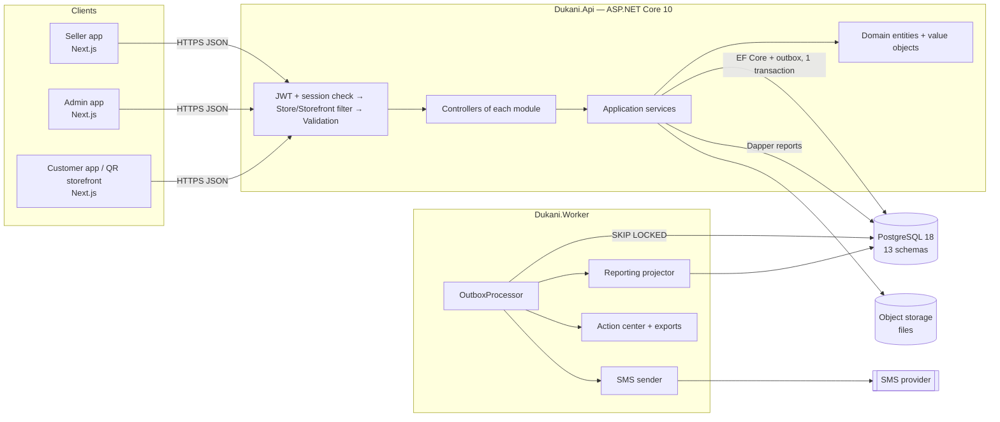
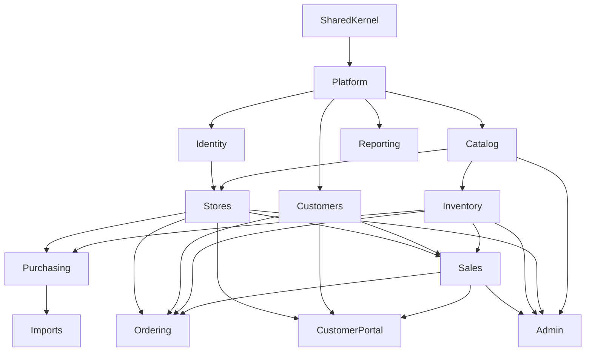
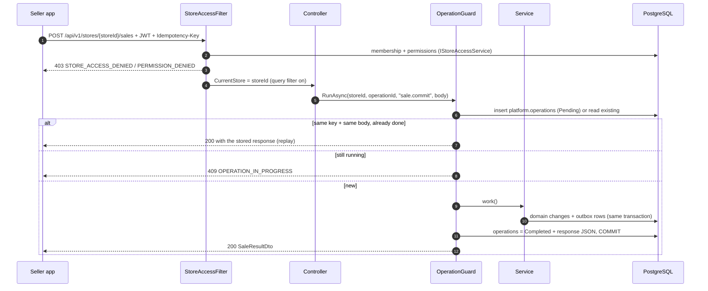
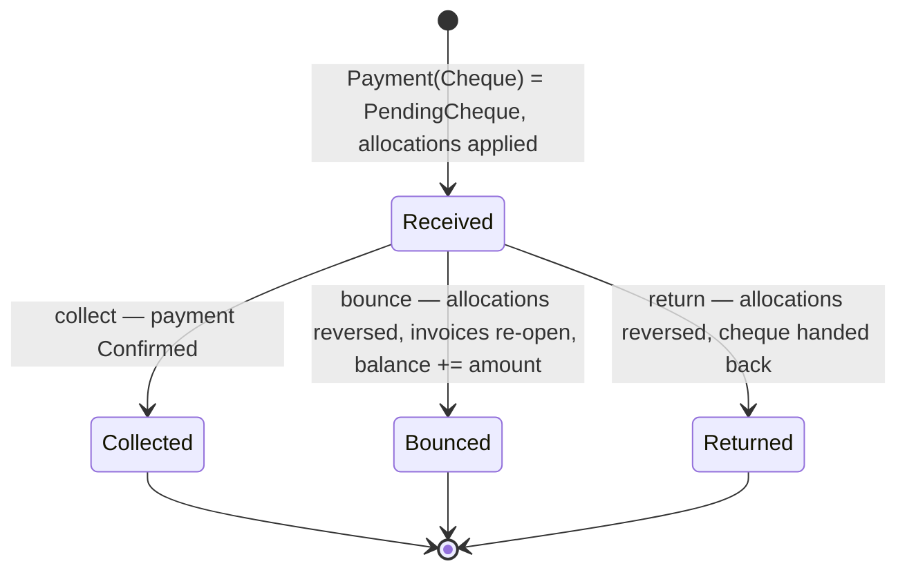
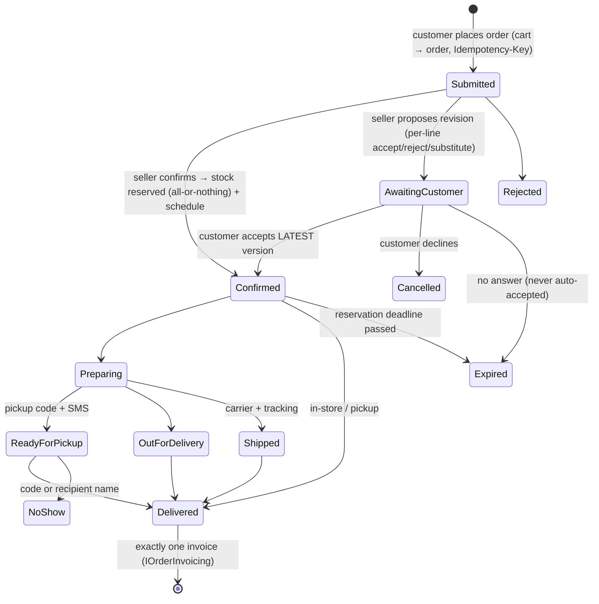
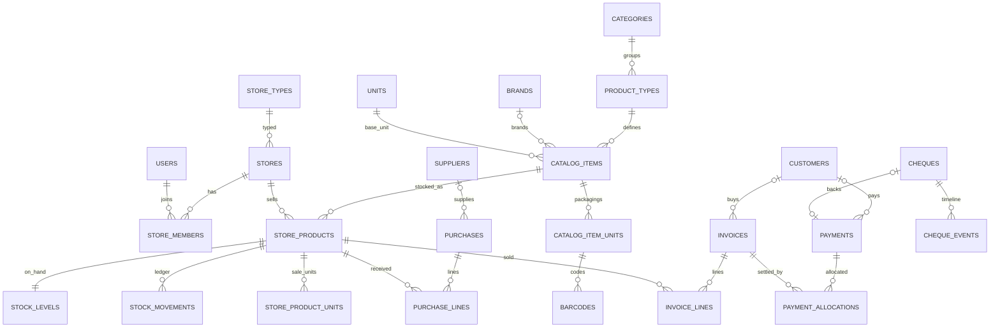

# معماری بک‌اند دکانی (.NET 10)

این سند نقشهٔ کل بک‌اند است: لایه‌ها، ماژول‌ها، قراردادهای مشترک، فلوهای پیچیده، و نگاشت صفحه‌های فیگما به API. جزئیات کامل در سه سند دیگر است که مستقیم از کد تولید می‌شوند و با کد هم‌خوان می‌مانند:

| سند | محتوا |
|---|---|
| [`endpoints.md`](endpoints.md) | همهٔ **۳۲۰ endpoint** به تفکیک ماژول، با DTO ورودی و خروجی، مجوز و Idempotency |
| [`database.md`](database.md) | همهٔ **۸۳ جدول** در ۱۳ schema، ستون‌ها، PK، **۱۲۶ FK**، ایندکس‌ها، unique و check، و ERD هر schema |
| [`domain-model.md`](domain-model.md) | **۱۰۹ Entity**، Value Objectها، **۸۷ enum** و **۳۸۸ DTO** با فیلدها |
| [`IMPLEMENTATION_GUIDE.md`](IMPLEMENTATION_GUIDE.md) | قواعد نوشتن سرویس، Validator، تراکنش، پورت‌ها و تست (برای توسعه‌دهنده‌ها) |
| [`../deploy/README.md`](../deploy/README.md) | استقرار با Docker روی دو سرور Ubuntu |
| [`../PROGRESS.md`](../PROGRESS.md) | وضعیت هر ماژول و کارهای باز |
| [`openapi.json`](openapi.json) | سند OpenAPI 3.0.3 (Swagger) برای تولید کلاینت فرانت (orval یا openapi-typescript) |

---

## ۱. تصمیم‌های اصلی

| موضوع | تصمیم | دلیل |
|---|---|---|
| سبک معماری | **Modular Monolith**: یک API، یک Worker و یک دیتابیس، با ماژول‌های جدا | فلوهای اتمیک (فروش، تسویه، خرید) در یک تراکنش می‌مانند و بعداً هر ماژول قابل جداشدن است |
| فریمورک | ASP.NET Core 10 با **Controller** | Swagger دقیق، فیلتر مجوز روی اکشن، و الگوی آشنا برای تیم |
| دیتابیس | PostgreSQL 18 با EF Core 10 (Npgsql)، snake_case؛ روی سرور جدا | jsonb، ایندکس trigram برای جستجوی فارسی، partial و unique index، و xmin برای هم‌زمانی |
| گزارش | Dapper روی جدول‌های روزانهٔ `reporting.daily_*` | هر فیلتر زمانی فقط یک `SUM` روی بازهٔ روزهاست |
| چندفروشگاهی | همهٔ مسیرهای فروشنده `api/v1/stores/{storeId}/…` هستند؛ ستون `store_id` + Global Query Filter | نشت داده بین فروشگاه‌ها در سطح ORM بسته می‌شود |
| پول و مقدار | پول `long` ریالی و مقدار `decimal(18,3)` در واحد پایهٔ کالا | خطای اعشار در پول نداریم؛ UI تومان نشان می‌دهد |
| شناسه | UUIDv7 (`Guid.CreateVersion7()`)؛ شمارهٔ فاکتور و رسید جدا، بدون فاصله و per-store | شناسه از کلاینت هم قابل ساختن است و ترتیب زمانی دارد |
| ثبت قطعی | هدر `Idempotency-Key` + جدول `platform.operations` | دوبار زدن یا قطع شبکه هیچ‌وقت فاکتور یا دریافت دوم نمی‌سازد (P11) |
| اثرهای جانبی | **Outbox** در همان تراکنش؛ Worker آن را پردازش می‌کند | پیامک، پروجکشن گزارش و مرکز اقدام نمی‌توانند فروش را خراب کنند |
| خطا | ProblemDetails (RFC 7807) با `code` پایدار (مثل `STOCK_NOT_ENOUGH`) | فرانت پیام فارسی را از روی کد می‌سازد |
| هم‌زمانی | `Version` روی Aggregateها که به `xmin` نگاشت می‌شود؛ در DTOها برمی‌گردد | ویرایش هم‌زمان دو کارمند `409 VERSION_CONFLICT` می‌دهد |
| مستند API | `Microsoft.AspNetCore.OpenApi` در `/openapi/v1.json` و UI با Scalar در `/docs` | Swagger داخلی .NET 10 |
| نقش‌ها | یک حساب برای هر موبایل. **ادمین** نقش پلتفرمی روی کاربر است (`platform.admin`، `platform.catalog_reviewer`). **فروشنده** با عضویت در یک فروشگاه مشخص می‌شود (مالک یا کارمند با ۱۹ مجوز جدا). **مشتری** از روی موبایل تأییدشده با OTP مشخص می‌شود | یک نفر می‌تواند هم‌زمان فروشنده یک فروشگاه و مشتری فروشگاه دیگر باشد |
| اعتبارسنجی | FluentValidation برای همهٔ درخواست‌ها با فیلتر سراسری، به‌علاوه قواعد دامنه داخل Entityها (`Guard`) | خطای شکل ورودی ۴۰۰ `VALIDATION_FAILED` با خطای هر فیلد؛ نقض قاعده کسب‌وکار ۴۲۲ با کد مشخص |
| پیامک | کاوه‌نگار (verify/lookup) از طریق Outbox؛ OTP هم‌زمان | شکست پیامک هیچ‌وقت فروش یا سفارش را برنمی‌گرداند |
| فایل | ذخیره S3 (MinIO) با لینک دانلود موقت امضاشده | تصویر کالا، فیش، چک، Excel ورودی و خروجی |
| نسخه‌های محصول | `[RequiresRelease]` + `Releases:Current` | پنل مشتری (۱.۲) و سفارش (۳.۰) با یک تنظیم روشن یا خاموش می‌شوند |

## ۲. نمای کلی



### لایه‌ها در هر ماژول

| پوشه | محتوا | قاعده |
|---|---|---|
| `Domain/` | Entity، enum، رکوردهای Owned | بدون وابستگی به EF یا HTTP؛ setterها private؛ قواعد با `Guard.Against` |
| `Contracts/` | DTOهای `record` برای API | فقط نوع‌های ساده، enumها و DTOهای دیگر |
| `Application/` | اینترفیس سرویس‌ها و پورت‌های بین‌ماژولی (مثل `IStockLedger`) | Controller فقط این‌ها را صدا می‌زند |
| `Api/` | Controllerها | هر اکشن یک خط است: route، مجوز، Idempotency و فراخوانی سرویس |
| `Infrastructure/` | `XModel : IModuleModel` (پیکربندی EF و schema) | هر ماژول فقط schema خودش را می‌سازد |
| `XModule.cs` | `AddXModule()` | ثبت مدل و سرویس‌ها در DI |

### ساختار Solution

```text
dukani-backend/
├─ Dukani.slnx · Directory.Build.props · Directory.Packages.props
├─ src/
│  ├─ Dukani.SharedKernel/     Entity, StoreScopedEntity, Money, Quantity, IranMobile, Barcode, Percent, DateRange,
│  │                           AppError/ErrorCodes, StorePermission, IntegrationEvents, CursorPage
│  ├─ Dukani.Platform/         AppDbContext, IModuleModel, OperationGuard (idempotency), Outbox, Sequences,
│  │                           Files, ReleaseGate, StoreAccessFilter, ProblemDetails mapping, base controllers
│  ├─ Modules/
│  │  ├─ Dukani.Modules.Identity    schema identity   ورود OTP، نشست‌ها، پروفایل
│  │  ├─ Dukani.Modules.Stores      schema store      فروشگاه، تنظیمات، کارکنان، دعوت، انتقال مالکیت، پشتیبانی
│  │  ├─ Dukani.Modules.Catalog     schema catalog    واحد، نوع فروشگاه، دسته، نوع کالا، ویژگی، برند، کاتالوگ، اصلاحیه
│  │  ├─ Dukani.Modules.Inventory   schema inventory  کالای فروشگاه، قیمت، واحد فروش، موجودی، گردش، تعدیل، شمارش
│  │  ├─ Dukani.Modules.Purchasing  schema purchasing تأمین‌کننده، رسید خرید، اصلاح و ابطال، ثبت کالا با موجودی
│  │  ├─ Dukani.Modules.Customers   schema crm        مشتری، ادغام
│  │  ├─ Dukani.Modules.Sales       schema sales      فروش، فاکتور، دریافت، تخصیص، چک، پیامک، نسیه
│  │  ├─ Dukani.Modules.Reporting   schema reporting  جدول‌های روزانه، مرکز اقدام، خروجی
│  │  ├─ Dukani.Modules.Imports     schema imports    ورود Excel
│  │  ├─ Dukani.Modules.Admin       schema admin      API ادمین، Seed، Audit
│  │  ├─ Dukani.Modules.Ordering    schema ordering   ویترین QR، سبد، سفارش، زمان‌بندی تحویل، پرداخت و بازپرداخت سفارش (۳.۰)
│  │  └─ Dukani.Modules.CustomerPortal schema portal  پنل مشتری: فاکتورها و بدهی در همه فروشگاه‌ها، «مال من نیست»، فیش تسویه (۱.۲)
│  ├─ Dukani.Api/              Program.cs, JWT, policies, OpenAPI + Scalar
│  └─ Dukani.Worker/           OutboxProcessor (+ scheduled jobs)
├─ tests/                      ۱۲ پروژه تست واحد (xunit)، یکی برای هر ماژول
├─ deploy/                     compose سرور دیتابیس و سرور اپ، nginx، بکاپ
├─ seed/                       بسته داده اولیه کاتالوگ (Excel + JSON نسخه‌دار)
├─ Dockerfile                  image‌های api، worker، seeder
├─ tools/
│  ├─ Dukani.Seeder/           validate/apply seed package (seed/dukani-seed-v1.json)
│  └─ openapi-gen/             gen_openapi.py · gen_schema_doc.py · gen_domain_doc.py · check_references.py
└─ docs/                       this file + generated docs + openapi.json
```

## ۳. ماژول‌ها و وابستگی‌ها



قواعد:

- وابستگی فقط در جهت فلش است و چرخه ممنوع است. `check_references.py` این را از روی `.csproj`ها بررسی می‌کند.
- **نوشتن** در ماژول دیگر فقط از **پورت‌های Application** آن انجام می‌شود. **خواندن** فقط‌خواندنی از Entityهای ماژول مرجع مجاز است. Reporting به هیچ ماژولی reference ندارد و فقط با SQL می‌خواند.

| پورت | صاحب | مصرف‌کننده | کار |
|---|---|---|---|
| `IStockLedger` | Inventory | Purchasing، Sales، Imports، Ordering | `ReceiveAsync`، `IssueAsync` (هزینهٔ لحظهٔ خروج را برمی‌گرداند)، `FindInsufficientAsync`، رزرو سفارش (`Reserve`/`Release`/`Extend`/`ConsumeReservation`)، `RecalculateReceiptCostsAsync` |
| `IStoreProductRegistry` | Inventory | Purchasing | ساخت کالای فروشگاه از کالای کاتالوگ |
| `IOrderInvoicing` | Sales | Ordering | سفارش تحویل‌شده ← دقیقاً یک فاکتور، مصرف رزرو، ثبت پرداخت‌ها |
| `IReceivablesService.SettleAsync` | Sales | CustomerPortal | تأیید فیش تسویه مشتری |
| `IStorefrontAccessService` | Ordering | Platform (فیلتر ویترین) | ویترین فروشگاه باز است یا نه |
| `ISessionValidator` | Identity | API (JWT) | ردکردن نشست باطل‌شده از درخواست بعدی |
| `ICustomerMergeParticipant` | Sales، Ordering، CustomerPortal | Customers | انتقال رکوردها هنگام ادغام مشتری |
| `IMemberWorkSource` | Sales، Purchasing | Stores | کارهای باز کارمند هنگام خروج |
| `IStoreProductReader` | Inventory | Sales | Snapshot واحد قابل فروش (عنوان، قیمت، ضریب واحد پایه) |
| `ICustomerAccounts` | Customers | Sales، Ordering | خواندن مشتری، به‌روزکردن مانده (`balance_rials`) در همان تراکنش، `EnsureCustomerAsync` |
| `ICatalogAdminService` | Catalog | Admin | همهٔ عملیات ادمین روی کاتالوگ و طبقه‌بندی |
| `IStoreAccessService` | Stores | Platform (فیلتر) | عضویت و مجوزهای کاربر در فروشگاه |
| Integration events | همه | Reporting، Worker | `SaleCommitted`، `PaymentRecorded`، `PurchaseFinalized`، `StockChanged` و … از Outbox |

- FK بین schemaها مجاز است (یک دیتابیس داریم). ماژولی که FK را تعریف می‌کند باید به ماژول مقصد reference داشته باشد. FK مربوط به `store_id` را `StoresModel.Finalize` برای همهٔ `StoreScopedEntity`ها اضافه می‌کند.

## ۴. مسیر یک درخواست



| جزء | کجا | رفتار |
|---|---|---|
| احراز هویت | `AuthController`، JWT کوتاه‌عمر + Refresh چرخشی در `identity.user_sessions` | `sub` = شناسهٔ کاربر؛ نقش پلتفرم در claim `role` |
| دسترسی فروشگاه | `StoreController` → `StoreAccessFilter` | مالک همهٔ مجوزها را دارد؛ کارمند فقط مجوزهای ۱۹گانهٔ `StorePermission` را |
| ادمین | `AdminController` با Policy `platform-admin`؛ کاتالوگ با `catalog-reviewer` | مسیرهای `api/v1/admin/...` |
| Idempotency | `[Idempotent]` + `RequireOperationId()` | کلید یکسان با بدنهٔ متفاوت `409` می‌دهد؛ نتیجهٔ نامعلوم با تکرار همان کلید روشن می‌شود |
| اعتبارسنجی و قاعده | `Guard.Against(...)` در Entity → `DomainException` | `DomainExceptionHandler` آن را به ProblemDetails با `code` تبدیل می‌کند |
| هم‌زمانی | `Version` (xmin) در DTO و Request | `DbUpdateConcurrencyException` → `409 VERSION_CONFLICT` |
| نسخهٔ محصول | `[RequiresRelease(ProductRelease.V1_1)]` و `IReleaseGate` | فیچرهای ۱.۱ و بعد پشت گیت هستند و `FEATURE_NOT_RELEASED` می‌دهند |
| صفحه‌بندی | `CursorPage<T>(Items, NextCursor, TotalCount?)` | cursor روی `(created_at, id)`؛ `limit` حداکثر ۱۰۰ |

## ۵. فلوهای پیچیده

### ۵.۱ ثبت فروش اتمیک (F17 تا F20)

`POST /stores/{storeId}/sales` با `CommitSaleRequest`. همهٔ مراحل زیر در **یک تراکنش** انجام می‌شوند:

1. سبد دوباره قیمت‌گذاری می‌شود (`IStoreProductReader`). اگر جمع با `ExpectedTotalRials` فرق کند، `PRICE_CHANGED` برمی‌گردد و کاربر پیش‌نمایش جدید را می‌بیند.
2. `Invoice.Create` اجرا می‌شود: تخفیف ردیف و فاکتور بررسی و تخفیف فاکتور با `Money.Allocate` بین ردیف‌ها پخش می‌شود. شماره از `platform.sequences` می‌آید.
3. `IStockLedger.IssueAsync` موجودی را کم می‌کند و `inventory.stock_movements` را می‌نویسد. کمبود موجودی `STOCK_NOT_ENOUGH` می‌دهد. خروجی این مرحله هزینهٔ میانگین هر ردیف است که به `InvoiceLine.SetCost` داده می‌شود؛ هزینهٔ نامعلوم نامعلوم می‌ماند و صفر نمی‌شود.
4. برای هر روش پرداخت `Payment.Receive` و سپس `AllocateTo(invoice)` اجرا می‌شود. باقی‌مانده نسیه است و مشتری لازم دارد (`CUSTOMER_REQUIRED_FOR_CREDIT`). اضافه‌پرداخت فقط «بقیهٔ پول» است و ذخیره نمی‌شود.
5. `ICustomerAccounts.ApplyBalanceDeltaAsync(+credit)` مانده را افزایش می‌دهد. check constraint اجازهٔ منفی‌شدن مانده را نمی‌دهد.
6. رویدادهای `SaleCommitted`، `PaymentRecorded` و در صورت نیاز `InvoiceSmsRequested` در Outbox نوشته می‌شوند.

Worker بعداً `reporting.daily_*` را به‌روز می‌کند و پیامک را می‌فرستد. شکست پیامک در `sales.sms_messages` ثبت می‌شود و از `POST …/invoices/{id}/sms` دوباره قابل ارسال است.

### ۵.۲ تسویهٔ چندفاکتوری (F22، F23)

`POST /stores/{storeId}/customers/{customerId}/settlements`: اگر `Allocations` خالی باشد، مبلغ از **قدیمی‌ترین فاکتور باز** تخصیص داده می‌شود. مثال: دریافت ۱۵۰ روی دو فاکتور ۱۰۰ و ۱۰۰ نتیجه‌اش ۰ و ۵۰ است. دریافت بیشتر از بدهی `SETTLEMENT_EXCEEDS_DEBT` می‌دهد. پیش‌نمایش (`/settlements/preview`) همین محاسبه را بدون ثبت انجام می‌دهد.

### ۵.۳ چک دریافتی (F38)



### ۵.۴ ثبت کالا با موجودی و خرید

- **ثبت تک‌کالا** (`POST …/product-entry/register`): در یک تراکنش، کالای کاتاگ در صورت نیاز ساخته می‌شود (با وضعیت Private یا PendingReview)، بعد `StoreProduct` و واحدهایش، قیمت و آستانهٔ کمبود ثبت می‌شوند. اگر موجودی وارد شده باشد، رسید `Opening` یا `Purchase` با `IStockLedger.ReceiveAsync` هم ثبت می‌شود. مثال: ۳ بسته ۲۰تایی در موجودی ۶۰ عدد ثبت می‌شود.
- **رسید خرید**: `Draft → Finalized → (Corrected)* | Cancelled`. نهایی‌کردن موجودی و میانگین هزینه را به‌روز می‌کند. ابطال وقتی که بخشی از کالا فروخته شده باشد `PURCHASE_CANCEL_BLOCKED` می‌دهد. پیش‌نمایش اصلاح اثر آن را روی موجودی و هزینه نشان می‌دهد.
- **ورود Excel**: `Uploaded → Mapped → Validated → Executing → Completed(WithErrors)`. هر فایل (با fingerprint sha256) فقط یک بار برای هر نوع ورود اجرا می‌شود. اجرا همان `BulkRegister` است، پس قواعد آن با ویزارد یکی است.

### ۵.۵ اصلاح فاکتور (F60)

فاکتور حذف نمی‌شود. `InvoiceCorrection` مقادیر قبل و بعد را در jsonb نگه می‌دارد و اثر آن روی موجودی، مانده و گزارش ثبت می‌شود. اصلاحی که فروشگاه را بدهکار مشتری کند (مرجوعی و برگشت وجه) `CORRECTION_BLOCKED` می‌دهد، چون در دامنهٔ نسخهٔ بعد است.

### ۵.۶ گزارش و سود

`reporting.daily_sales` برای هر روز و فروشگاه یک ردیف دارد و پروجکتور Worker آن را از روی رویدادها پر می‌کند. `reporting.processed_events` مانع شمارش دوبارهٔ یک رویداد می‌شود. سود فقط روی فروشی حساب می‌شود که هزینه‌اش معلوم است، و درصد پوشش هم گزارش می‌شود. مثال: فروش ۱۰۰۰، فروش با هزینهٔ معلوم ۷۰۰ و هزینهٔ آن ۴۰۰ یعنی سود ۳۰۰ با پوشش ۷۰٪. همهٔ فیلترهای زمانی (امروز، هفته، ماه شمسی، ۷ تا ۹۰ روز، بازهٔ دلخواه) به بازهٔ `business_day` تبدیل می‌شوند و با `reporting.calendar_days` بر اساس روز، هفته یا ماه شمسی گروه می‌شوند.

### ۵.۷ سفارش مشتری با QR (نسخه ۳.۰؛ F45 تا F50 و F80)

- **ورود مشتری:** با اسکن QR فروشگاه آدرس `{PublicBaseUrl}/s/{PublicCode}` باز می‌شود. فرانت با `GET /api/v1/shop/by-code/{code}` شناسه فروشگاه را پیدا می‌کند.
  - مرور کالاها بدون ورود است (`/api/v1/shop/{storeId}/…`).
  - سبد و ثبت سفارش ورود با OTP لازم دارند.
  - بهای خرید هیچ‌وقت نمایش داده نمی‌شود.
- **روش‌های تحویل:**
  - **داخل فروشگاه:** تحویل پشت صندوق.
  - **تحویل حضوری:** فروشگاه اول تأیید می‌کند و زمان دریافت را تعیین می‌کند.
  - **پیک فروشگاه:** با هزینه، حداقل سفارش و ظرفیت بازه‌های زمانی.
  - **پست بین‌شهری:** با شرکت حمل و کد رهگیری.
- **روش‌های پرداخت:** نقد، کارتخوان، چک و کارت‌به‌کارت.
  - کارت‌به‌کارت **فیش اجباری** دارد و فروشنده آن را تأیید یا رد می‌کند.
  - بیعانه هم پشتیبانی می‌شود.
  - مبلغ دریافتی پیش از تحویل، درآمد فروش حساب نمی‌شود.
  - درگاه آنلاین فعلاً نداریم.



- **رزرو موجودی:** بعد از تأیید، موجودی رزرو می‌شود (`on_hand − reserved` قابل فروش است) و مهلت دارد.
  - لغو یا انقضا فقط رزرو را آزاد می‌کند و این کار idempotent است.
  - اگر وجهی دریافت شده باشد، یک تعهد بازپرداخت ساخته می‌شود با وضعیت‌های `Pending → Processing → Paid/Failed`. این تعهد هرگز خودکار «پرداخت‌شده» نمی‌شود.
- **تحویل:** در همان تراکنش `IOrderInvoicing` صدا زده می‌شود و این کارها را انجام می‌دهد:
  - رزرو مصرف می‌شود (موجودی و رزرو با هم کم می‌شوند).
  - یک فاکتور با قیمت‌های توافق‌شده ساخته می‌شود.
  - پرداخت‌های تأییدشده سفارش به فاکتور تخصیص پیدا می‌کنند.
  - باقی‌مانده، فقط با مجوز `sale.credit`، بدهی مشتری می‌شود.
- **پیگیری:** هر تغییر وضعیت در timeline ثبت می‌شود و پیامک وضعیت از Outbox می‌رود. سفارش‌های جدید، فیش‌های در انتظار و درخواست‌های تسویه در **مرکز اقدام** فروشنده ظاهر می‌شوند.

### ۵.۸ پنل مشتری (نسخه ۱.۲؛ F79، BIZ-BUY)

- **دسترسی:** مشتری با OTP وارد می‌شود و در همه فروشگاه‌ها رکوردهایی را می‌بیند که با موبایل تأییدشده‌اش ثبت شده‌اند: فاکتورها، مانده بدهی، صورت‌حساب و چک‌های در جریان.
  - هیچ فیلتر فروشگاهی فعال نیست؛ هر کوئری صریحاً بر اساس فروشگاه و شناسه‌های مشتریِ خود کاربر فیلتر می‌شود.
  - تغییر شناسه در URL فقط ۴۰۴ برمی‌گرداند.
- **«این مال من نیست»:** رکورد برای همان کاربر تا بررسی فروشنده پنهان می‌شود. سند فروشگاه هرگز حذف نمی‌شود.
- **فیش تسویه:** مشتری فیش کارت‌به‌کارت می‌فرستد و فروشنده با `Idempotency-Key` تأیید می‌کند.
  - تأیید از `IReceivablesService.SettleAsync` می‌گذرد، پس قاعده‌های تسویه قدیمی‌ترین فاکتور اول و سقف بدهی رعایت می‌شوند.
  - تکرار تأیید هیچ‌وقت بدهی را دوبار کم نمی‌کند.
  - یک مرجع یا فایل فیش در یک فروشگاه دوبار تأیید نمی‌شود.
- **تنظیم فروشگاه:** هر فروشگاه می‌تواند نمایش در پنل مشتری یا دریافت درخواست تسویه را خاموش کند.

## ۶. دیتابیس در یک نگاه

| Schema | جدول‌ها | مهم‌ترین رابطه‌ها |
|---|---|---|
| `identity` | users، otp_requests، user_sessions | session → user |
| `store` | stores، store_private_info، store_settings، store_members، invitations، ownership_transfers، support_requests | ۱:۱ برای private_info و settings؛ member → user؛ store → catalog.store_types |
| `catalog` | units، store_types، categories (درختی)، store_type_categories، product_types، product_type_attributes، attributes، attribute_options، brands، catalog_items، catalog_item_units، barcodes، catalog_images، catalog_item_aliases، correction_requests | item → product_type → category؛ item → base_unit؛ unit → barcodes؛ `owner_store_id` خالی یعنی سراسری |
| `inventory` | store_products، store_product_units، stock_levels (۱:۱)، stock_movements (append-only)، stock_reservations، price_changes، stock_adjustments، count_sessions، count_lines | store_product → catalog_item؛ واحد فروش → catalog_item_unit |
| `purchasing` | suppliers، purchases، purchase_lines، purchase_corrections | line → store_product و واحد ورود |
| `crm` | customers، customer_merges | یکتا بودن `(store_id, mobile)` برای مشتری‌های فعال |
| `sales` | invoices، invoice_lines، invoice_corrections، payments، payment_allocations، cheques، cheque_events، sale_drafts، sms_messages، invoice_share_links | allocation بین payment و invoice (چندبه‌چند)؛ payment ۱:۱ با cheque |
| `reporting` | calendar_days، daily_sales، daily_product_sales، daily_receipts، daily_purchases، processed_events، action_items، export_jobs | کلید مرکب `(store_id, day, …)` و عمداً بدون FK به جدول‌های OLTP |
| `ordering` | storefront_settings، slot_templates، fulfillment_slots، customer_addresses، carts، cart_lines، orders، order_lines (نسخه‌دار)، order_events، order_payments، order_refunds، order_notifications | order → crm.customers؛ خط سفارش → inventory.store_product_units؛ `invoice_id` پس از تحویل |
| `portal` | store_settings، settlement_requests، settlement_request_events، record_claims | درخواست تسویه → crm.customers؛ یکتا بودن مرجع و فایل فیش در هر فروشگاه |
| `imports` | import_runs، import_rows | یکتا بودن `(store_id, kind, fingerprint)` |
| `admin` | seed_runs، seed_run_rows، audit_log | seed به تفکیک `seed_key` |
| `platform` | operations، outbox، sequences، files | operation با کلید `(store_id, operation_id)` |



## ۷. واحدهای اندازه‌گیری در API

- `GET /api/v1/units` فهرست واحدها با بعد (`Count`، `Mass`، `Volume`، `Length`، `Area`) و `factor_to_base` را برمی‌گرداند.
- **فرم نوع کالا و دسته** (ادمین و فروشنده): `ProductType.MeasureDimension`، `DefaultBaseUnitId` و `DefaultPackagings` پیشنهاد اولیهٔ فرم ثبت کالا را می‌سازند.
- **فرم کاتالوگ**: `CatalogItem.BaseUnitId` باید هم‌بعد با نوع کالا باشد (`UNIT_DIMENSION_MISMATCH`). بسته‌بندی‌ها (`catalog_item_units`) هر کدام `base_qty` دارند؛ مثلاً «بستهٔ ۲۰تایی» یعنی ۲۰ واحد پایه.
- **فرم موجودی و خرید**: ورود با `EntryUnitRef` (یک واحد کاتالوگ یا ایندکس یک واحد جدید) انجام می‌شود و مقدار در سرور به واحد پایه تبدیل می‌شود (`QtyBase`). همهٔ موجودی‌ها، گردش‌ها و گزارش‌ها در واحد پایه هستند.
- **فروش**: `store_product_units` قیمت هر واحد فروش را نگه می‌دارد (بسته ممکن است تخفیف حجمی داشته باشد). ردیف فاکتور `BaseQtyPerUnit` را هم snapshot می‌کند.

## ۸. نگاشت صفحه‌های فرانت (فیگما Seller-V2 و ادمین) به API

`~` یعنی `/s/[storeId]` در فرانت و `…` یعنی `/api/v1/stores/{storeId}` در API.

| ماژول فرانت و مسیرها | Endpointها |
|---|---|
| auth: `/login`، `/login/otp` | `POST /auth/otp/request`، `POST /auth/otp/verify`، `POST /auth/refresh`، `POST /auth/logout` |
| store: `/stores`، `/stores/new`، `~/onboarding`، `~/settings/store/*` | `GET/POST /stores`، `GET /store-types`، `GET/PUT …/profile`، `GET …/type-change-preview`، `GET/PUT …/private-info`، `GET/PUT …/settings` |
| staff-access: `~/settings/staff/*`، `~/settings/sessions` | `…/members/*`، `…/invitations/*`، `…/ownership-transfers/*`، `/invitations/{id}/accept\|decline`، `/ownership-transfers/{id}/accept\|decline`، `GET /permissions`، `/me/sessions/*` |
| Shell: `~/home` | `GET …/reports/summary`، `GET …/actions/counts`، `GET …/receivables/overview` |
| catalog: `~/catalog/*`، `~/categories/*` | `…/catalog/items/*` (جستجو، title-check، ایجاد، بسته‌بندی، بارکد، تصویر، اصلاحیه)، `…/catalog/categories`، `…/catalog/product-types/*`، `…/catalog/brands`، `…/catalog/corrections/*` |
| product-entry: `~/entry/*` (اسکن، دستی، ویژگی، تصویر، واحد، موجودی، قیمت، بازبینی) و `~/entry/bulk/*` | `GET …/barcodes/{code}` (StoreProduct، GlobalCatalog، Multiple، Unknown، Conflict، Invalid)، `POST …/product-entry/preview`، `POST …/product-entry/register` ♻، `POST …/product-entry/bulk/validate`، `POST …/product-entry/bulk` ♻، `POST …/products/pricing/preview` |
| bulk-import: `~/import/*` | `…/imports` (template، upload، mapping، validate، rows، execute ♻، cancel) |
| products: `~/products/*` | `…/products/*` (local، pricing، price-history، units، reorder-settings، archive، internal-barcode)، `…/products/{id}/receipts` |
| inventory: `~/inventory/*` | `GET …/inventory`، `…/inventory/{productId}/movements`، `…/inventory/adjustments/preview`، `…/inventory/adjustments` ♻، `…/inventory/counts/*` |
| purchasing: `~/purchases/*` | `…/suppliers/*`، `…/purchases/*` (draft، totals، finalize، attachments، corrections، cancel-preview، cancel، quick) |
| sales: `~/sales/new/*` (سبد، اسکن، تخفیف، مشتری، پرداخت نقد، کارت، ترکیبی، نسیه، چک، بازبینی) | `POST …/sales/quote`، `POST …/sales` ♻، `…/sale-drafts/*`، `GET …/customers/by-mobile/{mobile}`، `POST …/customers` |
| invoices: `~/invoices/*` | `…/invoices` (list، get، customer، sms، share-links، print، corrections/preview، corrections ♻)، `GET /public/invoices/{token}` 🌐 |
| customers: `~/customers/*` | `…/customers/*` (list، create، edit، archive، restore، merge/preview، merge ♻) |
| receivables: `~/debts/*`، `~/customers/[id]/debt-history\|standing\|settle` | `…/receivables/overview`، `…/receivables/debtors`، `…/customers/{id}/standing\|open-invoices\|ledger\|statement`، `…/customers/{id}/settlements/preview`، `…/customers/{id}/settlements` ♻، `…/payments/{id}`، `…/payments/{id}/reallocate` ♻ |
| cheques: `~/cheques/*` | `…/cheques` (list، get، collect ♻، bounce ♻، return ♻، image) |
| reports: `~/reports/*` | `…/reports/summary\|sales\|daily-compare\|receipts\|profit\|products\|analysis\|purchase-vs-sales\|discounts\|low-stock\|stock-health\|stock-value\|data-issues` |
| action-center، export، support | `…/actions/*`، `…/exports/*`، `…/support-requests` |
| ویترین مشتری و سفارش (۳.۰) | `/shop/by-code/{code}` 🌐، `/shop/{storeId}` (مشخصات، دسته‌ها، کالاها، بارکد، سبد، بازه‌ها، ثبت سفارش ♻)، `/customer/orders/*` (پیگیری، پذیرش یا رد اصلاح، لغو، فیش، سفارش مجدد)، `/customer/addresses/*`؛ فروشنده: `…/storefront/*` (تنظیمات، QR، بازه‌ها)، `…/orders/*` (تأیید، اصلاح، آماده‌سازی، آماده تحویل، ارسال، تحویل ♻، لغو ♻، تمدید رزرو)، `…/order-payments`، `…/order-refunds` |
| پنل مشتری (۱.۲) | `/customer/stores`، `/customer/stores/{storeId}/account\|statement`، `/customer/invoices/*`، `/customer/claims`، `/customer/settlement-requests/*`؛ فروشنده: `…/portal-settings`، `…/settlement-requests/*` (تأیید ♻)، `…/customer-claims/*` |
| ادمین (صفحه‌های ۱۸ تا ۲۰) | `/admin/catalog/items/*`، `/admin/catalog/review-cases/*`، `/admin/catalog/{categories\|product-types\|attributes\|brands\|units\|store-types}`، `/admin/{dashboard\|stores\|users\|support-requests\|audit-log}`، `/admin/seed-runs/*` |

## ۹. Seed داده (Data Entry Batch)

1. داده در `seed/dukani-seed-v1.xlsx` وارد می‌شود و `excel_to_seed_json.py` از آن `dukani-seed-v1.json` نسخه‌دار با checksum می‌سازد.
2. `dotnet run --project tools/Dukani.Seeder -- validate …json` کلیدها، تکراری‌ها و ترتیب را بررسی می‌کند.
3. اعمال یا از `Seeder apply` یا از `POST /api/v1/admin/seed-runs` → `…/apply` انجام می‌شود. ترتیب اعمال: units، store_types، attributes، options، categories، store_type_categories، product_types، product_type_attributes، brands، catalog_items، catalog_item_units. همه با upsert روی `seed_key` هستند، پس تکرار بی‌خطر است. نتیجه در `admin.seed_runs` و `seed_run_rows` ثبت می‌شود.

## ۱۰. تغییرات نسبت به سند دیتامدل قبلی

| قبلاً | الان | دلیل |
|---|---|---|
| `store.store_types` | `catalog.store_types` | نوع فروشگاه دسته‌بندی‌ها را تعیین می‌کند و بدون این جابه‌جایی، Catalog و Stores به هم وابستگی چرخشی پیدا می‌کردند |
| دریافت‌ها و چک در ماژول جدا | `sales.payments`، `payment_allocations`، `cheques` | تخصیص به فاکتور باید در همان تراکنش فروش باشد؛ ماژول جدا وابستگی دوطرفه می‌ساخت |
| به‌روزرسانی `daily_*` در تراکنش فروش | پروجکشن از Outbox + `processed_events` | فروش در ساعت شلوغ روی یک ردیف روزانه قفل نمی‌شود؛ گزارش با تأخیر حدود یک ثانیه به‌روز است |
| `platform.import_runs` | `imports.import_runs` | هر ماژول مالک schema خودش است |
| `CorrectionRequest` سراسری | store-scoped | درخواست اصلاح همیشه از یک فروشگاه می‌آید و فیلتر فروشگاه روی آن هم اعمال می‌شود |

## ۱۱. وضعیت کد و گام بعد

**آماده است:** همه ۱۲ ماژول با سرویس‌ها، Validatorها، Controllerها، jobها و handlerهای Outbox؛ ۱۲ پروژه تست واحد؛ Dockerfile و compose دو سرور. وضعیت دقیق هر بخش و کارهای باز در [`PROGRESS.md`](../PROGRESS.md) است.

**اعتبارسنجی:** در این محیط NuGet و SDK دات‌نت در دسترس نبود، پس کد **هنوز کامپایل نشده** است. به‌جای آن این کارها انجام شد:

- `check_references.py`: دیده‌شدن نوع‌ها، using، reference پروژه و نبودن چرخه.
- `gen_openapi.py`: route تکراری، نوع ناشناخته، و تطابق هر اکشن با متد سرویس.
- `gen_schema_doc.py`: وجود ستون برای هر FK، PK و ایندکس.
- `mmdc`: رندر همهٔ ERDها و نمودارها.
- `docker compose config`: معتبر بودن هر دو compose.
- چهار دور بازبینی مستقل «به‌جای کامپایلر» روی کل کد، که خطاهای قطعی build را پیدا و رفع کرد.

**اولین کار روی سیستم خودتان:**

```bash
dotnet restore && dotnet build          # خطاهای احتمالی را بفرستید تا رفع شوند
dotnet test
dotnet ef migrations add Initial --project src/Dukani.Api --startup-project src/Dukani.Api --output-dir Migrations
dotnet run --project src/Dukani.Api     # Development: /docs (Scalar), /openapi/v1.json
```

سپس استقرار طبق [`deploy/README.md`](../deploy/README.md) انجام می‌شود.
