# Dukani — Database (PostgreSQL)

Generated from the EF Core model by `tools/openapi-gen/gen_schema_doc.py`: **83 tables** in 13 schemas, **126 foreign keys**.

Conventions: snake_case names · `id uuid` = UUIDv7 · money = `bigint` Rials · quantity = `numeric(18,3)` in base unit · enums stored as text · aggregate roots use `xmin` for optimistic concurrency (no column) · every `store_id` column has an FK to `store.stores` and a global query filter.

| Schema | Tables | Module |
|---|---|---|
| `identity` | 3 | Identity |
| `store` | 7 | Stores |
| `catalog` | 15 | Catalog |
| `inventory` | 9 | Inventory |
| `purchasing` | 4 | Purchasing |
| `crm` | 2 | Customers |
| `sales` | 10 | Sales |
| `ordering` | 12 | Ordering |
| `portal` | 4 | CustomerPortal |
| `reporting` | 8 | Reporting |
| `imports` | 2 | Imports |
| `admin` | 3 | Admin |
| `platform` | 4 | Platform |

## Schema `identity`

> In the diagram, `store_id → store.stores` edges of store-scoped tables are omitted; the FK exists on every one of them.

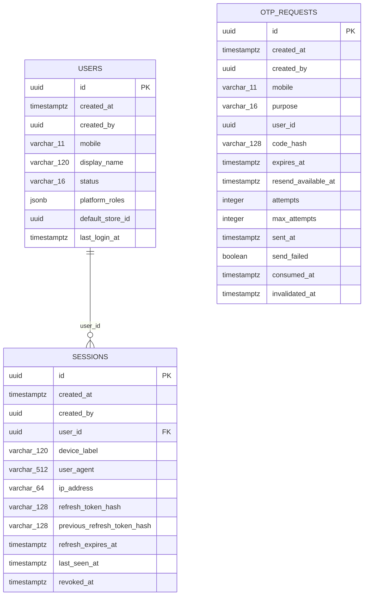

### `identity.users` — User · aggregate root (xmin)

| Column | Type | Null | Note |
|---|---|---|---|
| `id` | uuid |  | **PK** |
| `created_at` | timestamptz |  |  |
| `created_by` | uuid | ✓ |  |
| `mobile` | varchar(11) |  |  |
| `display_name` | varchar(120) | ✓ |  |
| `status` | varchar(16) |  | enum UserStatus |
| `platform_roles` | jsonb |  |  |
| `default_store_id` | uuid | ✓ |  |
| `last_login_at` | timestamptz | ✓ |  |

- UNIQUE `(mobile)`

### `identity.otp_requests` — OtpRequest

| Column | Type | Null | Note |
|---|---|---|---|
| `id` | uuid |  | **PK** |
| `created_at` | timestamptz |  |  |
| `created_by` | uuid | ✓ |  |
| `mobile` | varchar(11) |  |  |
| `purpose` | varchar(16) |  | enum OtpPurpose |
| `user_id` | uuid | ✓ |  |
| `code_hash` | varchar(128) |  |  |
| `expires_at` | timestamptz |  |  |
| `resend_available_at` | timestamptz |  |  |
| `attempts` | integer |  |  |
| `max_attempts` | integer |  |  |
| `sent_at` | timestamptz | ✓ |  |
| `send_failed` | boolean |  |  |
| `consumed_at` | timestamptz | ✓ |  |
| `invalidated_at` | timestamptz | ✓ |  |

- INDEX `(mobile, created_at)`
- UNIQUE `(mobile)` WHERE consumed_at IS NULL AND invalidated_at IS NULL
- INDEX `(created_at)`

### `identity.sessions` — UserSession

| Column | Type | Null | Note |
|---|---|---|---|
| `id` | uuid |  | **PK** |
| `created_at` | timestamptz |  |  |
| `created_by` | uuid | ✓ |  |
| `user_id` | uuid |  |  |
| `device_label` | varchar(120) | ✓ |  |
| `user_agent` | varchar(512) | ✓ |  |
| `ip_address` | varchar(64) | ✓ |  |
| `refresh_token_hash` | varchar(128) |  |  |
| `previous_refresh_token_hash` | varchar(128) | ✓ |  |
| `refresh_expires_at` | timestamptz |  |  |
| `last_seen_at` | timestamptz |  |  |
| `revoked_at` | timestamptz | ✓ |  |

- FK `user_id` → `identity.users.id` (restrict)
- UNIQUE `(refresh_token_hash)`
- INDEX `(previous_refresh_token_hash)`
- INDEX `(user_id, revoked_at)`

## Schema `store`

> In the diagram, `store_id → store.stores` edges of store-scoped tables are omitted; the FK exists on every one of them.

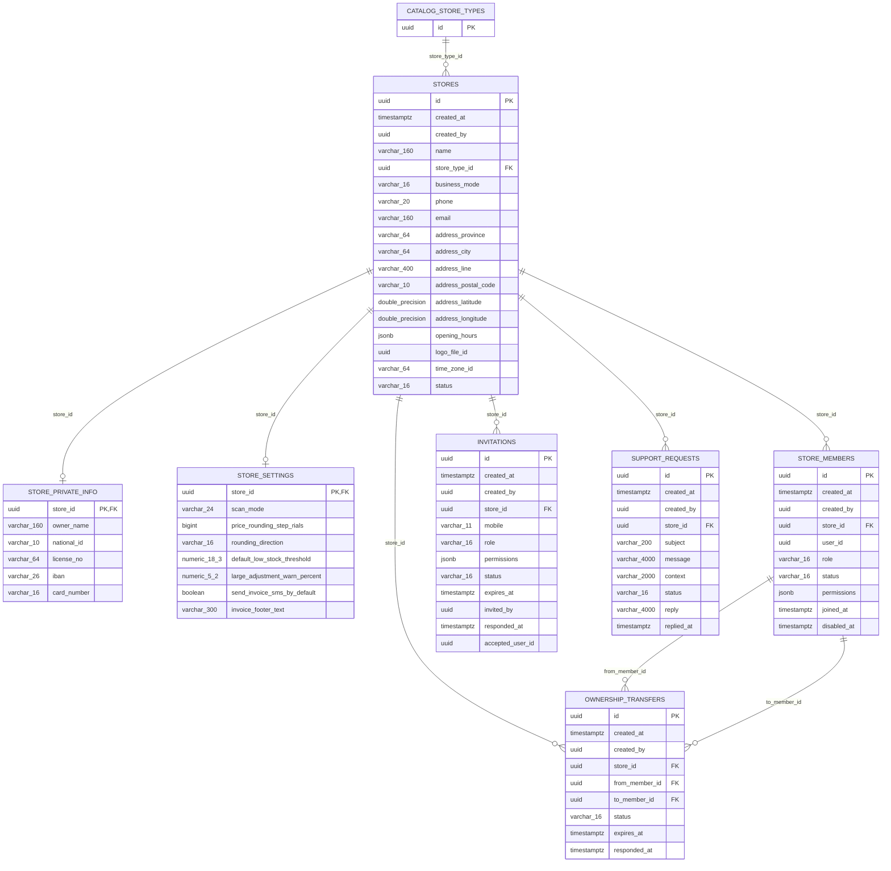

### `store.stores` — Store · aggregate root (xmin)

| Column | Type | Null | Note |
|---|---|---|---|
| `id` | uuid |  | **PK** |
| `created_at` | timestamptz |  |  |
| `created_by` | uuid | ✓ |  |
| `name` | varchar(160) |  |  |
| `store_type_id` | uuid |  |  |
| `business_mode` | varchar(16) | ✓ | enum BusinessMode |
| `phone` | varchar(20) | ✓ |  |
| `email` | varchar(160) | ✓ |  |
| `address_province` | varchar(64) | ✓ | owned Address.Province |
| `address_city` | varchar(64) | ✓ | owned Address.City |
| `address_line` | varchar(400) | ✓ | owned Address.Line |
| `address_postal_code` | varchar(10) | ✓ | owned Address.PostalCode |
| `address_latitude` | double precision | ✓ | owned Address.Latitude |
| `address_longitude` | double precision | ✓ | owned Address.Longitude |
| `opening_hours` | jsonb |  | owned OpeningHoursEntry as JSON |
| `logo_file_id` | uuid | ✓ |  |
| `time_zone_id` | varchar(64) |  |  |
| `status` | varchar(16) |  | enum StoreStatus |

- FK `store_type_id` → `catalog.store_types.id` (restrict)

### `store.store_private_info` — StorePrivateInfo

| Column | Type | Null | Note |
|---|---|---|---|
| `store_id` | uuid |  | **PK** |
| `owner_name` | varchar(160) | ✓ |  |
| `national_id` | varchar(10) | ✓ |  |
| `license_no` | varchar(64) | ✓ |  |
| `iban` | varchar(26) | ✓ |  |
| `card_number` | varchar(16) | ✓ |  |

- FK `store_id` → `store.stores.id` (cascade) 1:1

### `store.store_settings` — StoreSettings

| Column | Type | Null | Note |
|---|---|---|---|
| `store_id` | uuid |  | **PK** |
| `scan_mode` | varchar(24) |  | enum ScanMode |
| `price_rounding_step_rials` | bigint | ✓ |  |
| `rounding_direction` | varchar(16) |  | enum RoundingDirection |
| `default_low_stock_threshold` | numeric(18,3) | ✓ |  |
| `large_adjustment_warn_percent` | numeric(5,2) | ✓ |  |
| `send_invoice_sms_by_default` | boolean |  |  |
| `invoice_footer_text` | varchar(300) | ✓ |  |

- FK `store_id` → `store.stores.id` (cascade) 1:1

### `store.store_members` — StoreMember · store-scoped

| Column | Type | Null | Note |
|---|---|---|---|
| `id` | uuid |  | **PK** |
| `created_at` | timestamptz |  |  |
| `created_by` | uuid | ✓ |  |
| `store_id` | uuid |  |  |
| `user_id` | uuid |  |  |
| `role` | varchar(16) |  | enum MemberRole |
| `status` | varchar(16) |  | enum MemberStatus |
| `permissions` | jsonb |  |  |
| `joined_at` | timestamptz |  |  |
| `disabled_at` | timestamptz | ✓ |  |

- FK `store_id` → `store.stores.id` (cascade)
- UNIQUE `(store_id, user_id)`
- INDEX `(user_id)`

### `store.invitations` — Invitation · store-scoped

| Column | Type | Null | Note |
|---|---|---|---|
| `id` | uuid |  | **PK** |
| `created_at` | timestamptz |  |  |
| `created_by` | uuid | ✓ |  |
| `store_id` | uuid |  |  |
| `mobile` | varchar(11) |  |  |
| `role` | varchar(16) |  | enum MemberRole |
| `permissions` | jsonb |  |  |
| `status` | varchar(16) |  | enum InvitationStatus |
| `expires_at` | timestamptz |  |  |
| `invited_by` | uuid |  |  |
| `responded_at` | timestamptz | ✓ |  |
| `accepted_user_id` | uuid | ✓ |  |

- FK `store_id` → `store.stores.id` (cascade)
- INDEX `(store_id, status)`
- INDEX `(mobile, status)`

### `store.ownership_transfers` — OwnershipTransfer · store-scoped

| Column | Type | Null | Note |
|---|---|---|---|
| `id` | uuid |  | **PK** |
| `created_at` | timestamptz |  |  |
| `created_by` | uuid | ✓ |  |
| `store_id` | uuid |  |  |
| `from_member_id` | uuid |  |  |
| `to_member_id` | uuid |  |  |
| `status` | varchar(16) |  | enum OwnershipTransferStatus |
| `expires_at` | timestamptz |  |  |
| `responded_at` | timestamptz | ✓ |  |

- FK `store_id` → `store.stores.id` (cascade)
- FK `from_member_id` → `store.store_members.id` (restrict)
- FK `to_member_id` → `store.store_members.id` (restrict)
- UNIQUE `(store_id)` WHERE status = 'Requested'

### `store.support_requests` — SupportRequest · store-scoped

| Column | Type | Null | Note |
|---|---|---|---|
| `id` | uuid |  | **PK** |
| `created_at` | timestamptz |  |  |
| `created_by` | uuid | ✓ |  |
| `store_id` | uuid |  |  |
| `subject` | varchar(200) |  |  |
| `message` | varchar(4000) |  |  |
| `context` | varchar(2000) | ✓ |  |
| `status` | varchar(16) |  | enum SupportRequestStatus |
| `reply` | varchar(4000) | ✓ |  |
| `replied_at` | timestamptz | ✓ |  |

- FK `store_id` → `store.stores.id` (cascade)
- INDEX `(store_id, created_at)`

## Schema `catalog`

> In the diagram, `store_id → store.stores` edges of store-scoped tables are omitted; the FK exists on every one of them.

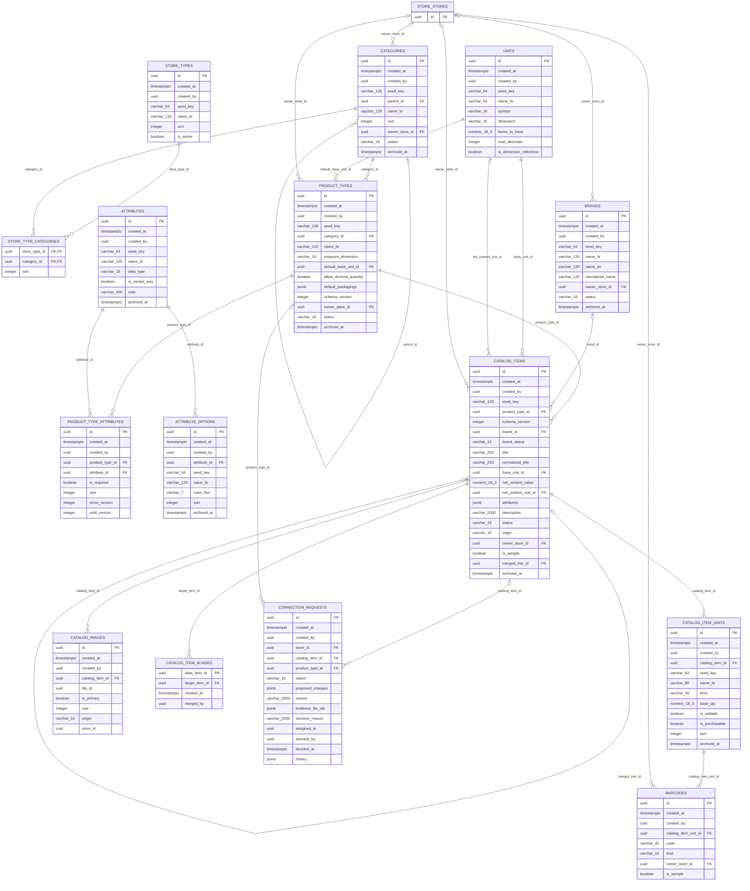

### `catalog.store_types` — StoreType

| Column | Type | Null | Note |
|---|---|---|---|
| `id` | uuid |  | **PK** |
| `created_at` | timestamptz |  |  |
| `created_by` | uuid | ✓ |  |
| `seed_key` | varchar(64) |  |  |
| `name_fa` | varchar(120) |  |  |
| `sort` | integer |  |  |
| `is_active` | boolean |  |  |

- UNIQUE `(seed_key)`

### `catalog.units` — Unit

| Column | Type | Null | Note |
|---|---|---|---|
| `id` | uuid |  | **PK** |
| `created_at` | timestamptz |  |  |
| `created_by` | uuid | ✓ |  |
| `seed_key` | varchar(64) |  |  |
| `name_fa` | varchar(64) |  |  |
| `symbol` | varchar(16) |  |  |
| `dimension` | varchar(16) |  | enum MeasureDimension |
| `factor_to_base` | numeric(18,6) |  |  |
| `max_decimals` | integer |  |  |
| `is_dimension_reference` | boolean |  |  |

- UNIQUE `(seed_key)`
- UNIQUE `(dimension)` WHERE is_dimension_reference

### `catalog.categories` — Category

| Column | Type | Null | Note |
|---|---|---|---|
| `id` | uuid |  | **PK** |
| `created_at` | timestamptz |  |  |
| `created_by` | uuid | ✓ |  |
| `seed_key` | varchar(128) | ✓ |  |
| `parent_id` | uuid | ✓ |  |
| `name_fa` | varchar(120) |  |  |
| `sort` | integer |  |  |
| `owner_store_id` | uuid | ✓ |  |
| `status` | varchar(16) |  | enum CatalogStatus |
| `archived_at` | timestamptz | ✓ |  |

- FK `parent_id` → `catalog.categories.id` (restrict)
- FK `owner_store_id` → `store.stores.id` (restrict)
- UNIQUE `(seed_key)`
- INDEX `(owner_store_id, parent_id)`

### `catalog.store_type_categories` — StoreTypeCategory

| Column | Type | Null | Note |
|---|---|---|---|
| `store_type_id` | uuid |  | **PK** |
| `category_id` | uuid |  | **PK** |
| `sort` | integer |  |  |

- PK `(store_type_id, category_id)`
- FK `store_type_id` → `catalog.store_types.id` (cascade)
- FK `category_id` → `catalog.categories.id` (cascade)

### `catalog.product_types` — ProductType · aggregate root (xmin)

| Column | Type | Null | Note |
|---|---|---|---|
| `id` | uuid |  | **PK** |
| `created_at` | timestamptz |  |  |
| `created_by` | uuid | ✓ |  |
| `seed_key` | varchar(128) | ✓ |  |
| `category_id` | uuid |  |  |
| `name_fa` | varchar(120) |  |  |
| `measure_dimension` | varchar(16) |  | enum MeasureDimension |
| `default_base_unit_id` | uuid |  |  |
| `allow_decimal_quantity` | boolean |  |  |
| `default_packagings` | jsonb |  | owned PackagingTemplate as JSON |
| `schema_version` | integer |  |  |
| `owner_store_id` | uuid | ✓ |  |
| `status` | varchar(16) |  | enum CatalogStatus |
| `archived_at` | timestamptz | ✓ |  |

- FK `category_id` → `catalog.categories.id` (restrict)
- FK `default_base_unit_id` → `catalog.units.id` (restrict)
- FK `owner_store_id` → `store.stores.id` (restrict)
- UNIQUE `(seed_key)`
- INDEX `(category_id, status)`
- INDEX `(owner_store_id)`

### `catalog.product_type_attributes` — ProductTypeAttribute

| Column | Type | Null | Note |
|---|---|---|---|
| `id` | uuid |  | **PK** |
| `created_at` | timestamptz |  |  |
| `created_by` | uuid | ✓ |  |
| `product_type_id` | uuid |  |  |
| `attribute_id` | uuid |  |  |
| `is_required` | boolean |  |  |
| `sort` | integer |  |  |
| `since_version` | integer |  |  |
| `until_version` | integer | ✓ |  |

- FK `product_type_id` → `catalog.product_types.id` (cascade)
- FK `attribute_id` → `catalog.attributes.id` (restrict)
- UNIQUE `(product_type_id, attribute_id, since_version)`

### `catalog.attributes` — AttributeDefinition

| Column | Type | Null | Note |
|---|---|---|---|
| `id` | uuid |  | **PK** |
| `created_at` | timestamptz |  |  |
| `created_by` | uuid | ✓ |  |
| `seed_key` | varchar(64) |  |  |
| `name_fa` | varchar(120) |  |  |
| `data_type` | varchar(16) |  | enum AttributeDataType |
| `is_variant_axis` | boolean |  |  |
| `note` | varchar(400) | ✓ |  |
| `archived_at` | timestamptz | ✓ |  |

- UNIQUE `(seed_key)`

### `catalog.attribute_options` — AttributeOption

| Column | Type | Null | Note |
|---|---|---|---|
| `id` | uuid |  | **PK** |
| `created_at` | timestamptz |  |  |
| `created_by` | uuid | ✓ |  |
| `attribute_id` | uuid |  |  |
| `seed_key` | varchar(64) |  |  |
| `value_fa` | varchar(120) |  |  |
| `color_hex` | varchar(7) | ✓ |  |
| `sort` | integer |  |  |
| `archived_at` | timestamptz | ✓ |  |

- FK `attribute_id` → `catalog.attributes.id` (cascade)
- UNIQUE `(attribute_id, seed_key)`

### `catalog.brands` — Brand

| Column | Type | Null | Note |
|---|---|---|---|
| `id` | uuid |  | **PK** |
| `created_at` | timestamptz |  |  |
| `created_by` | uuid | ✓ |  |
| `seed_key` | varchar(64) | ✓ |  |
| `name_fa` | varchar(120) |  |  |
| `name_en` | varchar(120) | ✓ |  |
| `normalized_name` | varchar(120) |  |  |
| `owner_store_id` | uuid | ✓ |  |
| `status` | varchar(16) |  | enum CatalogStatus |
| `archived_at` | timestamptz | ✓ |  |

- FK `owner_store_id` → `store.stores.id` (restrict)
- UNIQUE `(seed_key)`
- INDEX `(normalized_name)` USING gin (trgm)
- UNIQUE `(owner_store_id, normalized_name)` NULLS NOT DISTINCT

### `catalog.catalog_items` — CatalogItem · aggregate root (xmin)

| Column | Type | Null | Note |
|---|---|---|---|
| `id` | uuid |  | **PK** |
| `created_at` | timestamptz |  |  |
| `created_by` | uuid | ✓ |  |
| `seed_key` | varchar(128) | ✓ |  |
| `product_type_id` | uuid |  |  |
| `schema_version` | integer |  |  |
| `brand_id` | uuid | ✓ |  |
| `brand_status` | varchar(16) |  | enum BrandStatus |
| `title` | varchar(250) |  |  |
| `normalized_title` | varchar(250) |  |  |
| `base_unit_id` | uuid |  |  |
| `net_content_value` | numeric(18,3) | ✓ |  |
| `net_content_unit_id` | uuid | ✓ |  |
| `attributes` | jsonb |  | owned AttributeValue as JSON |
| `description` | varchar(2000) | ✓ |  |
| `status` | varchar(16) |  | enum CatalogStatus |
| `origin` | varchar(16) |  | enum CatalogOrigin |
| `owner_store_id` | uuid | ✓ |  |
| `is_sample` | boolean |  |  |
| `merged_into_id` | uuid | ✓ |  |
| `archived_at` | timestamptz | ✓ |  |

- FK `product_type_id` → `catalog.product_types.id` (restrict)
- FK `brand_id` → `catalog.brands.id` (restrict)
- FK `base_unit_id` → `catalog.units.id` (restrict)
- FK `net_content_unit_id` → `catalog.units.id` (restrict)
- FK `merged_into_id` → `catalog.catalog_items.id` (restrict)
- FK `owner_store_id` → `store.stores.id` (restrict)
- UNIQUE `(seed_key)`
- UNIQUE `(owner_store_id, normalized_title)` NULLS NOT DISTINCT WHERE status <> 'Archived'
- INDEX `(normalized_title)` USING gin (trgm)
- INDEX `(product_type_id, status)`
- INDEX `(status, created_at)`

### `catalog.catalog_item_units` — CatalogItemUnit

| Column | Type | Null | Note |
|---|---|---|---|
| `id` | uuid |  | **PK** |
| `created_at` | timestamptz |  |  |
| `created_by` | uuid | ✓ |  |
| `catalog_item_id` | uuid |  |  |
| `seed_key` | varchar(64) | ✓ |  |
| `name_fa` | varchar(80) |  |  |
| `kind` | varchar(16) |  | enum UnitKind |
| `base_qty` | numeric(18,3) |  |  |
| `is_sellable` | boolean |  |  |
| `is_purchasable` | boolean |  |  |
| `sort` | integer |  |  |
| `archived_at` | timestamptz | ✓ |  |

- FK `catalog_item_id` → `catalog.catalog_items.id` (cascade)
- UNIQUE `(catalog_item_id, seed_key)`
- UNIQUE `(catalog_item_id)` WHERE kind = 'Base'

### `catalog.barcodes` — ItemBarcode

| Column | Type | Null | Note |
|---|---|---|---|
| `id` | uuid |  | **PK** |
| `created_at` | timestamptz |  |  |
| `created_by` | uuid | ✓ |  |
| `catalog_item_unit_id` | uuid |  |  |
| `code` | varchar(32) |  |  |
| `kind` | varchar(16) |  | enum BarcodeKind |
| `owner_store_id` | uuid | ✓ |  |
| `is_sample` | boolean |  |  |

- FK `catalog_item_unit_id` → `catalog.catalog_item_units.id` (cascade)
- FK `owner_store_id` → `store.stores.id` (restrict)
- UNIQUE `(code, owner_store_id)` NULLS NOT DISTINCT
- INDEX `(code)`

### `catalog.catalog_images` — CatalogImage

| Column | Type | Null | Note |
|---|---|---|---|
| `id` | uuid |  | **PK** |
| `created_at` | timestamptz |  |  |
| `created_by` | uuid | ✓ |  |
| `catalog_item_id` | uuid |  |  |
| `file_id` | uuid |  |  |
| `is_primary` | boolean |  |  |
| `sort` | integer |  |  |
| `origin` | varchar(16) |  | enum ImageOrigin |
| `store_id` | uuid | ✓ |  |

- FK `catalog_item_id` → `catalog.catalog_items.id` (cascade)
- INDEX `(catalog_item_id, store_id, sort)`

### `catalog.catalog_item_aliases` — CatalogItemAlias

| Column | Type | Null | Note |
|---|---|---|---|
| `alias_item_id` | uuid |  | **PK** |
| `target_item_id` | uuid |  |  |
| `created_at` | timestamptz |  |  |
| `merged_by` | uuid |  |  |

- FK `target_item_id` → `catalog.catalog_items.id` (restrict)

### `catalog.correction_requests` — CorrectionRequest · aggregate root (xmin), store-scoped

| Column | Type | Null | Note |
|---|---|---|---|
| `id` | uuid |  | **PK** |
| `created_at` | timestamptz |  |  |
| `created_by` | uuid | ✓ |  |
| `store_id` | uuid |  |  |
| `catalog_item_id` | uuid | ✓ |  |
| `product_type_id` | uuid | ✓ |  |
| `status` | varchar(16) |  | enum CorrectionStatus |
| `proposed_changes` | jsonb |  |  |
| `reason` | varchar(2000) |  |  |
| `evidence_file_ids` | jsonb |  |  |
| `decision_reason` | varchar(2000) | ✓ |  |
| `assigned_to` | uuid | ✓ |  |
| `decided_by` | uuid | ✓ |  |
| `decided_at` | timestamptz | ✓ |  |
| `history` | jsonb |  | owned CorrectionHistoryEntry as JSON |

- FK `catalog_item_id` → `catalog.catalog_items.id` (restrict)
- FK `product_type_id` → `catalog.product_types.id` (restrict)
- FK `store_id` → `store.stores.id` (restrict)
- INDEX `(status, created_at)`
- INDEX `(store_id, status)`

## Schema `inventory`

> In the diagram, `store_id → store.stores` edges of store-scoped tables are omitted; the FK exists on every one of them.

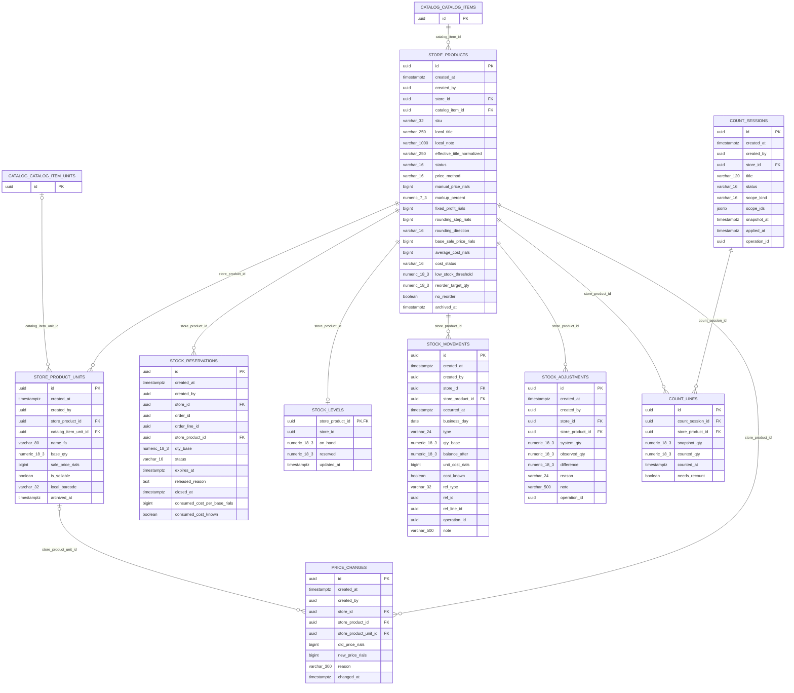

### `inventory.store_products` — StoreProduct · aggregate root (xmin), store-scoped

| Column | Type | Null | Note |
|---|---|---|---|
| `id` | uuid |  | **PK** |
| `created_at` | timestamptz |  |  |
| `created_by` | uuid | ✓ |  |
| `store_id` | uuid |  |  |
| `catalog_item_id` | uuid |  |  |
| `sku` | varchar(32) |  |  |
| `local_title` | varchar(250) | ✓ |  |
| `local_note` | varchar(1000) | ✓ |  |
| `effective_title_normalized` | varchar(250) |  |  |
| `status` | varchar(16) |  | enum StoreProductStatus |
| `price_method` | varchar(16) | ✓ | owned PriceRule.Method |
| `manual_price_rials` | bigint | ✓ | owned PriceRule.ManualPriceRials |
| `markup_percent` | numeric(7,3) | ✓ | owned PriceRule.MarkupPercent |
| `fixed_profit_rials` | bigint | ✓ | owned PriceRule.FixedProfitRials |
| `rounding_step_rials` | bigint | ✓ | owned PriceRule.RoundingStepRials |
| `rounding_direction` | varchar(16) | ✓ | owned PriceRule.RoundingDirection |
| `base_sale_price_rials` | bigint | ✓ |  |
| `average_cost_rials` | bigint | ✓ |  |
| `cost_status` | varchar(16) |  | enum CostStatus |
| `low_stock_threshold` | numeric(18,3) | ✓ |  |
| `reorder_target_qty` | numeric(18,3) | ✓ |  |
| `no_reorder` | boolean |  |  |
| `archived_at` | timestamptz | ✓ |  |

- FK `catalog_item_id` → `catalog.catalog_items.id` (restrict)
- FK `store_id` → `store.stores.id` (restrict)
- UNIQUE `(store_id, catalog_item_id)`
- UNIQUE `(store_id, sku)`
- UNIQUE `(store_id, effective_title_normalized)` WHERE status = 'Active'
- INDEX `(effective_title_normalized)` USING gin (trgm)

### `inventory.store_product_units` — StoreProductUnit

| Column | Type | Null | Note |
|---|---|---|---|
| `id` | uuid |  | **PK** |
| `created_at` | timestamptz |  |  |
| `created_by` | uuid | ✓ |  |
| `store_product_id` | uuid |  |  |
| `catalog_item_unit_id` | uuid | ✓ |  |
| `name_fa` | varchar(80) |  |  |
| `base_qty` | numeric(18,3) |  |  |
| `sale_price_rials` | bigint | ✓ |  |
| `is_sellable` | boolean |  |  |
| `local_barcode` | varchar(32) | ✓ |  |
| `archived_at` | timestamptz | ✓ |  |

- FK `store_product_id` → `inventory.store_products.id` (cascade)
- FK `catalog_item_unit_id` → `catalog.catalog_item_units.id` (restrict)
- UNIQUE `(store_product_id, catalog_item_unit_id)`
- INDEX `(local_barcode)` WHERE local_barcode IS NOT NULL

### `inventory.stock_reservations` — StockReservation · store-scoped

| Column | Type | Null | Note |
|---|---|---|---|
| `id` | uuid |  | **PK** |
| `created_at` | timestamptz |  |  |
| `created_by` | uuid | ✓ |  |
| `store_id` | uuid |  |  |
| `order_id` | uuid |  |  |
| `order_line_id` | uuid | ✓ |  |
| `store_product_id` | uuid |  |  |
| `qty_base` | numeric(18,3) |  |  |
| `status` | varchar(16) |  | enum ReservationStatus |
| `expires_at` | timestamptz |  |  |
| `released_reason` | text | ✓ |  |
| `closed_at` | timestamptz | ✓ |  |
| `consumed_cost_per_base_rials` | bigint | ✓ |  |
| `consumed_cost_known` | boolean |  |  |

- FK `store_product_id` → `inventory.store_products.id` (restrict)
- FK `store_id` → `store.stores.id` (restrict)
- INDEX `(store_id, order_id)`
- INDEX `(store_id, expires_at)` WHERE status = 'Active'
- INDEX `(store_product_id)` WHERE status = 'Active'
- CHECK `ck_stock_reservations_qty_positive`: `qty_base > 0`

### `inventory.stock_levels` — StockLevel

| Column | Type | Null | Note |
|---|---|---|---|
| `store_product_id` | uuid |  | **PK** |
| `store_id` | uuid |  |  |
| `on_hand` | numeric(18,3) |  |  |
| `reserved` | numeric(18,3) |  |  |
| `updated_at` | timestamptz |  |  |

- FK `store_product_id` → `inventory.store_products.id` (cascade) 1:1
- INDEX `(store_id, on_hand)`
- CHECK `ck_stock_levels_non_negative`: `on_hand >= 0 AND reserved >= 0 AND reserved <= on_hand`

### `inventory.stock_movements` — StockMovement · store-scoped

| Column | Type | Null | Note |
|---|---|---|---|
| `id` | uuid |  | **PK** |
| `created_at` | timestamptz |  |  |
| `created_by` | uuid | ✓ |  |
| `store_id` | uuid |  |  |
| `store_product_id` | uuid |  |  |
| `occurred_at` | timestamptz |  |  |
| `business_day` | date |  |  |
| `type` | varchar(24) |  | enum MovementType |
| `qty_base` | numeric(18,3) |  |  |
| `balance_after` | numeric(18,3) |  |  |
| `unit_cost_rials` | bigint | ✓ |  |
| `cost_known` | boolean |  |  |
| `ref_type` | varchar(32) |  |  |
| `ref_id` | uuid |  |  |
| `ref_line_id` | uuid | ✓ |  |
| `operation_id` | uuid | ✓ |  |
| `note` | varchar(500) | ✓ |  |

- FK `store_product_id` → `inventory.store_products.id` (restrict)
- FK `store_id` → `store.stores.id` (restrict)
- INDEX `(store_id, store_product_id, occurred_at)`
- INDEX `(store_id, business_day)`
- INDEX `(ref_type, ref_id)`

### `inventory.price_changes` — PriceChange · store-scoped

| Column | Type | Null | Note |
|---|---|---|---|
| `id` | uuid |  | **PK** |
| `created_at` | timestamptz |  |  |
| `created_by` | uuid | ✓ |  |
| `store_id` | uuid |  |  |
| `store_product_id` | uuid |  |  |
| `store_product_unit_id` | uuid | ✓ |  |
| `old_price_rials` | bigint | ✓ |  |
| `new_price_rials` | bigint |  |  |
| `reason` | varchar(300) | ✓ |  |
| `changed_at` | timestamptz |  |  |

- FK `store_product_id` → `inventory.store_products.id` (cascade)
- FK `store_product_unit_id` → `inventory.store_product_units.id` (restrict)
- FK `store_id` → `store.stores.id` (restrict)
- INDEX `(store_product_id, changed_at)`

### `inventory.stock_adjustments` — StockAdjustment · store-scoped

| Column | Type | Null | Note |
|---|---|---|---|
| `id` | uuid |  | **PK** |
| `created_at` | timestamptz |  |  |
| `created_by` | uuid | ✓ |  |
| `store_id` | uuid |  |  |
| `store_product_id` | uuid |  |  |
| `system_qty` | numeric(18,3) |  |  |
| `observed_qty` | numeric(18,3) |  |  |
| `difference` | numeric(18,3) |  |  |
| `reason` | varchar(24) |  | enum AdjustmentReason |
| `note` | varchar(500) | ✓ |  |
| `operation_id` | uuid | ✓ |  |

- FK `store_product_id` → `inventory.store_products.id` (restrict)
- FK `store_id` → `store.stores.id` (restrict)

### `inventory.count_sessions` — CountSession · aggregate root (xmin), store-scoped

| Column | Type | Null | Note |
|---|---|---|---|
| `id` | uuid |  | **PK** |
| `created_at` | timestamptz |  |  |
| `created_by` | uuid | ✓ |  |
| `store_id` | uuid |  |  |
| `title` | varchar(120) |  |  |
| `status` | varchar(16) |  | enum CountStatus |
| `scope_kind` | varchar(16) |  | enum CountScopeKind |
| `scope_ids` | jsonb |  |  |
| `snapshot_at` | timestamptz |  |  |
| `applied_at` | timestamptz | ✓ |  |
| `operation_id` | uuid | ✓ |  |

- FK `store_id` → `store.stores.id` (restrict)

### `inventory.count_lines` — CountLine

| Column | Type | Null | Note |
|---|---|---|---|
| `id` | uuid |  | **PK** |
| `count_session_id` | uuid |  |  |
| `store_product_id` | uuid |  |  |
| `snapshot_qty` | numeric(18,3) |  |  |
| `counted_qty` | numeric(18,3) | ✓ |  |
| `counted_at` | timestamptz | ✓ |  |
| `needs_recount` | boolean |  |  |

- FK `count_session_id` → `inventory.count_sessions.id` (cascade)
- FK `store_product_id` → `inventory.store_products.id` (restrict)
- UNIQUE `(count_session_id, store_product_id)`

## Schema `purchasing`

> In the diagram, `store_id → store.stores` edges of store-scoped tables are omitted; the FK exists on every one of them.

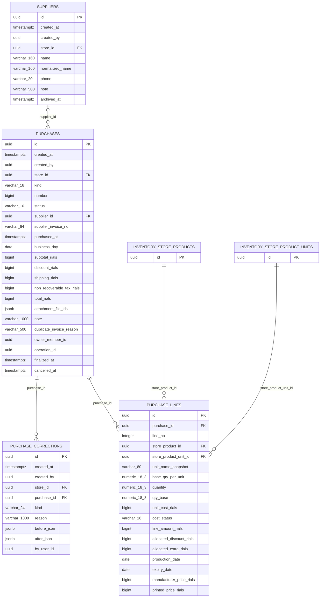

### `purchasing.suppliers` — Supplier · store-scoped

| Column | Type | Null | Note |
|---|---|---|---|
| `id` | uuid |  | **PK** |
| `created_at` | timestamptz |  |  |
| `created_by` | uuid | ✓ |  |
| `store_id` | uuid |  |  |
| `name` | varchar(160) |  |  |
| `normalized_name` | varchar(160) |  |  |
| `phone` | varchar(20) | ✓ |  |
| `note` | varchar(500) | ✓ |  |
| `archived_at` | timestamptz | ✓ |  |

- FK `store_id` → `store.stores.id` (restrict)
- INDEX `(store_id, name)`
- UNIQUE `(store_id, normalized_name)` WHERE archived_at IS NULL

### `purchasing.purchases` — Purchase · aggregate root (xmin), store-scoped

| Column | Type | Null | Note |
|---|---|---|---|
| `id` | uuid |  | **PK** |
| `created_at` | timestamptz |  |  |
| `created_by` | uuid | ✓ |  |
| `store_id` | uuid |  |  |
| `kind` | varchar(16) |  | enum PurchaseKind |
| `number` | bigint | ✓ |  |
| `status` | varchar(16) |  | enum PurchaseStatus |
| `supplier_id` | uuid | ✓ |  |
| `supplier_invoice_no` | varchar(64) | ✓ |  |
| `purchased_at` | timestamptz |  |  |
| `business_day` | date |  |  |
| `subtotal_rials` | bigint |  |  |
| `discount_rials` | bigint |  |  |
| `shipping_rials` | bigint |  |  |
| `non_recoverable_tax_rials` | bigint |  |  |
| `total_rials` | bigint |  |  |
| `attachment_file_ids` | jsonb |  |  |
| `note` | varchar(1000) | ✓ |  |
| `duplicate_invoice_reason` | varchar(500) | ✓ |  |
| `owner_member_id` | uuid | ✓ |  |
| `operation_id` | uuid | ✓ |  |
| `finalized_at` | timestamptz | ✓ |  |
| `cancelled_at` | timestamptz | ✓ |  |

- FK `supplier_id` → `purchasing.suppliers.id` (restrict)
- FK `store_id` → `store.stores.id` (restrict)
- UNIQUE `(store_id, number)` WHERE number IS NOT NULL
- INDEX `(store_id, business_day)`
- INDEX `(store_id, supplier_id, supplier_invoice_no)`
- UNIQUE `(store_id, operation_id)` WHERE operation_id IS NOT NULL

### `purchasing.purchase_lines` — PurchaseLine

| Column | Type | Null | Note |
|---|---|---|---|
| `id` | uuid |  | **PK** |
| `purchase_id` | uuid |  |  |
| `line_no` | integer |  |  |
| `store_product_id` | uuid |  |  |
| `store_product_unit_id` | uuid |  |  |
| `unit_name_snapshot` | varchar(80) |  |  |
| `base_qty_per_unit` | numeric(18,3) |  |  |
| `quantity` | numeric(18,3) |  |  |
| `qty_base` | numeric(18,3) |  |  |
| `unit_cost_rials` | bigint | ✓ |  |
| `cost_status` | varchar(16) |  | enum CostStatus |
| `line_amount_rials` | bigint |  |  |
| `allocated_discount_rials` | bigint |  |  |
| `allocated_extra_rials` | bigint |  |  |
| `production_date` | date | ✓ |  |
| `expiry_date` | date | ✓ |  |
| `manufacturer_price_rials` | bigint | ✓ |  |
| `printed_price_rials` | bigint | ✓ |  |

- FK `purchase_id` → `purchasing.purchases.id` (cascade)
- FK `store_product_id` → `inventory.store_products.id` (restrict)
- FK `store_product_unit_id` → `inventory.store_product_units.id` (restrict)
- INDEX `(store_product_id)`
- CHECK `ck_purchase_lines_dates`: `production_date IS NULL OR expiry_date IS NULL OR production_date <= expiry_date`

### `purchasing.purchase_corrections` — PurchaseCorrection · store-scoped

| Column | Type | Null | Note |
|---|---|---|---|
| `id` | uuid |  | **PK** |
| `created_at` | timestamptz |  |  |
| `created_by` | uuid | ✓ |  |
| `store_id` | uuid |  |  |
| `purchase_id` | uuid |  |  |
| `kind` | varchar(24) |  | enum PurchaseCorrectionKind |
| `reason` | varchar(1000) |  |  |
| `before_json` | jsonb | ✓ |  |
| `after_json` | jsonb | ✓ |  |
| `by_user_id` | uuid |  |  |

- FK `purchase_id` → `purchasing.purchases.id` (cascade)
- FK `store_id` → `store.stores.id` (restrict)

## Schema `crm`

> In the diagram, `store_id → store.stores` edges of store-scoped tables are omitted; the FK exists on every one of them.

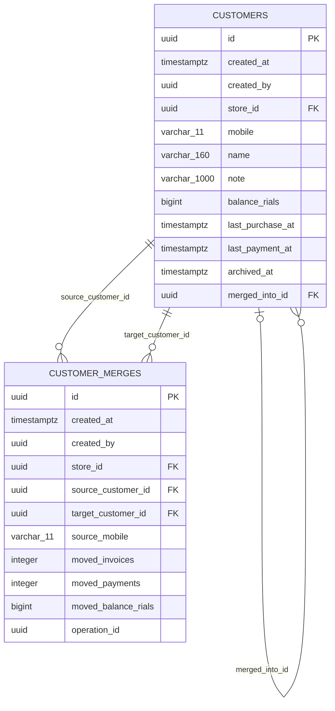

### `crm.customers` — Customer · aggregate root (xmin), store-scoped

| Column | Type | Null | Note |
|---|---|---|---|
| `id` | uuid |  | **PK** |
| `created_at` | timestamptz |  |  |
| `created_by` | uuid | ✓ |  |
| `store_id` | uuid |  |  |
| `mobile` | varchar(11) |  |  |
| `name` | varchar(160) | ✓ |  |
| `note` | varchar(1000) | ✓ |  |
| `balance_rials` | bigint |  |  |
| `last_purchase_at` | timestamptz | ✓ |  |
| `last_payment_at` | timestamptz | ✓ |  |
| `archived_at` | timestamptz | ✓ |  |
| `merged_into_id` | uuid | ✓ |  |

- FK `merged_into_id` → `crm.customers.id` (restrict)
- FK `store_id` → `store.stores.id` (restrict)
- UNIQUE `(store_id, mobile)` WHERE merged_into_id IS NULL
- INDEX `(store_id, balance_rials)` WHERE balance_rials > 0
- INDEX `(name)` USING gin (trgm)
- CHECK `ck_customers_balance_non_negative`: `balance_rials >= 0`

### `crm.customer_merges` — CustomerMerge · store-scoped

| Column | Type | Null | Note |
|---|---|---|---|
| `id` | uuid |  | **PK** |
| `created_at` | timestamptz |  |  |
| `created_by` | uuid | ✓ |  |
| `store_id` | uuid |  |  |
| `source_customer_id` | uuid |  |  |
| `target_customer_id` | uuid |  |  |
| `source_mobile` | varchar(11) |  |  |
| `moved_invoices` | integer |  |  |
| `moved_payments` | integer |  |  |
| `moved_balance_rials` | bigint |  |  |
| `operation_id` | uuid | ✓ |  |

- FK `source_customer_id` → `crm.customers.id` (restrict)
- FK `target_customer_id` → `crm.customers.id` (restrict)
- FK `store_id` → `store.stores.id` (restrict)

## Schema `sales`

> In the diagram, `store_id → store.stores` edges of store-scoped tables are omitted; the FK exists on every one of them.

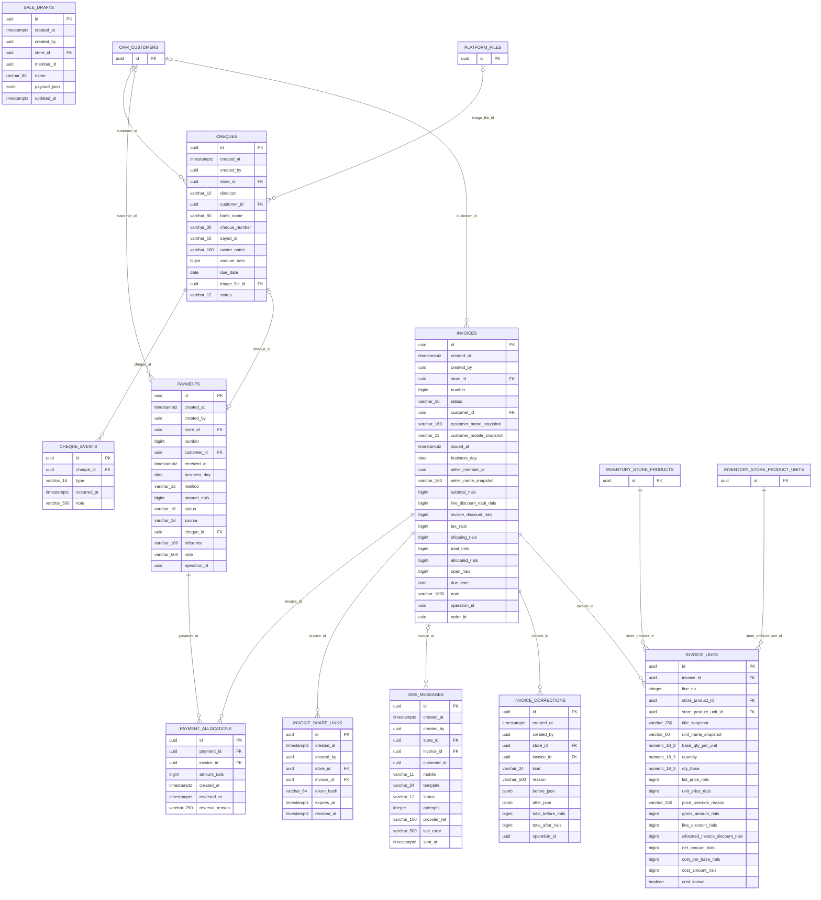

### `sales.invoices` — Invoice · aggregate root (xmin), store-scoped

| Column | Type | Null | Note |
|---|---|---|---|
| `id` | uuid |  | **PK** |
| `created_at` | timestamptz |  |  |
| `created_by` | uuid | ✓ |  |
| `store_id` | uuid |  |  |
| `number` | bigint |  |  |
| `status` | varchar(16) |  | enum InvoiceStatus |
| `customer_id` | uuid | ✓ |  |
| `customer_name_snapshot` | varchar(160) | ✓ |  |
| `customer_mobile_snapshot` | varchar(11) | ✓ |  |
| `issued_at` | timestamptz |  |  |
| `business_day` | date |  |  |
| `seller_member_id` | uuid |  |  |
| `seller_name_snapshot` | varchar(160) | ✓ |  |
| `subtotal_rials` | bigint |  |  |
| `line_discount_total_rials` | bigint |  |  |
| `invoice_discount_rials` | bigint |  |  |
| `tax_rials` | bigint |  |  |
| `shipping_rials` | bigint |  |  |
| `total_rials` | bigint |  |  |
| `allocated_rials` | bigint |  |  |
| `open_rials` | bigint |  |  |
| `due_date` | date | ✓ |  |
| `note` | varchar(1000) | ✓ |  |
| `operation_id` | uuid |  |  |
| `order_id` | uuid | ✓ |  |

- FK `customer_id` → `crm.customers.id` (restrict)
- FK `store_id` → `store.stores.id` (restrict)
- UNIQUE `(store_id, number)`
- UNIQUE `(store_id, operation_id)`
- UNIQUE `(store_id, order_id)` WHERE order_id IS NOT NULL
- INDEX `(store_id, business_day)`
- INDEX `(store_id, customer_id, issued_at)`
- CHECK `ck_invoices_amounts`: `total_rials >= 0 AND allocated_rials >= 0 AND open_rials >= 0 AND (status = 'Voided' OR allocated_rials + open_rials = total_rials)`
- CHECK `ck_invoices_credit_needs_customer`: `open_rials = 0 OR customer_id IS NOT NULL`

### `sales.invoice_lines` — InvoiceLine

| Column | Type | Null | Note |
|---|---|---|---|
| `id` | uuid |  | **PK** |
| `invoice_id` | uuid |  |  |
| `line_no` | integer |  |  |
| `store_product_id` | uuid |  |  |
| `store_product_unit_id` | uuid |  |  |
| `title_snapshot` | varchar(250) |  |  |
| `unit_name_snapshot` | varchar(60) |  |  |
| `base_qty_per_unit` | numeric(18,3) |  |  |
| `quantity` | numeric(18,3) |  |  |
| `qty_base` | numeric(18,3) |  |  |
| `list_price_rials` | bigint |  |  |
| `unit_price_rials` | bigint |  |  |
| `price_override_reason` | varchar(250) | ✓ |  |
| `gross_amount_rials` | bigint |  |  |
| `line_discount_rials` | bigint |  |  |
| `allocated_invoice_discount_rials` | bigint |  |  |
| `net_amount_rials` | bigint |  |  |
| `cost_per_base_rials` | bigint | ✓ |  |
| `cost_amount_rials` | bigint | ✓ |  |
| `cost_known` | boolean |  |  |

- FK `invoice_id` → `sales.invoices.id` (cascade)
- FK `store_product_id` → `inventory.store_products.id` (restrict)
- FK `store_product_unit_id` → `inventory.store_product_units.id` (restrict)
- UNIQUE `(invoice_id, line_no)`
- INDEX `(store_product_id)`
- CHECK `ck_invoice_lines_qty`: `quantity > 0 AND qty_base > 0`

### `sales.invoice_corrections` — InvoiceCorrection · store-scoped

| Column | Type | Null | Note |
|---|---|---|---|
| `id` | uuid |  | **PK** |
| `created_at` | timestamptz |  |  |
| `created_by` | uuid | ✓ |  |
| `store_id` | uuid |  |  |
| `invoice_id` | uuid |  |  |
| `kind` | varchar(24) |  | enum InvoiceCorrectionKind |
| `reason` | varchar(500) |  |  |
| `before_json` | jsonb |  |  |
| `after_json` | jsonb |  |  |
| `total_before_rials` | bigint |  |  |
| `total_after_rials` | bigint |  |  |
| `operation_id` | uuid |  |  |

- FK `invoice_id` → `sales.invoices.id` (restrict)
- FK `store_id` → `store.stores.id` (restrict)
- UNIQUE `(store_id, operation_id)`

### `sales.sale_drafts` — SaleDraft · aggregate root (xmin), store-scoped

| Column | Type | Null | Note |
|---|---|---|---|
| `id` | uuid |  | **PK** |
| `created_at` | timestamptz |  |  |
| `created_by` | uuid | ✓ |  |
| `store_id` | uuid |  |  |
| `member_id` | uuid |  |  |
| `name` | varchar(80) | ✓ |  |
| `payload_json` | jsonb |  |  |
| `updated_at` | timestamptz |  |  |

- FK `store_id` → `store.stores.id` (restrict)
- INDEX `(store_id, updated_at)`

### `sales.sms_messages` — SmsMessage · store-scoped

| Column | Type | Null | Note |
|---|---|---|---|
| `id` | uuid |  | **PK** |
| `created_at` | timestamptz |  |  |
| `created_by` | uuid | ✓ |  |
| `store_id` | uuid |  |  |
| `invoice_id` | uuid | ✓ |  |
| `customer_id` | uuid | ✓ |  |
| `mobile` | varchar(11) |  |  |
| `template` | varchar(24) |  | enum SmsTemplate |
| `status` | varchar(12) |  | enum SmsStatus |
| `attempts` | integer |  |  |
| `provider_ref` | varchar(100) | ✓ |  |
| `last_error` | varchar(500) | ✓ |  |
| `sent_at` | timestamptz | ✓ |  |

- FK `invoice_id` → `sales.invoices.id` (restrict)
- FK `store_id` → `store.stores.id` (restrict)
- INDEX `(status)` WHERE status = 'Queued'

### `sales.invoice_share_links` — InvoiceShareLink · store-scoped

| Column | Type | Null | Note |
|---|---|---|---|
| `id` | uuid |  | **PK** |
| `created_at` | timestamptz |  |  |
| `created_by` | uuid | ✓ |  |
| `store_id` | uuid |  |  |
| `invoice_id` | uuid |  |  |
| `token_hash` | varchar(64) |  |  |
| `expires_at` | timestamptz |  |  |
| `revoked_at` | timestamptz | ✓ |  |

- FK `invoice_id` → `sales.invoices.id` (cascade)
- FK `store_id` → `store.stores.id` (restrict)
- UNIQUE `(token_hash)`

### `sales.payments` — Payment · aggregate root (xmin), store-scoped

| Column | Type | Null | Note |
|---|---|---|---|
| `id` | uuid |  | **PK** |
| `created_at` | timestamptz |  |  |
| `created_by` | uuid | ✓ |  |
| `store_id` | uuid |  |  |
| `number` | bigint | ✓ |  |
| `customer_id` | uuid | ✓ |  |
| `received_at` | timestamptz |  |  |
| `business_day` | date |  |  |
| `method` | varchar(16) |  | enum PaymentMethod |
| `amount_rials` | bigint |  |  |
| `status` | varchar(16) |  | enum PaymentStatus |
| `source` | varchar(16) |  | enum PaymentSource |
| `cheque_id` | uuid | ✓ |  |
| `reference` | varchar(100) | ✓ |  |
| `note` | varchar(500) | ✓ |  |
| `operation_id` | uuid | ✓ |  |

- FK `cheque_id` → `sales.cheques.id` (restrict) 1:1
- FK `customer_id` → `crm.customers.id` (restrict)
- FK `store_id` → `store.stores.id` (restrict)
- INDEX `(store_id, business_day)`
- INDEX `(store_id, customer_id, received_at)`
- UNIQUE `(store_id, number)`
- CHECK `ck_payments_amount_positive`: `amount_rials > 0`

### `sales.payment_allocations` — PaymentAllocation

| Column | Type | Null | Note |
|---|---|---|---|
| `id` | uuid |  | **PK** |
| `payment_id` | uuid |  |  |
| `invoice_id` | uuid |  |  |
| `amount_rials` | bigint |  |  |
| `created_at` | timestamptz |  |  |
| `reversed_at` | timestamptz | ✓ |  |
| `reversal_reason` | varchar(250) | ✓ |  |

- FK `payment_id` → `sales.payments.id` (cascade)
- FK `invoice_id` → `sales.invoices.id` (restrict)
- INDEX `(invoice_id)` WHERE reversed_at IS NULL
- CHECK `ck_allocations_amount_positive`: `amount_rials > 0`

### `sales.cheques` — Cheque · aggregate root (xmin), store-scoped

| Column | Type | Null | Note |
|---|---|---|---|
| `id` | uuid |  | **PK** |
| `created_at` | timestamptz |  |  |
| `created_by` | uuid | ✓ |  |
| `store_id` | uuid |  |  |
| `direction` | varchar(10) |  | enum ChequeDirection |
| `customer_id` | uuid | ✓ |  |
| `bank_name` | varchar(80) |  |  |
| `cheque_number` | varchar(30) |  |  |
| `sayad_id` | varchar(16) | ✓ |  |
| `owner_name` | varchar(160) | ✓ |  |
| `amount_rials` | bigint |  |  |
| `due_date` | date |  |  |
| `image_file_id` | uuid | ✓ |  |
| `status` | varchar(12) |  | enum ChequeStatus |

- FK `customer_id` → `crm.customers.id` (restrict)
- FK `image_file_id` → `platform.files.id` (setnull)
- FK `store_id` → `store.stores.id` (restrict)
- INDEX `(store_id, status, due_date)`
- UNIQUE `(store_id, sayad_id)` WHERE sayad_id IS NOT NULL
- CHECK `ck_cheques_amount_positive`: `amount_rials > 0`

### `sales.cheque_events` — ChequeEvent

| Column | Type | Null | Note |
|---|---|---|---|
| `id` | uuid |  | **PK** |
| `cheque_id` | uuid |  |  |
| `type` | varchar(16) |  | enum ChequeEventType |
| `occurred_at` | timestamptz |  |  |
| `note` | varchar(500) | ✓ |  |

- FK `cheque_id` → `sales.cheques.id` (cascade)

## Schema `ordering`

> In the diagram, `store_id → store.stores` edges of store-scoped tables are omitted; the FK exists on every one of them.

```mermaid
erDiagram
    STOREFRONT_SETTINGS {
        uuid id PK
        timestamptz created_at
        uuid created_by
        uuid store_id FK
        varchar_8 public_code
        boolean enabled
        boolean accepting_orders
        boolean in_store_enabled
        boolean pickup_enabled
        boolean local_delivery_enabled
        boolean shipping_enabled
        bigint min_order_rials
        bigint local_delivery_fee_rials
        bigint free_delivery_above_rials
        varchar_500 delivery_area_note
        bigint shipping_fee_rials
        varchar_500 shipping_note
        integer preparation_minutes
        boolean accept_cash
        boolean accept_pos
        boolean accept_card_transfer
        boolean accept_cheque
        varchar_16 card_number
        varchar_26 sheba
        varchar_120 card_holder_name
        varchar_12 deposit_policy
        numeric_5_2 deposit_percent
        bigint deposit_fixed_rials
        integer reservation_hold_hours
        integer pickup_grace_hours
        integer revision_reply_timeout_hours
        timestamptz updated_at
    }
    SLOT_TEMPLATES {
        uuid id PK
        timestamptz created_at
        uuid created_by
        uuid store_id FK
        varchar_16 method
        varchar_10 day
        time start_time
        time end_time
        integer capacity
        boolean is_active
    }
    FULFILLMENT_SLOTS {
        uuid id PK
        timestamptz created_at
        uuid created_by
        uuid store_id FK
        uuid template_id FK
        varchar_16 method
        date date
        time start_time
        time end_time
        integer capacity
        integer booked_count
    }
    CUSTOMER_ADDRESSES {
        uuid id PK
        timestamptz created_at
        uuid created_by
        uuid user_id
        varchar_60 title
        varchar_160 recipient_name
        varchar_11 phone
        varchar_64 province
        varchar_64 city
        varchar_400 address_line
        varchar_20 plaque
        varchar_20 unit_no
        varchar_10 postal_code
        double_precision latitude
        double_precision longitude
        boolean is_default
        timestamptz updated_at
    }
    CARTS {
        uuid id PK
        timestamptz created_at
        uuid created_by
        uuid store_id FK
        uuid user_id
        timestamptz updated_at
    }
    CART_LINES {
        uuid id PK
        uuid cart_id FK
        uuid store_product_unit_id FK
        numeric_18_3 quantity
        boolean allow_substitute
        varchar_250 note
        bigint price_seen_rials
        timestamptz added_at
        timestamptz updated_at
    }
    ORDERS {
        uuid id PK
        timestamptz created_at
        uuid created_by
        uuid store_id FK
        bigint number
        varchar_16 method
        varchar_20 status
        uuid customer_user_id
        uuid customer_id FK
        varchar_11 customer_mobile
        varchar_160 customer_name
        varchar_60 address_title
        varchar_160 address_recipient_name
        varchar_11 address_phone
        varchar_64 address_province
        varchar_64 address_city
        varchar_400 address_line
        varchar_20 address_plaque
        varchar_20 address_unit_no
        varchar_10 address_postal_code
        double_precision address_latitude
        double_precision address_longitude
        varchar_1000 customer_note
        integer accepted_version_no
        integer item_count
        bigint subtotal_rials
        bigint delivery_fee_rials
        bigint total_rials
        integer proposed_version_no
        bigint proposed_subtotal_rials
        bigint proposed_delivery_fee_rials
        timestamptz proposed_scheduled_start
        timestamptz proposed_scheduled_end
        varchar_1000 revision_note
        timestamptz revision_proposed_at
        timestamptz revision_expires_at
        varchar_16 payment_method
        varchar_12 payment_plan
        bigint advance_due_rials
        bigint paid_rials
        bigint pending_review_rials
        bigint refund_obligation_rials
        uuid slot_id FK
        timestamptz scheduled_start
        timestamptz scheduled_end
        boolean reservation_active
        timestamptz reservation_expires_at
        varchar_6 pickup_code
        varchar_120 courier_name
        varchar_20 courier_phone
        varchar_80 carrier
        varchar_80 tracking_code
        timestamptz shipped_at
        timestamptz delivered_at
        varchar_160 delivered_to_name
        varchar_100 delivery_reference
        uuid invoice_id FK
        bigint invoice_number
        varchar_500 cancel_reason
        varchar_10 cancelled_by
        varchar_500 reject_reason
        timestamptz confirmed_at
        timestamptz last_status_at
    }
    ORDER_LINES {
        uuid id PK
        uuid order_id FK
        integer version_no
        integer line_no
        uuid store_product_id FK
        uuid store_product_unit_id FK
        varchar_250 title_snapshot
        varchar_80 unit_name_snapshot
        numeric_18_3 base_qty_per_unit
        numeric_18_3 quantity
        bigint unit_price_rials
        bigint line_total_rials
        boolean allow_substitute
        varchar_250 customer_note
        varchar_16 decision
        uuid previous_line_id
        numeric_18_3 previous_quantity
        bigint previous_unit_price_rials
        varchar_250 seller_note
    }
    ORDER_EVENTS {
        uuid id PK
        uuid order_id FK
        varchar_24 kind
        varchar_20 from_status
        varchar_20 to_status
        varchar_10 actor
        uuid actor_user_id
        varchar_1000 note
        timestamptz occurred_at
    }
    ORDER_PAYMENTS {
        uuid id PK
        timestamptz created_at
        uuid created_by
        uuid store_id FK
        uuid order_id FK
        varchar_16 method
        varchar_10 kind
        bigint amount_rials
        varchar_16 status
        varchar_10 submitted_by
        varchar_100 reference
        varchar_100 reference_normalized
        uuid receipt_file_id FK
        varchar_64 receipt_sha256
        timestamptz transferred_at
        varchar_4 payer_card_last4
        varchar_80 cheque_bank_name
        varchar_30 cheque_number
        varchar_16 cheque_sayad_id
        varchar_160 cheque_owner_name
        date cheque_due_date
        varchar_500 note
        timestamptz confirmed_at
        timestamptz reviewed_at
        uuid reviewed_by_user_id
        varchar_500 reject_reason
        uuid operation_id
    }
    ORDER_REFUNDS {
        uuid id PK
        timestamptz created_at
        uuid created_by
        uuid store_id FK
        uuid order_id FK
        bigint amount_rials
        varchar_12 reason
        varchar_12 status
        varchar_16 method
        varchar_100 reference
        uuid responsible_user_id
        varchar_160 responsible_name
        timestamptz paid_at
        varchar_500 failure_reason
        varchar_500 note
        timestamptz updated_at
    }
    ORDER_NOTIFICATIONS {
        uuid id PK
        timestamptz created_at
        uuid created_by
        uuid store_id FK
        uuid event_id
        uuid order_id
        varchar_11 mobile
        varchar_40 template
        boolean success
        varchar_100 provider_message_id
        varchar_500 error
        timestamptz sent_at
    }
    CRM_CUSTOMERS {
        uuid id PK
    }
    SALES_INVOICES {
        uuid id PK
    }
    INVENTORY_STORE_PRODUCTS {
        uuid id PK
    }
    INVENTORY_STORE_PRODUCT_UNITS {
        uuid id PK
    }
    PLATFORM_FILES {
        uuid id PK
    }
    SLOT_TEMPLATES |o--o{ FULFILLMENT_SLOTS : "template_id"
    CARTS ||--o{ CART_LINES : "cart_id"
    INVENTORY_STORE_PRODUCT_UNITS ||--o{ CART_LINES : "store_product_unit_id"
    CRM_CUSTOMERS ||--o{ ORDERS : "customer_id"
    SALES_INVOICES |o--o{ ORDERS : "invoice_id"
    FULFILLMENT_SLOTS |o--o{ ORDERS : "slot_id"
    ORDERS ||--o{ ORDER_LINES : "order_id"
    INVENTORY_STORE_PRODUCTS ||--o{ ORDER_LINES : "store_product_id"
    INVENTORY_STORE_PRODUCT_UNITS ||--o{ ORDER_LINES : "store_product_unit_id"
    ORDERS ||--o{ ORDER_EVENTS : "order_id"
    ORDERS ||--o{ ORDER_PAYMENTS : "order_id"
    PLATFORM_FILES |o--o{ ORDER_PAYMENTS : "receipt_file_id"
    ORDERS ||--o{ ORDER_REFUNDS : "order_id"
```

### `ordering.storefront_settings` — StorefrontSettings · aggregate root (xmin), store-scoped

| Column | Type | Null | Note |
|---|---|---|---|
| `id` | uuid |  | **PK** |
| `created_at` | timestamptz |  |  |
| `created_by` | uuid | ✓ |  |
| `store_id` | uuid |  |  |
| `public_code` | varchar(8) |  |  |
| `enabled` | boolean |  |  |
| `accepting_orders` | boolean |  |  |
| `in_store_enabled` | boolean |  |  |
| `pickup_enabled` | boolean |  |  |
| `local_delivery_enabled` | boolean |  |  |
| `shipping_enabled` | boolean |  |  |
| `min_order_rials` | bigint |  |  |
| `local_delivery_fee_rials` | bigint | ✓ |  |
| `free_delivery_above_rials` | bigint | ✓ |  |
| `delivery_area_note` | varchar(500) | ✓ |  |
| `shipping_fee_rials` | bigint | ✓ |  |
| `shipping_note` | varchar(500) | ✓ |  |
| `preparation_minutes` | integer | ✓ |  |
| `accept_cash` | boolean |  |  |
| `accept_pos` | boolean |  |  |
| `accept_card_transfer` | boolean |  |  |
| `accept_cheque` | boolean |  |  |
| `card_number` | varchar(16) | ✓ |  |
| `sheba` | varchar(26) | ✓ |  |
| `card_holder_name` | varchar(120) | ✓ |  |
| `deposit_policy` | varchar(12) |  | enum DepositPolicyKind |
| `deposit_percent` | numeric(5,2) | ✓ |  |
| `deposit_fixed_rials` | bigint | ✓ |  |
| `reservation_hold_hours` | integer |  |  |
| `pickup_grace_hours` | integer |  |  |
| `revision_reply_timeout_hours` | integer |  |  |
| `updated_at` | timestamptz |  |  |

- FK `store_id` → `store.stores.id` (restrict)
- UNIQUE `(store_id)`
- UNIQUE `(public_code)`
- CHECK `ck_storefront_settings_amounts`: `min_order_rials >= 0 AND (local_delivery_fee_rials IS NULL OR local_delivery_fee_rials >= 0) AND (free_delivery_above_rials IS NULL OR free_delivery_above_rials >= 0) AND (shipping_fee_rials IS NULL OR shipping_fee_rials >= 0)`
- CHECK `ck_storefront_settings_hours`: `reservation_hold_hours > 0 AND pickup_grace_hours >= 0 AND revision_reply_timeout_hours > 0`

### `ordering.slot_templates` — SlotTemplate · store-scoped

| Column | Type | Null | Note |
|---|---|---|---|
| `id` | uuid |  | **PK** |
| `created_at` | timestamptz |  |  |
| `created_by` | uuid | ✓ |  |
| `store_id` | uuid |  |  |
| `method` | varchar(16) |  | enum FulfillmentMethod |
| `day` | varchar(10) |  | enum DayOfWeek |
| `start_time` | time |  |  |
| `end_time` | time |  |  |
| `capacity` | integer |  |  |
| `is_active` | boolean |  |  |

- FK `store_id` → `store.stores.id` (restrict)
- INDEX `(store_id, method, day)`
- CHECK `ck_slot_templates_window`: `end_time > start_time AND capacity > 0`

### `ordering.fulfillment_slots` — FulfillmentSlot · store-scoped

| Column | Type | Null | Note |
|---|---|---|---|
| `id` | uuid |  | **PK** |
| `created_at` | timestamptz |  |  |
| `created_by` | uuid | ✓ |  |
| `store_id` | uuid |  |  |
| `template_id` | uuid | ✓ |  |
| `method` | varchar(16) |  | enum FulfillmentMethod |
| `date` | date |  |  |
| `start_time` | time |  |  |
| `end_time` | time |  |  |
| `capacity` | integer |  |  |
| `booked_count` | integer |  |  |

- FK `template_id` → `ordering.slot_templates.id` (setnull)
- FK `store_id` → `store.stores.id` (restrict)
- UNIQUE `(store_id, method, date, start_time)`
- CHECK `ck_fulfillment_slots_capacity`: `booked_count >= 0 AND booked_count <= capacity AND end_time > start_time`

### `ordering.customer_addresses` — CustomerAddress · aggregate root (xmin)

| Column | Type | Null | Note |
|---|---|---|---|
| `id` | uuid |  | **PK** |
| `created_at` | timestamptz |  |  |
| `created_by` | uuid | ✓ |  |
| `user_id` | uuid |  |  |
| `title` | varchar(60) | ✓ |  |
| `recipient_name` | varchar(160) |  |  |
| `phone` | varchar(11) |  |  |
| `province` | varchar(64) |  |  |
| `city` | varchar(64) |  |  |
| `address_line` | varchar(400) |  |  |
| `plaque` | varchar(20) | ✓ |  |
| `unit_no` | varchar(20) | ✓ |  |
| `postal_code` | varchar(10) | ✓ |  |
| `latitude` | double precision | ✓ |  |
| `longitude` | double precision | ✓ |  |
| `is_default` | boolean |  |  |
| `updated_at` | timestamptz |  |  |

- INDEX `(user_id, created_at)`
- CHECK `ck_customer_addresses_location`: `(latitude IS NULL OR (latitude BETWEEN -90 AND 90)) AND (longitude IS NULL OR (longitude BETWEEN -180 AND 180))`

### `ordering.carts` — ShopCart · aggregate root (xmin), store-scoped

| Column | Type | Null | Note |
|---|---|---|---|
| `id` | uuid |  | **PK** |
| `created_at` | timestamptz |  |  |
| `created_by` | uuid | ✓ |  |
| `store_id` | uuid |  |  |
| `user_id` | uuid |  |  |
| `updated_at` | timestamptz |  |  |

- FK `store_id` → `store.stores.id` (restrict)
- UNIQUE `(store_id, user_id)`

### `ordering.cart_lines` — ShopCartLine

| Column | Type | Null | Note |
|---|---|---|---|
| `id` | uuid |  | **PK** |
| `cart_id` | uuid |  |  |
| `store_product_unit_id` | uuid |  |  |
| `quantity` | numeric(18,3) |  |  |
| `allow_substitute` | boolean |  |  |
| `note` | varchar(250) | ✓ |  |
| `price_seen_rials` | bigint | ✓ |  |
| `added_at` | timestamptz |  |  |
| `updated_at` | timestamptz |  |  |

- FK `cart_id` → `ordering.carts.id` (cascade)
- FK `store_product_unit_id` → `inventory.store_product_units.id` (cascade)
- UNIQUE `(cart_id, store_product_unit_id)`
- CHECK `ck_cart_lines_qty`: `quantity > 0`

### `ordering.orders` — Order · aggregate root (xmin), store-scoped

| Column | Type | Null | Note |
|---|---|---|---|
| `id` | uuid |  | **PK** |
| `created_at` | timestamptz |  |  |
| `created_by` | uuid | ✓ |  |
| `store_id` | uuid |  |  |
| `number` | bigint |  |  |
| `method` | varchar(16) |  | enum FulfillmentMethod |
| `status` | varchar(20) |  | enum OrderStatus |
| `customer_user_id` | uuid |  |  |
| `customer_id` | uuid |  |  |
| `customer_mobile` | varchar(11) |  |  |
| `customer_name` | varchar(160) | ✓ |  |
| `address_title` | varchar(60) | ✓ | owned OrderAddress.Title |
| `address_recipient_name` | varchar(160) | ✓ | owned OrderAddress.RecipientName |
| `address_phone` | varchar(11) | ✓ | owned OrderAddress.Phone |
| `address_province` | varchar(64) | ✓ | owned OrderAddress.Province |
| `address_city` | varchar(64) | ✓ | owned OrderAddress.City |
| `address_line` | varchar(400) | ✓ | owned OrderAddress.AddressLine |
| `address_plaque` | varchar(20) | ✓ | owned OrderAddress.Plaque |
| `address_unit_no` | varchar(20) | ✓ | owned OrderAddress.UnitNo |
| `address_postal_code` | varchar(10) | ✓ | owned OrderAddress.PostalCode |
| `address_latitude` | double precision | ✓ | owned OrderAddress.Latitude |
| `address_longitude` | double precision | ✓ | owned OrderAddress.Longitude |
| `customer_note` | varchar(1000) | ✓ |  |
| `accepted_version_no` | integer |  |  |
| `item_count` | integer |  |  |
| `subtotal_rials` | bigint |  |  |
| `delivery_fee_rials` | bigint |  |  |
| `total_rials` | bigint |  |  |
| `proposed_version_no` | integer | ✓ |  |
| `proposed_subtotal_rials` | bigint | ✓ |  |
| `proposed_delivery_fee_rials` | bigint | ✓ |  |
| `proposed_scheduled_start` | timestamptz | ✓ |  |
| `proposed_scheduled_end` | timestamptz | ✓ |  |
| `revision_note` | varchar(1000) | ✓ |  |
| `revision_proposed_at` | timestamptz | ✓ |  |
| `revision_expires_at` | timestamptz | ✓ |  |
| `payment_method` | varchar(16) |  | enum OrderPaymentMethod |
| `payment_plan` | varchar(12) |  | enum OrderPaymentPlan |
| `advance_due_rials` | bigint |  |  |
| `paid_rials` | bigint |  |  |
| `pending_review_rials` | bigint |  |  |
| `refund_obligation_rials` | bigint |  |  |
| `slot_id` | uuid | ✓ |  |
| `scheduled_start` | timestamptz | ✓ |  |
| `scheduled_end` | timestamptz | ✓ |  |
| `reservation_active` | boolean |  |  |
| `reservation_expires_at` | timestamptz | ✓ |  |
| `pickup_code` | varchar(6) | ✓ |  |
| `courier_name` | varchar(120) | ✓ |  |
| `courier_phone` | varchar(20) | ✓ |  |
| `carrier` | varchar(80) | ✓ |  |
| `tracking_code` | varchar(80) | ✓ |  |
| `shipped_at` | timestamptz | ✓ |  |
| `delivered_at` | timestamptz | ✓ |  |
| `delivered_to_name` | varchar(160) | ✓ |  |
| `delivery_reference` | varchar(100) | ✓ |  |
| `invoice_id` | uuid | ✓ |  |
| `invoice_number` | bigint | ✓ |  |
| `cancel_reason` | varchar(500) | ✓ |  |
| `cancelled_by` | varchar(10) | ✓ | enum OrderActor |
| `reject_reason` | varchar(500) | ✓ |  |
| `confirmed_at` | timestamptz | ✓ |  |
| `last_status_at` | timestamptz |  |  |

- FK `customer_id` → `crm.customers.id` (restrict)
- FK `invoice_id` → `sales.invoices.id` (restrict)
- FK `slot_id` → `ordering.fulfillment_slots.id` (setnull)
- FK `store_id` → `store.stores.id` (restrict)
- UNIQUE `(store_id, number)`
- INDEX `(store_id, status, created_at)`
- INDEX `(customer_user_id, created_at)`
- UNIQUE `(invoice_id)` WHERE invoice_id IS NOT NULL
- INDEX `(reservation_expires_at)` WHERE reservation_active
- INDEX `(revision_expires_at)` WHERE status = 'AwaitingCustomer'
- CHECK `ck_orders_amounts`: `subtotal_rials >= 0 AND delivery_fee_rials >= 0 AND total_rials = subtotal_rials + delivery_fee_rials AND advance_due_rials >= 0 AND paid_rials >= 0 AND pending_review_rials >= 0 AND refund_obligation_rials >= 0 AND refund_obligation_rials <= paid_rials`

### `ordering.order_lines` — OrderLine

| Column | Type | Null | Note |
|---|---|---|---|
| `id` | uuid |  | **PK** |
| `order_id` | uuid |  |  |
| `version_no` | integer |  |  |
| `line_no` | integer |  |  |
| `store_product_id` | uuid |  |  |
| `store_product_unit_id` | uuid |  |  |
| `title_snapshot` | varchar(250) |  |  |
| `unit_name_snapshot` | varchar(80) |  |  |
| `base_qty_per_unit` | numeric(18,3) |  |  |
| `quantity` | numeric(18,3) |  |  |
| `unit_price_rials` | bigint |  |  |
| `line_total_rials` | bigint |  |  |
| `allow_substitute` | boolean |  |  |
| `customer_note` | varchar(250) | ✓ |  |
| `decision` | varchar(16) |  | enum OrderLineDecision |
| `previous_line_id` | uuid | ✓ |  |
| `previous_quantity` | numeric(18,3) | ✓ |  |
| `previous_unit_price_rials` | bigint | ✓ |  |
| `seller_note` | varchar(250) | ✓ |  |

- FK `order_id` → `ordering.orders.id` (cascade)
- FK `store_product_id` → `inventory.store_products.id` (restrict)
- FK `store_product_unit_id` → `inventory.store_product_units.id` (restrict)
- UNIQUE `(order_id, version_no, line_no)`
- CHECK `ck_order_lines_amounts`: `quantity > 0 AND unit_price_rials >= 0 AND line_total_rials >= 0 AND base_qty_per_unit > 0`

### `ordering.order_events` — OrderEvent

| Column | Type | Null | Note |
|---|---|---|---|
| `id` | uuid |  | **PK** |
| `order_id` | uuid |  |  |
| `kind` | varchar(24) |  | enum OrderEventKind |
| `from_status` | varchar(20) | ✓ | enum OrderStatus |
| `to_status` | varchar(20) | ✓ | enum OrderStatus |
| `actor` | varchar(10) |  | enum OrderActor |
| `actor_user_id` | uuid | ✓ |  |
| `note` | varchar(1000) | ✓ |  |
| `occurred_at` | timestamptz |  |  |

- FK `order_id` → `ordering.orders.id` (cascade)
- INDEX `(order_id, occurred_at)`

### `ordering.order_payments` — OrderPayment · aggregate root (xmin), store-scoped

| Column | Type | Null | Note |
|---|---|---|---|
| `id` | uuid |  | **PK** |
| `created_at` | timestamptz |  |  |
| `created_by` | uuid | ✓ |  |
| `store_id` | uuid |  |  |
| `order_id` | uuid |  |  |
| `method` | varchar(16) |  | enum OrderPaymentMethod |
| `kind` | varchar(10) |  | enum OrderPaymentKind |
| `amount_rials` | bigint |  |  |
| `status` | varchar(16) |  | enum OrderPaymentStatus |
| `submitted_by` | varchar(10) |  | enum OrderActor |
| `reference` | varchar(100) | ✓ |  |
| `reference_normalized` | varchar(100) | ✓ |  |
| `receipt_file_id` | uuid | ✓ |  |
| `receipt_sha256` | varchar(64) | ✓ |  |
| `transferred_at` | timestamptz | ✓ |  |
| `payer_card_last4` | varchar(4) | ✓ |  |
| `cheque_bank_name` | varchar(80) | ✓ |  |
| `cheque_number` | varchar(30) | ✓ |  |
| `cheque_sayad_id` | varchar(16) | ✓ |  |
| `cheque_owner_name` | varchar(160) | ✓ |  |
| `cheque_due_date` | date | ✓ |  |
| `note` | varchar(500) | ✓ |  |
| `confirmed_at` | timestamptz | ✓ |  |
| `reviewed_at` | timestamptz | ✓ |  |
| `reviewed_by_user_id` | uuid | ✓ |  |
| `reject_reason` | varchar(500) | ✓ |  |
| `operation_id` | uuid | ✓ |  |

- FK `order_id` → `ordering.orders.id` (restrict)
- FK `receipt_file_id` → `platform.files.id` (restrict)
- FK `store_id` → `store.stores.id` (restrict)
- INDEX `(store_id, status, created_at)`
- INDEX `(order_id)`
- UNIQUE `(store_id, reference_normalized)` WHERE reference_normalized IS NOT NULL AND method = 'CardTransfer' AND status <> 'Rejected'
- UNIQUE `(store_id, receipt_sha256)` WHERE receipt_sha256 IS NOT NULL AND status <> 'Rejected'
- CHECK `ck_order_payments_amount_positive`: `amount_rials > 0`

### `ordering.order_refunds` — OrderRefund · aggregate root (xmin), store-scoped

| Column | Type | Null | Note |
|---|---|---|---|
| `id` | uuid |  | **PK** |
| `created_at` | timestamptz |  |  |
| `created_by` | uuid | ✓ |  |
| `store_id` | uuid |  |  |
| `order_id` | uuid |  |  |
| `amount_rials` | bigint |  |  |
| `reason` | varchar(12) |  | enum OrderRefundReason |
| `status` | varchar(12) |  | enum OrderRefundStatus |
| `method` | varchar(16) | ✓ | enum OrderPaymentMethod |
| `reference` | varchar(100) | ✓ |  |
| `responsible_user_id` | uuid | ✓ |  |
| `responsible_name` | varchar(160) | ✓ |  |
| `paid_at` | timestamptz | ✓ |  |
| `failure_reason` | varchar(500) | ✓ |  |
| `note` | varchar(500) | ✓ |  |
| `updated_at` | timestamptz |  |  |

- FK `order_id` → `ordering.orders.id` (restrict)
- FK `store_id` → `store.stores.id` (restrict)
- INDEX `(store_id, status, created_at)`
- INDEX `(order_id)`
- CHECK `ck_order_refunds_amount_positive`: `amount_rials > 0`

### `ordering.order_notifications` — OrderNotification · store-scoped

| Column | Type | Null | Note |
|---|---|---|---|
| `id` | uuid |  | **PK** |
| `created_at` | timestamptz |  |  |
| `created_by` | uuid | ✓ |  |
| `store_id` | uuid |  |  |
| `event_id` | uuid |  |  |
| `order_id` | uuid | ✓ |  |
| `mobile` | varchar(11) |  |  |
| `template` | varchar(40) |  |  |
| `success` | boolean |  |  |
| `provider_message_id` | varchar(100) | ✓ |  |
| `error` | varchar(500) | ✓ |  |
| `sent_at` | timestamptz |  |  |

- FK `store_id` → `store.stores.id` (restrict)
- UNIQUE `(event_id)`
- INDEX `(order_id, sent_at)`

## Schema `portal`

> In the diagram, `store_id → store.stores` edges of store-scoped tables are omitted; the FK exists on every one of them.

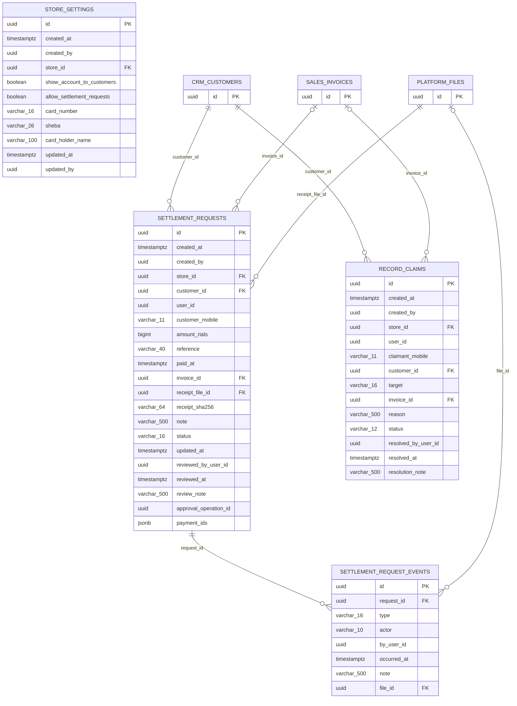

### `portal.store_settings` — StorePortalSettings · aggregate root (xmin), store-scoped

| Column | Type | Null | Note |
|---|---|---|---|
| `id` | uuid |  | **PK** |
| `created_at` | timestamptz |  |  |
| `created_by` | uuid | ✓ |  |
| `store_id` | uuid |  |  |
| `show_account_to_customers` | boolean |  |  |
| `allow_settlement_requests` | boolean |  |  |
| `card_number` | varchar(16) | ✓ |  |
| `sheba` | varchar(26) | ✓ |  |
| `card_holder_name` | varchar(100) | ✓ |  |
| `updated_at` | timestamptz |  |  |
| `updated_by` | uuid | ✓ |  |

- FK `store_id` → `store.stores.id` (restrict)
- UNIQUE `(store_id)`
- CHECK `ck_store_settings_card_number`: `card_number IS NULL OR card_number ~ '^[0-9]{16}$'`
- CHECK `ck_store_settings_sheba`: `sheba IS NULL OR sheba ~ '^IR[0-9]{24}$'`
- CHECK `ck_store_settings_holder`: `(card_number IS NULL AND sheba IS NULL) OR card_holder_name IS NOT NULL`

### `portal.settlement_requests` — CustomerSettlementRequest · aggregate root (xmin), store-scoped

| Column | Type | Null | Note |
|---|---|---|---|
| `id` | uuid |  | **PK** |
| `created_at` | timestamptz |  |  |
| `created_by` | uuid | ✓ |  |
| `store_id` | uuid |  |  |
| `customer_id` | uuid |  |  |
| `user_id` | uuid |  |  |
| `customer_mobile` | varchar(11) |  |  |
| `amount_rials` | bigint |  |  |
| `reference` | varchar(40) |  |  |
| `paid_at` | timestamptz |  |  |
| `invoice_id` | uuid | ✓ |  |
| `receipt_file_id` | uuid |  |  |
| `receipt_sha256` | varchar(64) |  |  |
| `note` | varchar(500) | ✓ |  |
| `status` | varchar(16) |  | enum SettlementRequestStatus |
| `updated_at` | timestamptz |  |  |
| `reviewed_by_user_id` | uuid | ✓ |  |
| `reviewed_at` | timestamptz | ✓ |  |
| `review_note` | varchar(500) | ✓ |  |
| `approval_operation_id` | uuid | ✓ |  |
| `payment_ids` | jsonb |  |  |

- FK `customer_id` → `crm.customers.id` (restrict)
- FK `invoice_id` → `sales.invoices.id` (restrict)
- FK `receipt_file_id` → `platform.files.id` (restrict)
- FK `store_id` → `store.stores.id` (restrict)
- INDEX `(store_id, status, created_at)`
- INDEX `(user_id, created_at)`
- INDEX `(customer_id)`
- CHECK `ck_settlement_requests_amount_positive`: `amount_rials > 0`
- CHECK `ck_settlement_requests_reference_length`: `char_length(reference) BETWEEN 4 AND 40`

### `portal.settlement_request_events` — CustomerSettlementEvent

| Column | Type | Null | Note |
|---|---|---|---|
| `id` | uuid |  | **PK** |
| `request_id` | uuid |  |  |
| `type` | varchar(16) |  | enum SettlementEventType |
| `actor` | varchar(10) |  | enum PortalActor |
| `by_user_id` | uuid | ✓ |  |
| `occurred_at` | timestamptz |  |  |
| `note` | varchar(500) | ✓ |  |
| `file_id` | uuid | ✓ |  |

- FK `request_id` → `portal.settlement_requests.id` (cascade)
- FK `file_id` → `platform.files.id` (restrict)
- INDEX `(request_id, occurred_at)`

### `portal.record_claims` — RecordClaim · aggregate root (xmin), store-scoped

| Column | Type | Null | Note |
|---|---|---|---|
| `id` | uuid |  | **PK** |
| `created_at` | timestamptz |  |  |
| `created_by` | uuid | ✓ |  |
| `store_id` | uuid |  |  |
| `user_id` | uuid |  |  |
| `claimant_mobile` | varchar(11) |  |  |
| `customer_id` | uuid |  |  |
| `target` | varchar(16) |  | enum RecordClaimTarget |
| `invoice_id` | uuid | ✓ |  |
| `reason` | varchar(500) |  |  |
| `status` | varchar(12) |  | enum RecordClaimStatus |
| `resolved_by_user_id` | uuid | ✓ |  |
| `resolved_at` | timestamptz | ✓ |  |
| `resolution_note` | varchar(500) | ✓ |  |

- FK `customer_id` → `crm.customers.id` (restrict)
- FK `invoice_id` → `sales.invoices.id` (restrict)
- FK `store_id` → `store.stores.id` (restrict)
- INDEX `(store_id, status, created_at)`
- CHECK `ck_record_claims_target`: `(target = 'Invoice') = (invoice_id IS NOT NULL)`

## Schema `reporting`

> In the diagram, `store_id → store.stores` edges of store-scoped tables are omitted; the FK exists on every one of them.

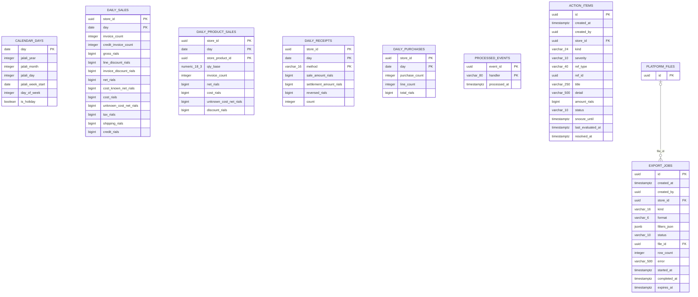

### `reporting.calendar_days` — CalendarDay

| Column | Type | Null | Note |
|---|---|---|---|
| `day` | date |  | **PK** |
| `jalali_year` | integer |  |  |
| `jalali_month` | integer |  |  |
| `jalali_day` | integer |  |  |
| `jalali_week_start` | date |  |  |
| `day_of_week` | integer |  |  |
| `is_holiday` | boolean |  |  |

- INDEX `(jalali_year, jalali_month)`
- INDEX `(jalali_week_start)`

### `reporting.daily_sales` — DailySales

| Column | Type | Null | Note |
|---|---|---|---|
| `store_id` | uuid |  | **PK** |
| `day` | date |  | **PK** |
| `invoice_count` | integer |  |  |
| `credit_invoice_count` | integer |  |  |
| `gross_rials` | bigint |  |  |
| `line_discount_rials` | bigint |  |  |
| `invoice_discount_rials` | bigint |  |  |
| `net_rials` | bigint |  |  |
| `cost_known_net_rials` | bigint |  |  |
| `cost_rials` | bigint |  |  |
| `unknown_cost_net_rials` | bigint |  |  |
| `tax_rials` | bigint |  |  |
| `shipping_rials` | bigint |  |  |
| `credit_rials` | bigint |  |  |

- PK `(store_id, day)`

### `reporting.daily_product_sales` — DailyProductSales

| Column | Type | Null | Note |
|---|---|---|---|
| `store_id` | uuid |  | **PK** |
| `day` | date |  | **PK** |
| `store_product_id` | uuid |  | **PK** |
| `qty_base` | numeric(18,3) |  |  |
| `invoice_count` | integer |  |  |
| `net_rials` | bigint |  |  |
| `cost_rials` | bigint |  |  |
| `unknown_cost_net_rials` | bigint |  |  |
| `discount_rials` | bigint |  |  |

- PK `(store_id, day, store_product_id)`
- INDEX `(store_id, store_product_id, day)`

### `reporting.daily_receipts` — DailyReceipts

| Column | Type | Null | Note |
|---|---|---|---|
| `store_id` | uuid |  | **PK** |
| `day` | date |  | **PK** |
| `method` | varchar(16) |  | **PK** |
| `sale_amount_rials` | bigint |  |  |
| `settlement_amount_rials` | bigint |  |  |
| `reversed_rials` | bigint |  |  |
| `count` | integer |  |  |

- PK `(store_id, day, method)`

### `reporting.daily_purchases` — DailyPurchases

| Column | Type | Null | Note |
|---|---|---|---|
| `store_id` | uuid |  | **PK** |
| `day` | date |  | **PK** |
| `purchase_count` | integer |  |  |
| `line_count` | integer |  |  |
| `total_rials` | bigint |  |  |

- PK `(store_id, day)`

### `reporting.processed_events` — ProcessedEvent

| Column | Type | Null | Note |
|---|---|---|---|
| `event_id` | uuid |  | **PK** |
| `handler` | varchar(80) |  | **PK** |
| `processed_at` | timestamptz |  |  |

- PK `(event_id, handler)`

### `reporting.action_items` — ActionItem · store-scoped

| Column | Type | Null | Note |
|---|---|---|---|
| `id` | uuid |  | **PK** |
| `created_at` | timestamptz |  |  |
| `created_by` | uuid | ✓ |  |
| `store_id` | uuid |  |  |
| `kind` | varchar(24) |  | enum ActionKind |
| `severity` | varchar(10) |  | enum ActionSeverity |
| `ref_type` | varchar(40) |  |  |
| `ref_id` | uuid |  |  |
| `title` | varchar(250) |  |  |
| `detail` | varchar(500) | ✓ |  |
| `amount_rials` | bigint | ✓ |  |
| `status` | varchar(10) |  | enum ActionStatus |
| `snooze_until` | timestamptz | ✓ |  |
| `last_evaluated_at` | timestamptz |  |  |
| `resolved_at` | timestamptz | ✓ |  |

- FK `store_id` → `store.stores.id` (restrict)
- UNIQUE `(store_id, kind, ref_id)` WHERE status IN ('Open','Snoozed')
- INDEX `(store_id, status, severity)`

### `reporting.export_jobs` — ExportJob · store-scoped

| Column | Type | Null | Note |
|---|---|---|---|
| `id` | uuid |  | **PK** |
| `created_at` | timestamptz |  |  |
| `created_by` | uuid | ✓ |  |
| `store_id` | uuid |  |  |
| `kind` | varchar(16) |  | enum ExportKind |
| `format` | varchar(6) |  | enum ExportFormat |
| `filters_json` | jsonb | ✓ |  |
| `status` | varchar(10) |  | enum ExportStatus |
| `file_id` | uuid | ✓ |  |
| `row_count` | integer | ✓ |  |
| `error` | varchar(500) | ✓ |  |
| `started_at` | timestamptz | ✓ |  |
| `completed_at` | timestamptz | ✓ |  |
| `expires_at` | timestamptz | ✓ |  |

- FK `file_id` → `platform.files.id` (setnull)
- FK `store_id` → `store.stores.id` (restrict)
- INDEX `(store_id, created_at)`

## Schema `imports`

> In the diagram, `store_id → store.stores` edges of store-scoped tables are omitted; the FK exists on every one of them.

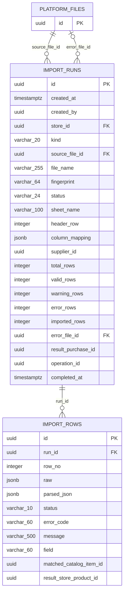

### `imports.import_runs` — ImportRun · aggregate root (xmin), store-scoped

| Column | Type | Null | Note |
|---|---|---|---|
| `id` | uuid |  | **PK** |
| `created_at` | timestamptz |  |  |
| `created_by` | uuid | ✓ |  |
| `store_id` | uuid |  |  |
| `kind` | varchar(20) |  | enum ImportKind |
| `source_file_id` | uuid |  |  |
| `file_name` | varchar(255) |  |  |
| `fingerprint` | varchar(64) |  |  |
| `status` | varchar(24) |  | enum ImportStatus |
| `sheet_name` | varchar(100) | ✓ |  |
| `header_row` | integer |  |  |
| `column_mapping` | jsonb |  |  |
| `supplier_id` | uuid | ✓ |  |
| `total_rows` | integer |  |  |
| `valid_rows` | integer |  |  |
| `warning_rows` | integer |  |  |
| `error_rows` | integer |  |  |
| `imported_rows` | integer |  |  |
| `error_file_id` | uuid | ✓ |  |
| `result_purchase_id` | uuid | ✓ |  |
| `operation_id` | uuid | ✓ |  |
| `completed_at` | timestamptz | ✓ |  |

- FK `source_file_id` → `platform.files.id` (restrict)
- FK `error_file_id` → `platform.files.id` (setnull)
- FK `store_id` → `store.stores.id` (restrict)
- UNIQUE `(store_id, kind, fingerprint)` WHERE status NOT IN ('Cancelled','Failed')
- INDEX `(store_id, created_at)`

### `imports.import_rows` — ImportRow

| Column | Type | Null | Note |
|---|---|---|---|
| `id` | uuid |  | **PK** |
| `run_id` | uuid |  |  |
| `row_no` | integer |  |  |
| `raw` | jsonb |  |  |
| `parsed_json` | jsonb | ✓ |  |
| `status` | varchar(10) |  | enum ImportRowStatus |
| `error_code` | varchar(60) | ✓ |  |
| `message` | varchar(500) | ✓ |  |
| `field` | varchar(60) | ✓ |  |
| `matched_catalog_item_id` | uuid | ✓ |  |
| `result_store_product_id` | uuid | ✓ |  |

- FK `run_id` → `imports.import_runs.id` (cascade)
- UNIQUE `(run_id, row_no)`
- INDEX `(run_id, status)`

## Schema `admin`

> In the diagram, `store_id → store.stores` edges of store-scoped tables are omitted; the FK exists on every one of them.

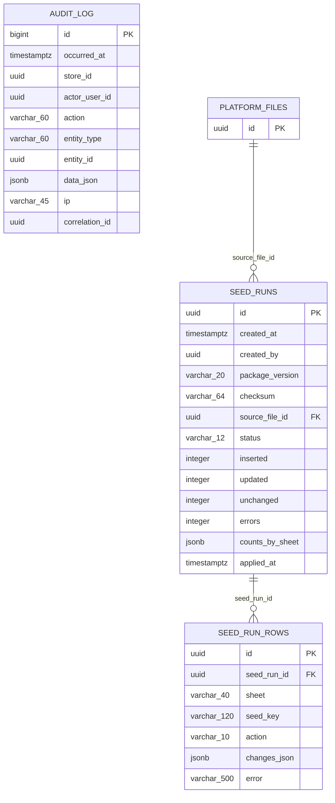

### `admin.seed_runs` — SeedRun · aggregate root (xmin)

| Column | Type | Null | Note |
|---|---|---|---|
| `id` | uuid |  | **PK** |
| `created_at` | timestamptz |  |  |
| `created_by` | uuid | ✓ |  |
| `package_version` | varchar(20) |  |  |
| `checksum` | varchar(64) |  |  |
| `source_file_id` | uuid |  |  |
| `status` | varchar(12) |  | enum SeedRunStatus |
| `inserted` | integer |  |  |
| `updated` | integer |  |  |
| `unchanged` | integer |  |  |
| `errors` | integer |  |  |
| `counts_by_sheet` | jsonb |  |  |
| `applied_at` | timestamptz | ✓ |  |

- FK `source_file_id` → `platform.files.id` (restrict)
- UNIQUE `(package_version, checksum)`

### `admin.seed_run_rows` — SeedRunRow

| Column | Type | Null | Note |
|---|---|---|---|
| `id` | uuid |  | **PK** |
| `seed_run_id` | uuid |  |  |
| `sheet` | varchar(40) |  |  |
| `seed_key` | varchar(120) |  |  |
| `action` | varchar(10) |  | enum SeedRowAction |
| `changes_json` | jsonb | ✓ |  |
| `error` | varchar(500) | ✓ |  |

- FK `seed_run_id` → `admin.seed_runs.id` (cascade)
- UNIQUE `(seed_run_id, sheet, seed_key)`

### `admin.audit_log` — AuditLogEntry

| Column | Type | Null | Note |
|---|---|---|---|
| `id` | bigint |  | **PK** identity |
| `occurred_at` | timestamptz |  |  |
| `store_id` | uuid | ✓ |  |
| `actor_user_id` | uuid | ✓ |  |
| `action` | varchar(60) |  |  |
| `entity_type` | varchar(60) |  |  |
| `entity_id` | uuid | ✓ |  |
| `data_json` | jsonb | ✓ |  |
| `ip` | varchar(45) | ✓ |  |
| `correlation_id` | uuid | ✓ |  |

- INDEX `(store_id, occurred_at)`
- INDEX `(entity_type, entity_id)`
- INDEX `(actor_user_id, occurred_at)`

## Schema `platform`

> In the diagram, `store_id → store.stores` edges of store-scoped tables are omitted; the FK exists on every one of them.

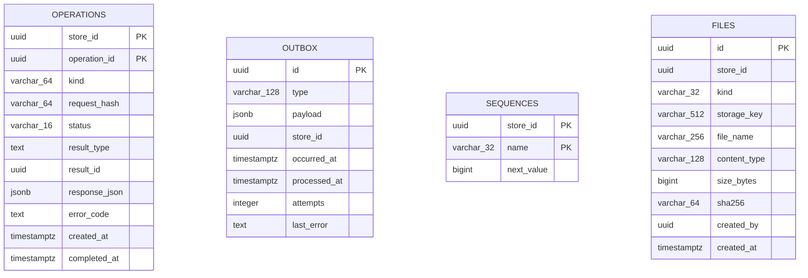

### `platform.operations` — OperationRecord

| Column | Type | Null | Note |
|---|---|---|---|
| `store_id` | uuid |  | **PK** |
| `operation_id` | uuid |  | **PK** |
| `kind` | varchar(64) |  |  |
| `request_hash` | varchar(64) |  |  |
| `status` | varchar(16) |  | enum OperationStatus |
| `result_type` | text | ✓ |  |
| `result_id` | uuid | ✓ |  |
| `response_json` | jsonb | ✓ |  |
| `error_code` | text | ✓ |  |
| `created_at` | timestamptz |  |  |
| `completed_at` | timestamptz | ✓ |  |

- PK `(store_id, operation_id)`
- INDEX `(created_at)`

### `platform.outbox` — OutboxMessage

| Column | Type | Null | Note |
|---|---|---|---|
| `id` | uuid |  | **PK** |
| `type` | varchar(128) |  |  |
| `payload` | jsonb |  |  |
| `store_id` | uuid |  |  |
| `occurred_at` | timestamptz |  |  |
| `processed_at` | timestamptz | ✓ |  |
| `attempts` | integer |  |  |
| `last_error` | text | ✓ |  |

- INDEX `(occurred_at)` WHERE processed_at IS NULL

### `platform.sequences` — NumberSequence

| Column | Type | Null | Note |
|---|---|---|---|
| `store_id` | uuid |  | **PK** |
| `name` | varchar(32) |  | **PK** |
| `next_value` | bigint |  |  |

- PK `(store_id, name)`

### `platform.files` — StoredFile

| Column | Type | Null | Note |
|---|---|---|---|
| `id` | uuid |  | **PK** |
| `store_id` | uuid | ✓ |  |
| `kind` | varchar(32) |  | enum FileKind |
| `storage_key` | varchar(512) |  |  |
| `file_name` | varchar(256) |  |  |
| `content_type` | varchar(128) |  |  |
| `size_bytes` | bigint |  |  |
| `sha256` | varchar(64) |  |  |
| `created_by` | uuid | ✓ |  |
| `created_at` | timestamptz |  |  |

- INDEX `(store_id, kind, created_at)`
