# فلوچارت فرآیندهای دکانی

> بازنگری 2.3.0 — 2026-09-25. مشخصات محصول، اجرای طراحی و آزمون نرم‌افزار سه وضعیت مستقل‌اند.
>
> بازنگری 2.5.0 — 2026-09-27: F84 تا F87 افزوده شد؛ F17، F45، F46، F48 و F49 با قواعد خدمت، دو شیوه دریافت، پیش‌سفارش و فیش اصلاح شدند ([`orders-services-membership.md`](../../business/orders-services-membership.md)).

برای جزئیات ورودی/خروجی هر F به core-user-flows.md و برای اثر انتقال‌ها به state-transitions.md مراجعه شود. نمودارها ترتیب و انشعاب را نشان می‌دهند؛ قواعد کامل در سند بیزنس‌اند.

## F01 — ورود، ثبت‌نام و بازیابی فروشنده · 1.0

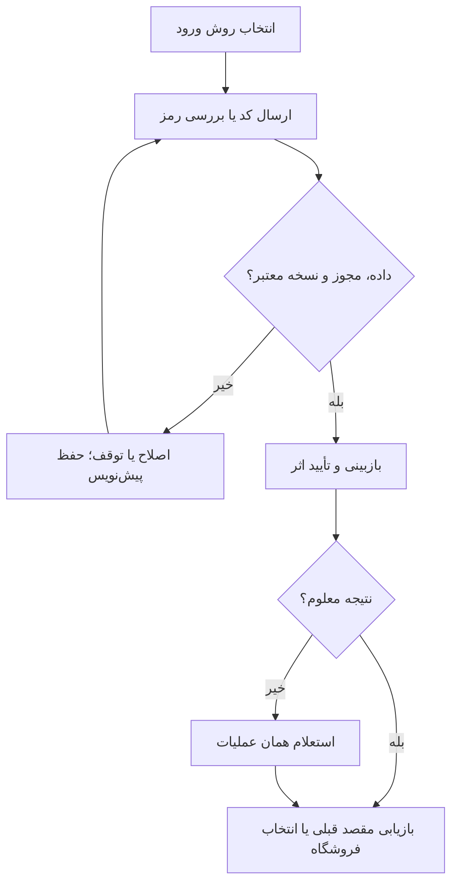

شاخه اختصاصی: کد غلط/منقضی: اصلاح و ارسال مجدد با شمارنده؛ رمز فراموش‌شده: بازیابی از راه تماس تأییدشده؛ کاربر مسدود: مسیر پشتیبانی؛ بازگشت از ورود نباید سبد پیش‌نویس را حذف کند.

پذیرش: کد غلط نشست نسازد؛ کاربر قدیمی بدون ثبت‌نام دوباره به مقصد قبلی برسد.

## F02 — ایجاد سریع و انتخاب فروشگاه · 1.0

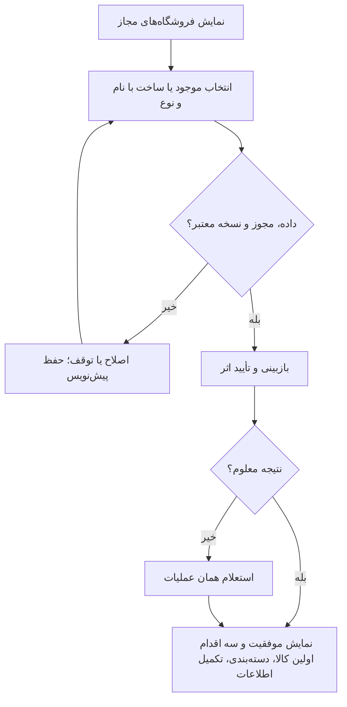

شاخه اختصاصی: نوع موجود نیست: انتخاب سایر و ثبت نیاز برای ادمین؛ نام مشابه فروشگاهی دیگر مانع نیست؛ تکرار درخواست ساخت با همان شناسه عملیات فروشگاه دوم نسازد.

پذیرش: بدون آدرس و اطلاعات بانکی بتوان اولین کالا را ثبت کرد.

## F03 — تکمیل و ویرایش پروفایل فروشگاه · 1.0

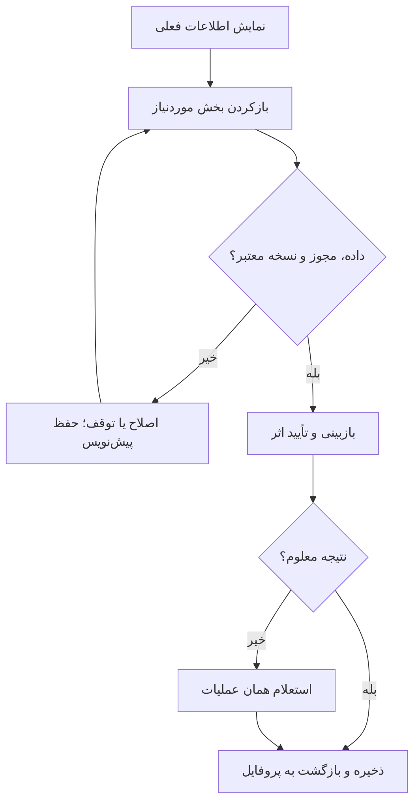

شاخه اختصاصی: مجوز موقعیت رد شد: ورود دستی آدرس؛ نوع فروشگاه پس از ثبت کالا: پیش‌نمایش اثر و حفظ داده‌های دسته‌های قبلی؛ اطلاعات بانکی خصوصی در صفحه عمومی منتشر نشود.

پذیرش: فیلد اختیاری خالی مانع ذخیره نیست؛ تغییر نوع باعث حذف کالا نمی‌شود.

## F04 — ناوبری و دسترسی سریع · 1.0

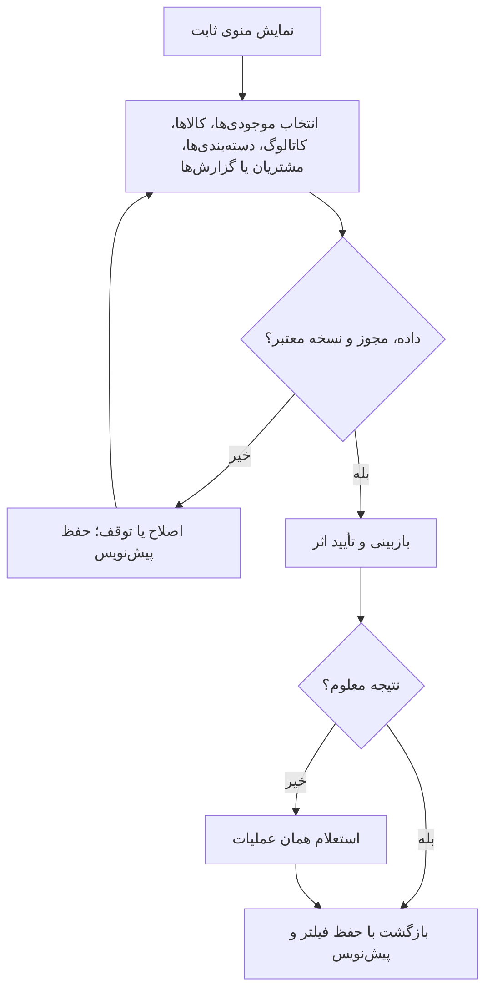

شاخه اختصاصی: در اسکن تمام‌صفحه و مرحله حساس می‌توان نوار پایین را پنهان کرد؛ خروج از فرم تغییرکرده: نگهداری پیش‌نویس یا دورریزی صریح.

پذیرش: از هر بخش اصلی به فروش سریع دسترسی باشد و بازگشت فیلتر را حفظ کند.

## F05 — فهرست، جزئیات و ساخت دسته‌بندی/نوع کالا · 1.0

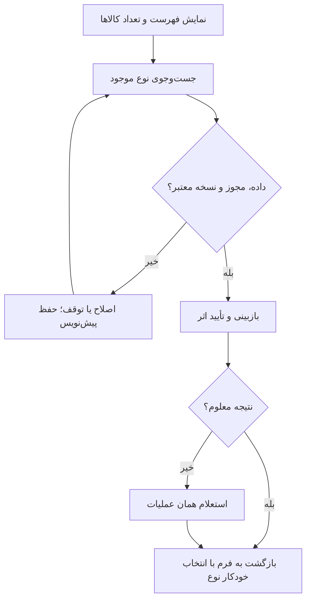

شاخه اختصاصی: نام نرمال‌شده تکراری: انتخاب مورد موجود؛ نوع عمومی ویرایش مستقیم نشود؛ غیرفعال‌سازی نوع دارای کالا مرجع‌ها را حفظ کند؛ ادغام عمومی فقط ادمین.

پذیرش: ساخت نوع از داخل کالا تمام ورودی‌های کالا را حفظ کند.

## F06 — برند، ویژگی‌ها و مشخصات کالا · 1.0

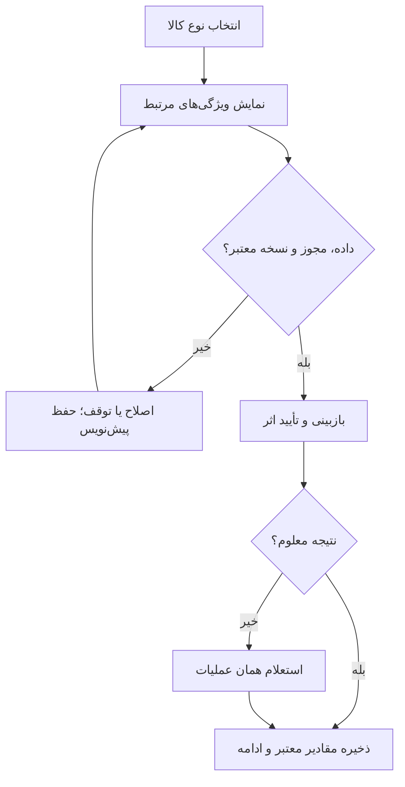

شاخه اختصاصی: برند نامعلوم برای استفاده محلی مجاز است؛ انتشار عمومی تا رفع ابهام متوقف می‌ماند؛ ویژگی با داده نامعتبر کنار همان فیلد اصلاح شود؛ ویژگی عمومی توسط فروشنده ساخته نشود.

پذیرش: بدون عکس و ویژگی اختیاری ثبت ممکن باشد؛ ساخت برند فرم را پاک نکند.

## F07 — جست‌وجو و انتخاب از کاتالوگ · 1.0

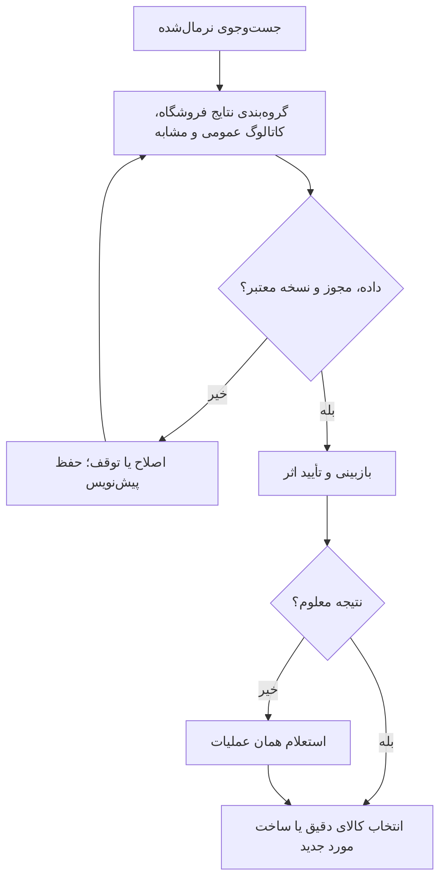

شاخه اختصاصی: مورد موجود در فروشگاه: افزودن موجودی به همان کالا؛ مشابه فقط فرم را پیش‌پر کند و تأیید هویت بخواهد؛ نتیجه خالی: ثبت کاتالوگ با عبارت جست‌وجو.

پذیرش: انتخاب کالای موجود رکورد فروشگاهی تکراری نسازد.

## F08 — مجوز دوربین، اسکن و ورود دستی بارکد · 1.0

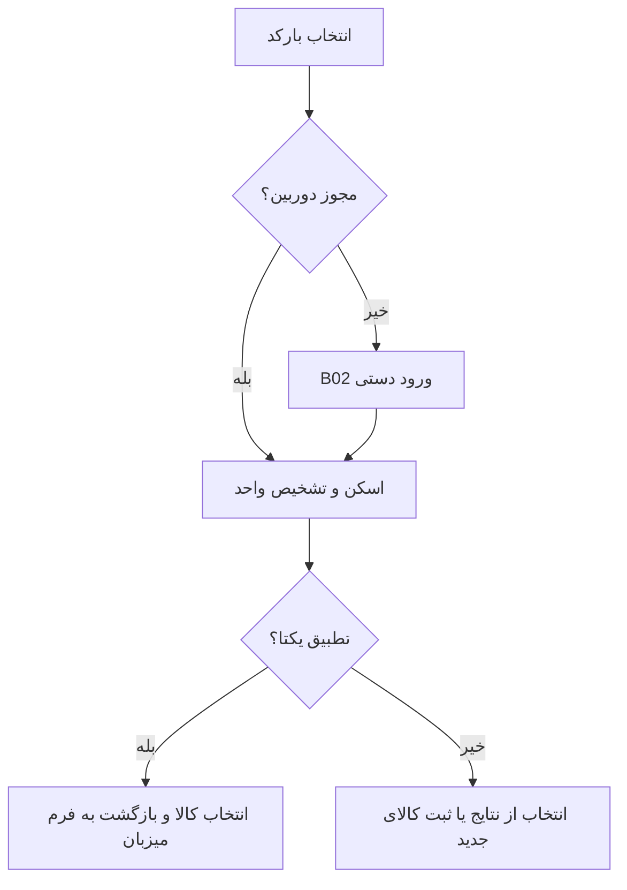

شاخه اختصاصی: مجوز رد/دوربین خراب/نور کم: ورود دستی یا جست‌وجو؛ قالب نامعتبر: اصلاح؛ کد داخلی فروشگاه دیگر: عدم نمایش داده آن فروشگاه؛ اسکن تکراری دوربین در یک تشخیص نباید چند قلم بسازد.

پذیرش: رد دوربین همچنان به ثبت کالا منتهی شود؛ صفر ابتدایی حذف نشود.

## F09 — نتیجه بارکد، واحد و تعارض · 1.0

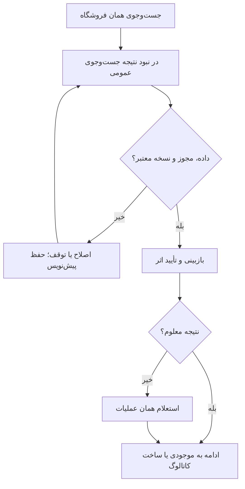

شاخه اختصاصی: چند نتیجه: مقایسه و انتخاب؛ ناشناخته: ثبت دستی با کد حفظ‌شده؛ تعارض: ثبت مورد محلی برای بررسی، بدون تغییر نگاشت عمومی؛ بارکد بسته با بارکد تک‌کالا یکسان فرض نشود.

پذیرش: اسکن بسته ۲۰تایی معادل یک قلم تکی محاسبه نشود.

## F10 — ثبت کاتالوگ و کالای فروشگاه · 1.0

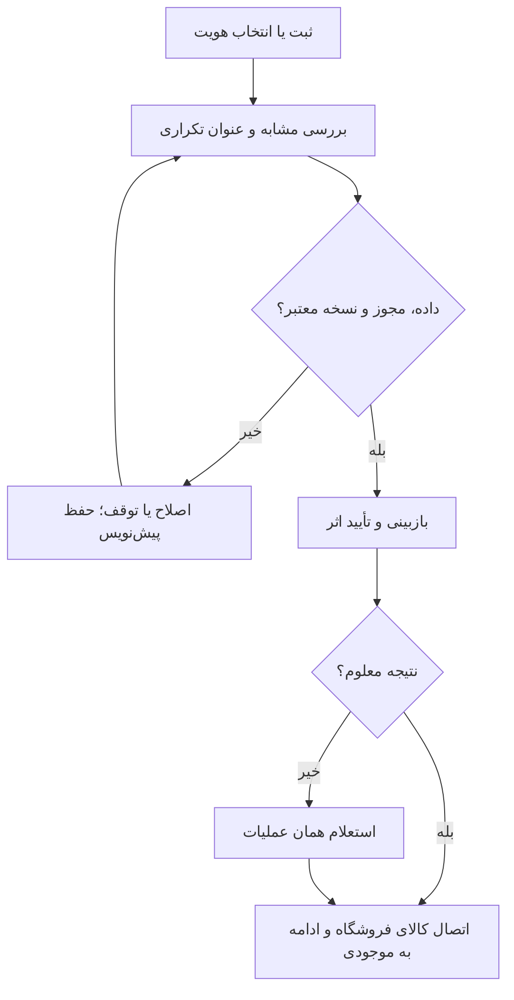

شاخه اختصاصی: عنوان تکراری بعد از نرمال‌سازی: استفاده از موجود یا افزودن تمایز واقعی؛ برند نامعلوم: محلی؛ رد پیشنهاد عمومی استفاده محلی را بی‌دلیل قطع نکند؛ ساخت کاتالوگ به‌تنهایی موجودی نسازد.

پذیرش: کاتالوگ تعداد و بهای خرید ندارد؛ دو درخواست همزمان کالای یکسان نسازند.

## F11 — ویرایش محلی، پیشنهاد اصلاح و غیرفعال‌سازی · 1.0

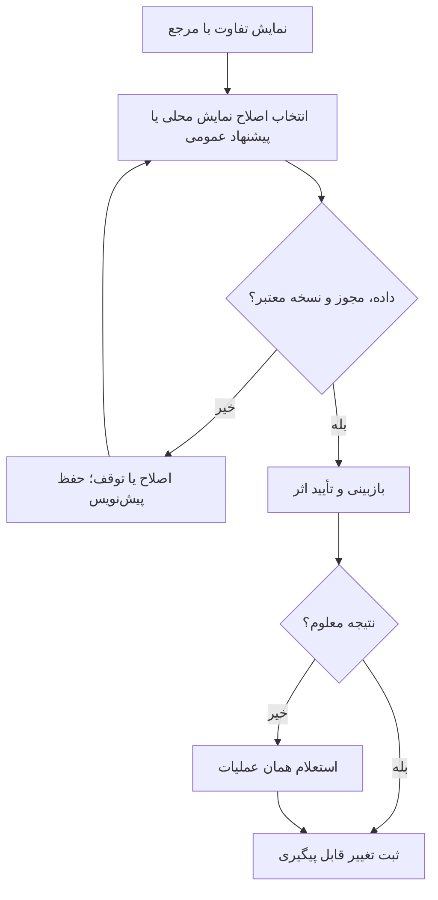

شاخه اختصاصی: تغییر هویت روی کالای دارای سابقه، موجودی قدیم را به مدل جدید منتقل نمی‌کند؛ آرشیو مانع فروش جدید است اما سوابق باقی می‌ماند؛ فعال‌سازی مجدد با مجوز.

پذیرش: تغییر عنوان امروز، عنوان فاکتور دیروز را تغییر ندهد.

## F12 — تعیین واحد خرید و فروش بسته‌ای/تکی · 1.0

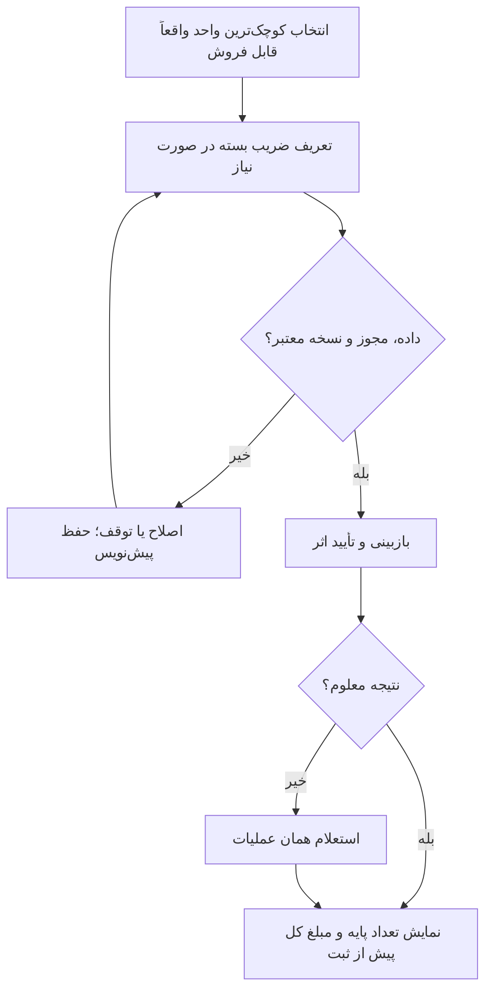

شاخه اختصاصی: مدادرنگی ۱۲رنگ غیرقابل تفکیک: پایه یک جعبه؛ خودکار بسته۲۰: پایه یک خودکار؛ تغییر ضریب پس از سابقه نسخه جدید می‌سازد؛ فروش کسری برای کالای شمارشی مجاز نیست.

پذیرش: ۳ بسته خودکار۲۰تایی برابر۶۰ خودکار؛ فروش۲ بسته و۳عدد برابر۴۳عدد.

## F13 — موجودی اولیه و خرید جدید تک‌کالا · 1.0

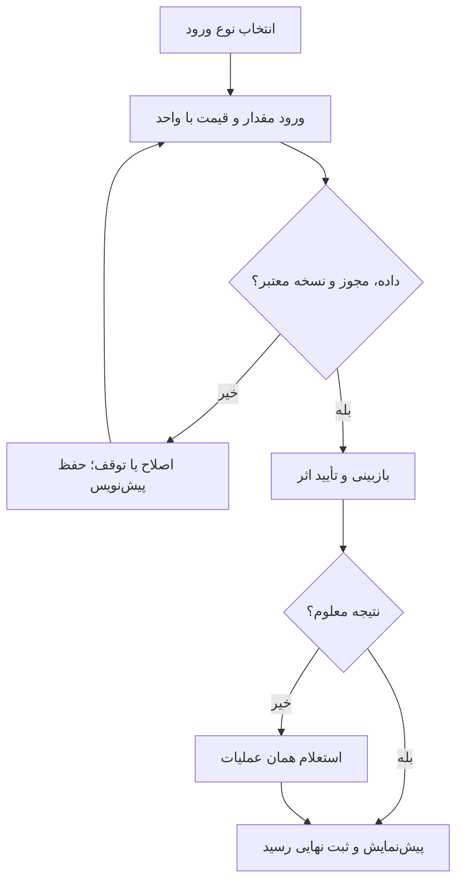

شاخه اختصاصی: بهای نامعلوم: هشدار اثر روی سود و ادامه آگاهانه؛ انقضا قبل تولید: اصلاح؛ قیمت فروش خالی: کالا موجود است ولی آماده فروش نیست؛ تاریخ خرید اولیه نامعلوم نیازمند تاریخ ساختگی نیست.

پذیرش: تاریخ‌های دو خرید از یک کالا مستقل بمانند؛ Retry موجودی را دوبرابر نکند.

## F14 — ثبت سریع پی‌درپی و چندردیفی · 1.0

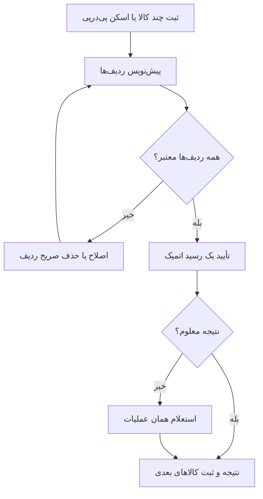

شاخه اختصاصی: ردیف خطادار مشخص و قابل اصلاح؛ هیچ ردیف بی‌اطلاع حذف نشود؛ تصمیم این بسته: نهایی‌سازی کل رسید اتمیک؛ داده مشترک فقط تاریخ/تأمین‌کننده با تأیید حفظ شود، بارکد و عنوان قبلی پاک شوند.

پذیرش: سه کالا با یک ردیف نامعتبر تا رفع آن موجودی نهایی نسازند؛ سبد فروشِ میزبان حفظ شود.

## F15 — فهرست موجودی‌ها و گردش کالا · 1.0

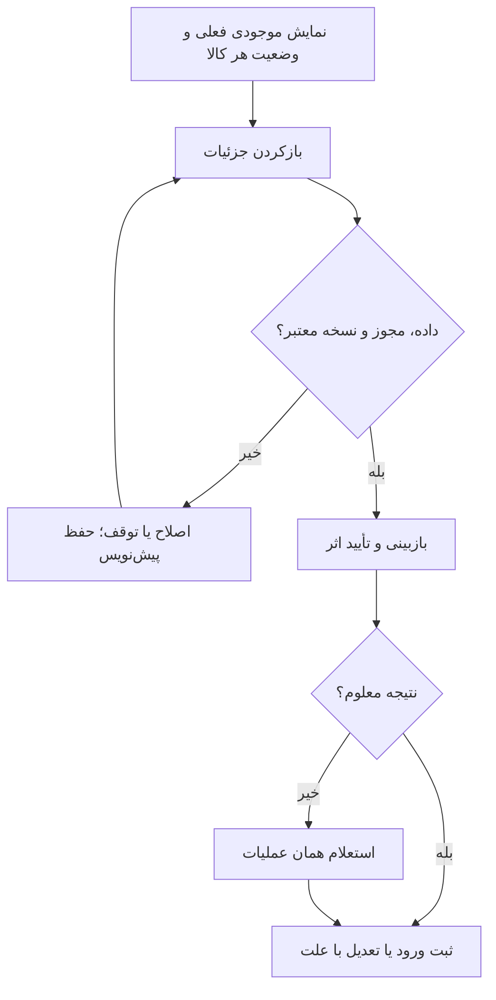

شاخه اختصاصی: فهرست کاتالوگ موجودی ندارد؛ موجودی صفر با کالای غیرفعال متفاوت است؛ تعدیل تعداد مشاهده‌شده را به اختلاف محاسبه کند، فروش ساختگی نسازد.

پذیرش: تعدیل از۱۰به۸ یک حرکت منفی۲ بسازد و سابقه را حذف نکند.

## F16 — قیمت‌گذاری و سابقه خرید · 1.0


شاخه اختصاصی: سه روش قیمت: دستی؛ بها×(۱+درصد افزایش)؛ بها+سود ثابت. درصد افزایش با حاشیه سود یکی نیست. روش وابسته به بها برای کالای فاقد بها غیرفعال و قیمت دستی مجاز است. گردکردن اختیاری با گام مثبت و جهت نزدیک‌ترین/بالا/پایین؛ Preview قیمت محاسبه‌شده و نهایی و هشدار زیر بها لازم است. تغییر تنظیمات، قیمت‌های ثبت‌شده را خودکار عوض نمی‌کند.

پذیرش: بهای۸۰ و افزایش۲۵درصد، قیمت۱۰۰ بدهد؛ حاشیه۲۵درصد قیمت۱۰۶٫۶۷ است.

## F17 — سبد فروش چندکالا و ثبت سریع کالای پیدا‌نشده · 1.0

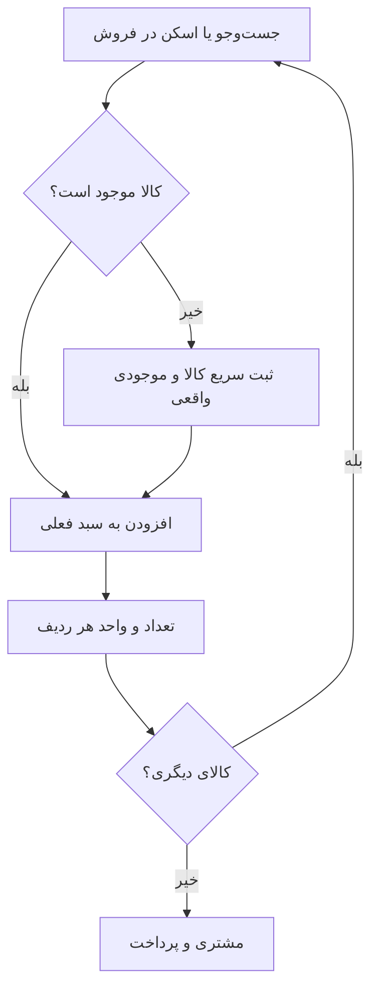

شاخه اختصاصی: بارکد شرط حضور در فاکتور نیست؛ خدمت با نام یا میان‌بر اضافه می‌شود و کنترل موجودی ندارد (F84)؛ کالا پیدا نشد: ثبت سریع و موجودی در پنل فرعی، سپس بازگشت به سبد؛ موجودی ناکافی: کاهش مقدار یا ورود واقعی موجودی؛ قیمت تغییرکرده: نمایش تغییر پیش از تأیید؛ کالای بدون قیمت فروش باید قیمت بگیرد.

پذیرش: افزودن دفتر پس از خودکار، ردیف خودکار را حفظ کند؛ بازگشت از ایجاد کالا سبد را پاک نکند.

## F18 — جست‌وجو، ثبت مشتری و استفاده از مشتری موجود · 1.0

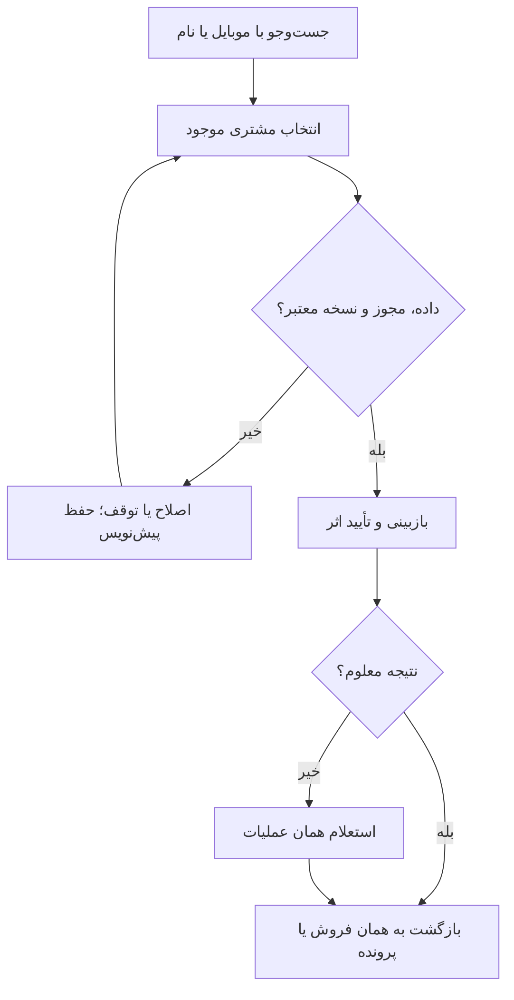

شاخه اختصاصی: موبایل تکراری در فروشگاه: اتصال موجود؛ شماره ثبت‌شده توسط فروشنده هنوز تأیید مالکیت نیست؛ تغییر شماره با سابقه حساس است و نباید خودکار مالک فاکتور را عوض کند؛ فروش کامل بی‌نام مجاز است.

پذیرش: مشتری موجود دوباره ساخته نشود؛ ادامه بدون نام امکان داشته باشد.

## F19 — انتخاب پرداخت، نسیه و نهایی‌سازی فروش · 1.0

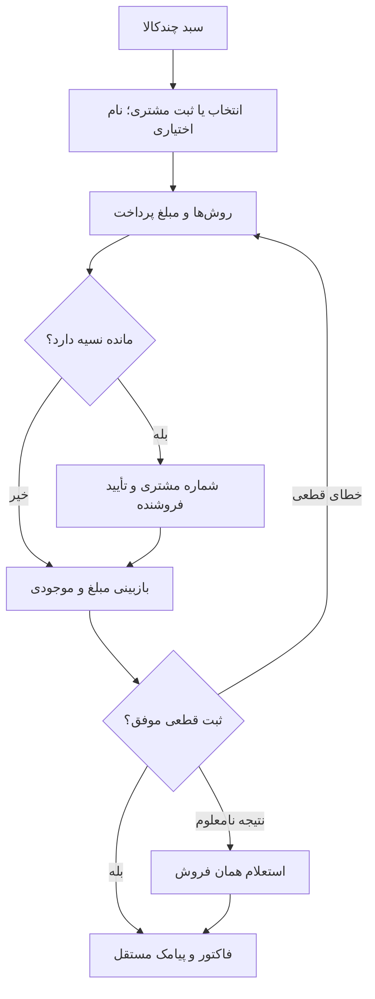

شاخه اختصاصی: دریافت صفر: نسیه کامل با مشتری؛ دریافت کمتر: نسیه جزئی؛ دریافت کامل: مشتری اختیاری مگر ارسال پیامک؛ بدهی قبلی نمایش داده شود ولی فروشنده تصمیم می‌گیرد؛ چندروش پرداخت به۱.۱ منتقل شده و با نسیه جزئی یکی نیست.

پذیرش: فاکتور۴۱۰هزار با وصول۲۰۰هزار، بدهی۲۱۰هزار بسازد؛ دو بار لمس تأیید فقط یک فاکتور.

## F20 — فاکتور، پیامک و فروش بعدی · 1.0

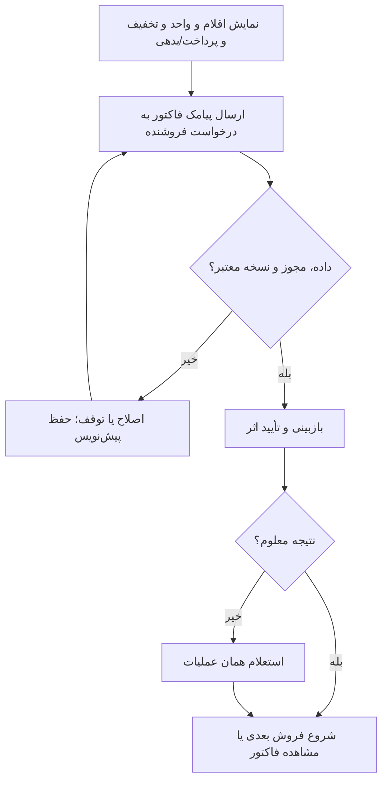

شاخه اختصاصی: پیامک ناموفق: ارسال مجدد همان فاکتور؛ پاسخ درگاه پیامک فقط ارسال را ثابت می‌کند، تحویل در صورت گزارش provider؛ لینک حدس‌زدنی و دسترسی به سایر خریدها ممنوع؛ بی‌موبایل: نمایش رسید بدون SMS.

پذیرش: شکست SMS فروش یا موجودی را برنگرداند؛ Retry پیامک فاکتور تازه نسازد.

## F21 — فهرست مشتریان و پرونده مشتری · 1.0

```mermaid
flowchart TD
 A["نمایش مشتریان با موبایل و مانده"] --> B["جست‌وجو و بازکردن پرونده"]
 B --> C{"داده، مجوز و نسخه معتبر؟"}
 C -->|خیر| D["اصلاح یا توقف؛ حفظ پیش‌نویس"]
 D --> B
 C -->|بله| E["بازبینی و تأیید اثر"]
 E --> F{"نتیجه معلوم؟"}
 F -->|خیر| G["استعلام همان عملیات"]
 F -->|بله| H["شروع فروش یا ثبت تسویه برای همان مشتری"]
 G --> H
```

شاخه اختصاصی: نام خالی با موبایل نمایش داده شود؛ مشتری بدون خرید و مشتری تسویه‌شده پنهان نشوند؛ اطلاعات فروشگاه دیگر در پرونده نمایش داده نشود.

پذیرش: فهرست مشتریان با فهرست بدهکاران متفاوت باشد؛ مشتری تسویه‌شده در مشتریان بماند.

## F22 — گزارش بدهکاران و نسیه‌بگیران · 1.0

```mermaid
flowchart TD
 A["انتخاب بدهکاران فعلی یا سابقه نسیه دوره"] --> B["نمایش مجموع و فهرست"]
 B --> C{"داده، مجوز و نسخه معتبر؟"}
 C -->|خیر| D["اصلاح یا توقف؛ حفظ پیش‌نویس"]
 D --> B
 C -->|بله| E["بازبینی و تأیید اثر"]
 E --> F{"نتیجه معلوم؟"}
 F -->|خیر| G["استعلام همان عملیات"]
 F -->|بله| H["ثبت تسویه یا یادآوری"]
 G --> H
```

شاخه اختصاصی: نسیه‌بگیر تسویه‌شده در گزارش سابقه هست ولی بدهکار فعلی نیست؛ بدون سررسید را معوق نشمار؛ شماره ناشناخته با نام ساختگی پر نشود.

پذیرش: فروش نسیه ماه قبل با تسویه امروز در گزارش وصول امروز دیده شود، نه فروش امروز.

## F23 — تسویه کامل، جزئی و چندفاکتوری توسط فروشنده · 1.0

```mermaid
flowchart TD
 A["انتخاب مشتری و مبلغ دریافت"] --> B{"مبلغ تا سقف بدهی؟"}
 B -->|خیر| C["اصلاح مبلغ؛ اعتبار مثبت در MVP نیست"]
 C --> A
 B -->|بله| D["انتخاب و بازبینی تخصیص فاکتورها"]
 D --> E{"جمع تخصیص برابر دریافت؟"}
 E -->|خیر| D
 E -->|بله| F["ثبت یک دریافت و تخصیص‌ها"]
 F --> G["رسید و مانده جدید"]
```

شاخه اختصاصی: بیشتر از بدهی انتخابی: انتخاب بدهی‌های دیگر یا اصلاح مبلغ؛ مانده منفی/اعتبار پیش‌پرداخت در MVP ساخته نشود؛ همزمانی تسویه: بازخوانی مانده؛ تخصیص نباید بیش از مانده فاکتور باشد.

پذیرش: دریافت۱۵۰ برای دو بدهی۱۰۰و۱۰۰، اولی تسویه و دومی۵۰ باقی بگذارد.

## F24 — گزارش فروش هفتگی، ماهانه و بازه دلخواه · 1.0

```mermaid
flowchart TD
 A["انتخاب بازه، فیلتر و معیار"] --> B{"داده کافی است؟"}
 B -->|خیر| C["وضعیت بدون داده یا پوشش ناقص"]
 B -->|بله| D["شاخص و مبنای مقایسه"]
 C --> E["اصلاح داده یا تغییر بازه"]
 E --> A
 D --> F{"اقدام کاربر"}
 F -->|جزئیات| G["فاکتور یا کالا با حفظ فیلتر"]
 F -->|خروجی| H["فایل با همان بازه و پوشش"]
```

شاخه اختصاصی: فروش با وصول یکی نیست؛ پیش‌نویس حساب نشود؛ بازه خالی صفر واقعی دارد؛ خطای دریافت داده صفر نمایش داده نشود؛ روش پرداخت فیلتر فاکتور است و مجموع دریافت گزارش مستقلی دارد.

پذیرش: تغییر از هفتگی به ماهانه همه کارت‌ها و نمودار و جزئیات را همزمان تغییر دهد.

## F25 — گزارش افزایش و کاهش فروش روزانه · 1.0

```mermaid
flowchart TD
 A["انتخاب بازه، فیلتر و معیار"] --> B{"داده کافی است؟"}
 B -->|خیر| C["وضعیت بدون داده یا پوشش ناقص"]
 B -->|بله| D["شاخص و مبنای مقایسه"]
 C --> E["اصلاح داده یا تغییر بازه"]
 E --> A
 D --> F{"اقدام کاربر"}
 F -->|جزئیات| G["فاکتور یا کالا با حفظ فیلتر"]
 F -->|خروجی| H["فایل با همان بازه و پوشش"]
```

شاخه اختصاصی: پایه صفر: درصد تعریف‌نشده و متن بدون فروش در دوره مبنا؛ داده ناقص: برچسب موقت؛ تعطیلی/فروش آفلاین ثبت‌نشده نتیجه را توضیح می‌دهد ولی عدد ساختگی نمی‌سازد.

پذیرش: امروز۶۰۰ و دیروز۴۰۰ تا ساعت برابر، افزایش۲۰۰ و۵۰درصد؛ هر دو صفر، اختلاف صفر و درصد —.

## F26 — کمبود، اتمام و فهرست خرید مجدد · 1.0

```mermaid
flowchart TD
 A["انتخاب بازه، فیلتر و معیار"] --> B{"داده کافی است؟"}
 B -->|خیر| C["وضعیت بدون داده یا پوشش ناقص"]
 B -->|بله| D["شاخص و مبنای مقایسه"]
 C --> E["اصلاح داده یا تغییر بازه"]
 E --> A
 D --> F{"اقدام کاربر"}
 F -->|جزئیات| G["فاکتور یا کالا با حفظ فیلتر"]
 F -->|خروجی| H["فایل با همان بازه و پوشش"]
```

شاخه اختصاصی: آستانه تعریف‌نشده با صفر یکسان نیست؛ کمبود با نقص اطلاعات یکی نیست؛ خرید پیشنهادی رسید قطعی یا سفارش تأمین‌کننده ایجاد نمی‌کند.

پذیرش: کالای۳ با آستانه۵ دیده شود و پس از ورود۴ از کمبود خارج شود.

## F27 — نقص اطلاعات، بهای نامعلوم و سود قابل محاسبه · 1.0

```mermaid
flowchart TD
 A["گزارش سود"] --> B{"همه بهاها معلوم‌اند؟"}
 B -->|بله| C["سود کالایی با پوشش کامل"]
 B -->|خیر| D["هشدار و فهرست اقلام ناقص"]
 D --> E{"انتخاب کاربر"}
 E -->|اصلاح| F["ثبت بها و بازحساب مرتبط"]
 F --> A
 E -->|گزارش محدود| G["حذف فقط از سود؛ نمایش پوشش و اقلام حذف‌شده"]
 G --> H["خروجی با همان برچسب محدودیت"]
```

شاخه اختصاصی: حذف از گزارش سود، فروش و فاکتور را حذف نمی‌کند؛ ورود قیمت فروش جای بهای خرید ننشیند؛ اصلاح بها بازسازی وابستگی میانگین و نسخه گزارش دارد؛ تخمینی جدا از قطعی.

پذیرش: فروش۱۰۰۰ شامل۳۰۰ نامعلوم، با بهای۴۰۰ برای۷۰۰ معلوم: سود۳۰۰ و پوشش۷۰درصد؛ نه سود۶۰۰.

## F28 — خطای شبکه، پیش‌نویس و نتیجه نامعلوم · 1.0

```mermaid
flowchart TD
 A["حفظ ورودی محلی بدون ادعای ثبت"] --> B["پس از ارسال نامطمئن استعلام همان عملیات"]
 B --> C{"داده، مجوز و نسخه معتبر؟"}
 C -->|خیر| D["اصلاح یا توقف؛ حفظ پیش‌نویس"]
 D --> B
 C -->|بله| E["بازبینی و تأیید اثر"]
 E --> F{"نتیجه معلوم؟"}
 F -->|خیر| G["استعلام همان عملیات"]
 F -->|بله| H["اگر ثبت نشده تلاش دوباره با همان شناسه"]
 G --> H
```

شاخه اختصاصی: فروش نهایی آفلاین نیست؛ تغییر فروشگاه پیش‌نویس قبلی را به دیگری منتقل نکند؛ خروج نشست داده حساس را از دسترس بعدی خارج کند.

پذیرش: قطع اتصال بعد از ثبت سرور و Retry نباید رسید یا فاکتور دوم بسازد.

## F29 — مدیریت ادمین، صف بررسی و تعارض کاتالوگ · 1.0

```mermaid
flowchart TD
 A["فیلتر صف و بازکردن تفاوت‌ها"] --> B["تأیید/رد با علت/درخواست تکمیل"]
 B --> C{"داده، مجوز و نسخه معتبر؟"}
 C -->|خیر| D["اصلاح یا توقف؛ حفظ پیش‌نویس"]
 D --> B
 C -->|بله| E["بازبینی و تأیید اثر"]
 E --> F{"نتیجه معلوم؟"}
 F -->|خیر| G["استعلام همان عملیات"]
 F -->|بله| H["ثبت تاریخچه و اطلاع نتیجه به فروشنده"]
 G --> H
```

شاخه اختصاصی: اختلاف هویت با تکرار یکی نیست؛ رد پیشنهاد عمومی کالای خصوصی را حذف نکند؛ ادغام موجودی دو فروشگاه یا دو مدل ممنوع؛ شناسه قدیمی به مرجع هدایت شود.

پذیرش: تأیید اصلاح عمومی، override محلی را بی‌صدا پاک نکند.

## F30 — Seed و به‌روزرسانی داده مرجع · 1.0

```mermaid
flowchart TD
 A["اعتبارسنجی وابستگی‌ها"] --> B["اجرای آزمایشی بدون تغییر"]
 B --> C{"داده، مجوز و نسخه معتبر؟"}
 C -->|خیر| D["اصلاح یا توقف؛ حفظ پیش‌نویس"]
 D --> B
 C -->|بله| E["بازبینی و تأیید اثر"]
 E --> F{"نتیجه معلوم؟"}
 F -->|خیر| G["استعلام همان عملیات"]
 F -->|بله| H["اعمال تأییدشده و گزارش نتیجه"]
 G --> H
```

شاخه اختصاصی: داده واقعی حذف نشود؛ تغییر schema ناسازگار نیازمند مهاجرت؛ اجرای دوباره همان نسخه تکرار نسازد؛ خطای یک بسته مرجع، بسته را نیمه‌اعمال نکند.

پذیرش: اجرای دوباره تعداد کالاها را افزایش ندهد.

## F31 — ورود Excel ساده، تطبیق و نتیجه سطری · 1.0

```mermaid
flowchart TD
 A["نوع ورود و فایل"] --> B{"اجرای تکراری؟"}
 B -->|بله| C["نمایش نتیجه قبلی"]
 B -->|خیر| D["نگاشت و اعتبارسنجی"]
 D --> E{"رسید خرید است؟"}
 E -->|بله| F["رفع همه خطاها؛ ثبت همه یا هیچ"]
 E -->|خیر| G["تأیید ثبت ردیف‌های سالم مهاجرت"]
 F --> H["نتیجه و تاریخچه"]
 G --> H
 H --> I["فایل خطا و اصلاح ردیف‌های ثبت‌نشده"]
```

شاخه اختصاصی: دو قرارداد روشن: یک رسید خرید چندقلمی همه یا هیچ؛ فایل مهاجرت موجودی اولیه، پس از انتخاب صریح ثبت سالم‌ها، نتیجه سطری دارد. نوع عملیات قبل Upload تعیین و روی Preview تکرار شود.

پذیرش: فایل ۱۰۰ ردیفی با ۲ خطا در مهاجرت، پس از تأیید ۹۸ ثبت کند؛ همان فایل به‌عنوان رسید خرید تا اصلاح خطا نهایی نشود.

## F32 — پرداخت با چند روش · 1.0

```mermaid
flowchart TD
 A["ورود روش اول و مبلغ"] --> B["افزودن روش دوم"]
 B --> C{"داده، مجوز و نسخه معتبر؟"}
 C -->|خیر| D["اصلاح یا توقف؛ حفظ پیش‌نویس"]
 D --> B
 C -->|بله| E["بازبینی و تأیید اثر"]
 E --> F{"نتیجه معلوم؟"}
 F -->|خیر| G["استعلام همان عملیات"]
 F -->|بله| H["تأیید پرداخت همراه فروش"]
 G --> H
```

شاخه اختصاصی: جمع روش‌ها از مبلغ قابل تخصیص بیشتر نشود؛ حذف روش جمع را بازحساب کند؛ نسیه جزئی از تعداد روش‌ها مستقل است.

پذیرش: پرداخت۱۰۰نقد و۲۰۰کارت برای فروش۳۰۰، یک فروش۳۰۰ و دو دریافت جمعاً۳۰۰ بسازد.

## F33 — فعال‌سازی مشتری، پروفایل و سوابق · 1.2

```mermaid
flowchart TD
 A["تأیید مالکیت موبایل"] --> B["مشاهده خریدهای متصل مجاز"]
 B --> C{"داده، مجوز و نسخه معتبر؟"}
 C -->|خیر| D["اصلاح یا توقف؛ حفظ پیش‌نویس"]
 D --> B
 C -->|بله| E["بازبینی و تأیید اثر"]
 E --> F{"نتیجه معلوم؟"}
 F -->|خیر| G["استعلام همان عملیات"]
 F -->|بله| H["ویرایش پروفایل و مدیریت نشست"]
 G --> H
```

شاخه اختصاصی: شماره ثبت‌شده فروشنده جای OTP نیست؛ فاکتور مورد اعتراض علامت‌گذاری و رسیدگی شود؛ تغییر موبایل بدون تأیید و رسیدگی مالکیت سوابق منتقل نکند؛ خروج سایر نشست‌ها موجود باشد.

پذیرش: یک مشتری نتواند با تغییر URL فاکتور شخص دیگری را ببیند.

## F34 — درخواست تسویه مشتری و بررسی فروشنده · 1.2

```mermaid
flowchart TD
 A["انتخاب بدهی‌ها و تخصیص مبلغ"] --> B["ارسال درخواست و نمایش در انتظار"]
 B --> C{"داده، مجوز و نسخه معتبر؟"}
 C -->|خیر| D["اصلاح یا توقف؛ حفظ پیش‌نویس"]
 D --> B
 C -->|بله| E["بازبینی و تأیید اثر"]
 E --> F{"نتیجه معلوم؟"}
 F -->|خیر| G["استعلام همان عملیات"]
 F -->|بله| H["تأیید یا رد با علت یا درخواست تکمیل"]
 G --> H
```

شاخه اختصاصی: درخواست به‌تنهایی مانده را کم نمی‌کند؛ اگر قبلاً فروشنده دریافت را ثبت کرده به همان دریافت متصل شود؛ تأیید دوباره یا همزمان دریافت دوم نسازد؛ درخواست ناقص قابل تکمیل.

پذیرش: درخواست۱۰۰هزار تا تأیید، بدهی۲۰۰هزار را۲۰۰ نگه دارد؛ پس از تأیید۱۰۰.

## F35 — اعتراض به فاکتور و اعلان مشتری · 1.2

```mermaid
flowchart TD
 A["ثبت درخواست بررسی"] --> B["نمایش وضعیت"]
 B --> C{"داده، مجوز و نسخه معتبر؟"}
 C -->|خیر| D["اصلاح یا توقف؛ حفظ پیش‌نویس"]
 D --> B
 C -->|بله| E["بازبینی و تأیید اثر"]
 E --> F{"نتیجه معلوم؟"}
 F -->|خیر| G["استعلام همان عملیات"]
 F -->|بله| H["بستن یا بازگشایی درخواست"]
 G --> H
```

شاخه اختصاصی: این مسیر مرجوعی کالا یا بازپرداخت خودکار نیست؛ درخواست اختلاف هیچ اثر مالی خودکار ندارد.

پذیرش: ثبت اعتراض موجودی و بدهی را تغییر ندهد.

## F36 — ثبت هزینه و تعهد پرداخت · 2.0

```mermaid
flowchart TD
 A["انتخاب آب/برق/اجاره/حقوق/سایر"] --> B["ثبت هزینه یا پیش‌پرداخت/ودیعه با ماهیت درست"]
 B --> C{"داده، مجوز و نسخه معتبر؟"}
 C -->|خیر| D["اصلاح یا توقف؛ حفظ پیش‌نویس"]
 D --> B
 C -->|بله| E["بازبینی و تأیید اثر"]
 E --> F{"نتیجه معلوم؟"}
 F -->|خیر| G["استعلام همان عملیات"]
 F -->|بله| H["نمایش تعهد و اتصال پرداخت"]
 G --> H
```

شاخه اختصاصی: حقوق این مرحله فقط مبلغ تأییدشده است نه موتور قانون کار؛ ودیعه هزینه جاری نیست؛ هزینه تکرارشونده ابتدا پیش‌نویس؛ ثبت هزینه دوباره از روی پرداخت ممنوع.

پذیرش: قبض ثبت‌شده و پرداخت بعدی فقط یک بار هزینه ایجاد کنند.

## F37 — سند دریافت و پرداخت مستقل · 2.0

```mermaid
flowchart TD
 A["ساخت پیش‌نویس"] --> B["انتخاب بدهی/طلب/هزینه یا پیش‌دریافت مستقل"]
 B --> C{"داده، مجوز و نسخه معتبر؟"}
 C -->|خیر| D["اصلاح یا توقف؛ حفظ پیش‌نویس"]
 D --> B
 C -->|بله| E["بازبینی و تأیید اثر"]
 E --> F{"نتیجه معلوم؟"}
 F -->|خیر| G["استعلام همان عملیات"]
 F -->|بله| H["ثبت نهایی و تخصیص"]
 G --> H
```

شاخه اختصاصی: تخصیص از مبلغ و مانده سند بیشتر نشود؛ مبلغ تخصیص‌نیافته با ماهیت مستقل نگهداری شود؛ وصول طلب درآمد فروش دوباره نیست؛ پرداخت خرید هزینه بهای فروش دوباره نیست.

پذیرش: تخصیص دریافت موجود به فاکتور، دریافت بانکی دوم نسازد.

## F38 — دریافت و تعیین تکلیف چک · 1.0

```mermaid
flowchart TD
 A["فروش یا بدهی بدون پوشش"] --> B["انتخاب مشتری و ثبت چک"]
 B --> C{"اطلاعات و تخصیص معتبر؟"}
 C -->|خیر| B
 C -->|بله| D["بازبینی و تأیید اتمیک"]
 D --> E["در انتظار وصول"]
 E --> F{"اقدام فروشنده"}
 F -->|وصول| G["ثبت دریافت قطعی و کاهش تعهد"]
 F -->|برگشت| H["بازگشت مبلغ به بدهی بدون پوشش"]
 F -->|عودت| H
```

دریافت چک، وجه نقد و فروش جدیدِ ناشی از تسویه ایجاد نمی‌کند. وصول یک بار ثبت می‌شود؛ برگشت/عودت مجموع تعهد را افزایش نمی‌دهد. وضعیت ناسازگار رد؛ نتیجه نامعلوم استعلام می‌شود. پرداخت چک فروشگاه F39 در2.0 است.

## F39 — چک پرداختی · 2.0

```mermaid
flowchart TD
 A["ثبت چک صادره"] --> B["ثبت تحویل"]
 B --> C{"داده، مجوز و نسخه معتبر؟"}
 C -->|خیر| D["اصلاح یا توقف؛ حفظ پیش‌نویس"]
 D --> B
 C -->|بله| E["بازبینی و تأیید اثر"]
 E --> F{"نتیجه معلوم؟"}
 F -->|خیر| G["استعلام همان عملیات"]
 F -->|بله| H["ثبت برداشت بانکی یا برگشت/ابطال با مرجع"]
 G --> H
```

شاخه اختصاصی: ابطال پس از وصول با پاک‌کردن چک انجام نمی‌شود؛ تعهد پرداخت و کاهش بانک در زمان‌های متفاوت نمایش یابند؛ دستکاری شماره سند نهایی مجاز نیست.

پذیرش: صدور و وصول چک هزینه را دو بار ثبت نکنند.

## F40 — صندوق، بانک، انتقال داخلی و تطبیق · 2.0

```mermaid
flowchart TD
 A["مشاهده مانده ثبت‌شده"] --> B["ثبت انتقال یا ورود گردش بانک"]
 B --> C{"داده، مجوز و نسخه معتبر؟"}
 C -->|خیر| D["اصلاح یا توقف؛ حفظ پیش‌نویس"]
 D --> B
 C -->|بله| E["بازبینی و تأیید اثر"]
 E --> F{"نتیجه معلوم؟"}
 F -->|خیر| G["استعلام همان عملیات"]
 F -->|بله| H["ثبت مغایرت قابل پیگیری"]
 G --> H
```

شاخه اختصاصی: انتقال بین دو حساب فروشگاه درآمد/هزینه نیست؛ گردش ناشناس خودکار فروش نشود؛ کارمزد با سند مستقل هزینه؛ پرداخت ثبت‌شده با پرداخت تأییدشده بانک یکی نیست.

پذیرش: تطبیق رسید POS موجود، مبلغ فروش را افزایش ندهد.

## F41 — افتتاحیه و اصلاح اسناد مالی · 2.0

```mermaid
flowchart TD
 A["ورود مانده‌ها و کنترل جمع"] --> B["نمایش مغایرت برای رفع"]
 B --> C{"داده، مجوز و نسخه معتبر؟"}
 C -->|خیر| D["اصلاح یا توقف؛ حفظ پیش‌نویس"]
 D --> B
 C -->|بله| E["بازبینی و تأیید اثر"]
 E --> F{"نتیجه معلوم؟"}
 F -->|خیر| G["استعلام همان عملیات"]
 F -->|بله| H["برای سند نهایی ثبت اصلاح/برگشت و سند جایگزین با ارجاع"]
 G --> H
```

شاخه اختصاصی: ورود بدهی پیش از سامانه در MVP فعال نیست؛ افتتاحیه درآمد روز ثبت نیست؛ دوره بسته نیازمند مجوز بازگشایی یا اصلاح دوره باز؛ سند نهایی حذف نشود.

پذیرش: افتتاحیه طلب۵۰۰هزار فروش امروز را۵۰۰هزار زیاد نکند.

## F42 — کدینگ حساب کل، معین و تفصیل · 2.1

```mermaid
flowchart TD
 A["انتخاب الگوی ساده فروشگاهی"] --> B["تعریف یا تکمیل معین و تفصیل"]
 B --> C{"داده، مجوز و نسخه معتبر؟"}
 C -->|خیر| D["اصلاح یا توقف؛ حفظ پیش‌نویس"]
 D --> B
 C -->|بله| E["بازبینی و تأیید اثر"]
 E --> F{"نتیجه معلوم؟"}
 F -->|خیر| G["استعلام همان عملیات"]
 F -->|بله| H["کنترل حساب‌های موردنیاز پیش از انتشار"]
 G --> H
```

شاخه اختصاصی: حساب استفاده‌شده حذف نشود؛ تفصیل یک طرف حساب در چند معین قابل استفاده با قید مجاز؛ شماره حساب ظاهری شناسه اصلی داده نیست.

پذیرش: فروش عادی با نگاشت معتبر خودکار سند متوازن بسازد.

## F43 — سند حسابداری و دفترها · 2.1

```mermaid
flowchart TD
 A["تولید پیش‌نویس از رویداد یا ورود دستی"] --> B["کنترل توازن و دوره باز"]
 B --> C{"داده، مجوز و نسخه معتبر؟"}
 C -->|خیر| D["اصلاح یا توقف؛ حفظ پیش‌نویس"]
 D --> B
 C -->|بله| E["بازبینی و تأیید اثر"]
 E --> F{"نتیجه معلوم؟"}
 F -->|خیر| G["استعلام همان عملیات"]
 F -->|بله| H["مشاهده دفتر روزنامه، کل، معین و تفصیل"]
 G --> H
```

شاخه اختصاصی: سند نامتوازن ثبت نشود؛ رویداد تکراری سند دوباره نسازد؛ اصلاح سند قطعی با سند مرتبط؛ سند عملیاتی و سند حسابداری یکدیگر را دور نزنند.

پذیرش: جمع بدهکار و بستانکار هر سند یکسان و منبع قابل بازکردن باشد.

## F44 — ترازها، سود و زیان، ترازنامه و بستن دوره · 2.1

```mermaid
flowchart TD
 A["کنترل موارد ثبت‌نشده و مغایرت"] --> B["تهیه تراز آزمایشی دو/چهار/شش ستونی"]
 B --> C{"داده، مجوز و نسخه معتبر؟"}
 C -->|خیر| D["اصلاح یا توقف؛ حفظ پیش‌نویس"]
 D --> B
 C -->|بله| E["بازبینی و تأیید اثر"]
 E --> F{"نتیجه معلوم؟"}
 F -->|خیر| G["استعلام همان عملیات"]
 F -->|بله| H["ثبت تعدیلات و بستن دوره پس از بررسی"]
 G --> H
```

شاخه اختصاصی: ترازشدن به‌تنهایی صحت داده را ثابت نمی‌کند؛ بهای نامعلوم/افتتاحیه ناقص هشدار مانع ادعای گزارش کامل؛ بستن دوره جلوی بازنویسی را بگیرد؛ بازگشایی با دلیل و مجوز.

پذیرش: دارایی برابر بدهی به‌علاوه حقوق مالکانه؛ هزینه تعلق‌یافته پرداخت‌نشده در سود و زیان دوره بیاید.

## F45 — تنظیم کانال فروش و ویترین مشتری · 3.0

```mermaid
flowchart TD
 A["مالک کانال‌های معتبر را فعال کند"] --> B["مشتری با QR یا جست‌وجو وارد ویترین شود"]
 B --> C{"داده، مجوز و نسخه معتبر؟"}
 C -->|خیر| D["اصلاح یا توقف؛ حفظ پیش‌نویس"]
 D --> B
 C -->|بله| E["بازبینی و تأیید اثر"]
 E --> F{"نتیجه معلوم؟"}
 F -->|خیر| G["استعلام همان عملیات"]
 F -->|بله| H["افزودن سریع چند کالا به سبد در همان صفحه"]
 G --> H
```

شاخه اختصاصی: فروش حضوری پنل مشتری همان خرید از ویترین است، نه دسترسی به صندوق فروشنده؛ دو شیوه دریافت «تحویل از فروشگاه» و «ارسال به نشانی» (پیک یا پست حامل است، نه شیوه)؛ ارسال به نشانی بدون تنظیم محدوده/هزینه فعال نشود؛ کالای غیرفعال قابل سفارش نیست.

پذیرش: QR فروشگاه درست را باز کند؛ قیمت خرید محرمانه نمایش داده نشود.

## F46 — ثبت سفارش چندکالا و بازبینی فروشنده · 3.0

```mermaid
flowchart TD
 A["ساخت سبد و تأیید هویت"] --> B["انتخاب تحویل و ثبت درخواست"]
 B --> C{"داده، مجوز و نسخه معتبر؟"}
 C -->|خیر| D["اصلاح یا توقف؛ حفظ پیش‌نویس"]
 D --> B
 C -->|بله| E["بازبینی و تأیید اثر"]
 E --> F{"نتیجه معلوم؟"}
 F -->|خیر| G["استعلام همان عملیات"]
 F -->|بله| H["در تغییر مبلغ/قلم/زمان گرفتن تأیید مجدد مشتری"]
 G --> H
```

شاخه اختصاصی: پیش‌سفارش نوع سفارش با موعد آینده است، نه شیوه دریافت؛ کالای ناموجود فقط با امکان پیش‌سفارش و موعد تقریبی فروشنده؛ سبد مشترک کالا و خدمت؛ درخواست به‌تنهایی فروش قطعی نیست؛ تغییر قیمت بدون تأیید مشتری پرداخت یا فاکتور جدید نسازد؛ فروشنده ثبت‌کننده و مشتری مالک سفارش هر دو ثبت شوند.

پذیرش: حذف یک قلم توسط فروشنده، مشتری را برای پذیرش مبلغ جدید مطلع کند.

## F47 — رزرو و جلوگیری از فروش به مشتری دیگر · 3.0

```mermaid
flowchart TD
 A["پذیرش آخرین نسخه سفارش"] --> B{"موجودی آزاد کافی؟"}
 B -->|خیر| C["پیشنهاد اصلاح با تأیید مشتری"]
 C --> A
 B -->|بله| D["رزرو اتمیک با مهلت"]
 D --> E{"نتیجه سفارش"}
 E -->|تحویل| F["کاهش فیزیکی و مصرف رزرو"]
 E -->|لغو یا انقضا| G["آزادسازی رزرو"]
 G --> H{"وجه دارد؟"}
 H -->|بله| I["تعهد استرداد و پیگیری پرداخت"]
 H -->|خیر| J["بستن سفارش"]
```

شاخه اختصاصی: پیشنهاد اجرایی: رزرو پس از تأیید فروشنده و پذیرش آخرین نسخه مشتری؛ دو تأیید همزمان آخرین کالا فقط یکی موفق؛ تمدید یا آزادسازی علت و وضعیت داشته باشد.

پذیرش: فیزیکی۱۰ و رزرو۳، حداکثر۷ برای فروش دیگر؛ تحویل رزروشده هم فیزیکی و هم رزرو را۳کم کند.

## F48 — پرداخت سفارش، بیعانه و فیش · 3.0

```mermaid
flowchart TD
 A["انتخاب شکل و روش مجاز"] --> B["پرداخت و ارسال مدرک در روش انتقال"]
 B --> C{"داده، مجوز و نسخه معتبر؟"}
 C -->|خیر| D["اصلاح یا توقف؛ حفظ پیش‌نویس"]
 D --> B
 C -->|بله| E["بازبینی و تأیید اثر"]
 E --> F{"نتیجه معلوم؟"}
 F -->|خیر| G["استعلام همان عملیات"]
 F -->|بله| H["نمایش مبلغ پرداخت‌شده و باقی‌مانده"]
 G --> H
```

شاخه اختصاصی: فیش به همان سفارش پیوست می‌شود و وضعیت پرداخت «در انتظار بررسی پرداخت» می‌شود؛ تصویر فیش اثبات وصول نیست؛ تغییر سفارش پس از بیعانه نیازمند محاسبه مانده و تأیید؛ callback تکراری دوباره دریافت نسازد؛ دریافت پیش از تحویل خودبه‌خود درآمد فروش نیست.

پذیرش: سفارش۵۰۰ با بیعانه۲۰۰، مانده۳۰۰؛ انتخاب کارت‌به‌کارت تعیین‌کننده کامل/بیعانه نیست.

## F49 — آماده‌سازی، تحویل از فروشگاه و ارسال به نشانی · 3.0

```mermaid
flowchart TD
 A["ثبت زمان آماده‌سازی و اعلان"] --> B["نمایش آماده دریافت یا آماده ارسال"]
 B --> C{"داده، مجوز و نسخه معتبر؟"}
 C -->|خیر| D["اصلاح یا توقف؛ حفظ پیش‌نویس"]
 D --> B
 C -->|بله| E["بازبینی و تأیید اثر"]
 E --> F{"نتیجه معلوم؟"}
 F -->|خیر| G["استعلام همان عملیات"]
 F -->|بله| H["تأیید تحویل و تسویه باقی‌مانده طبق توافق"]
 G --> H
```

شاخه اختصاصی: تأخیر زمان جدید با اطلاع؛ عدم مراجعه وارد F50؛ ارسال ناموفق کالا را خودکار دوبار به موجودی برنگرداند؛ یک سفارش فقط یک بار فاکتور نهایی متناظر بسازد.

پذیرش: سفارش «تحویل از فروشگاه» بدون عبور اجباری از صفحه ارسال تکمیل شود؛ شماره سفارش برای شناسایی هنگام مراجعه کافی است و بارکد محصول لازم نیست.

## F50 — لغو، انقضا و وجه سفارش لغوشده · 3.0

```mermaid
flowchart TD
 A["بررسی مجاز بودن لغو"] --> B["آزادسازی فقط رزرو فعال"]
 B --> C{"داده، مجوز و نسخه معتبر؟"}
 C -->|خیر| D["اصلاح یا توقف؛ حفظ پیش‌نویس"]
 D --> B
 C -->|بله| E["بازبینی و تأیید اثر"]
 E --> F{"نتیجه معلوم؟"}
 F -->|خیر| G["استعلام همان عملیات"]
 F -->|بله| H["ثبت نتیجه بازپرداخت مالی با مرجع"]
 G --> H
```

شاخه اختصاصی: این بازپرداخت وابسته به سفارش آینده است؛ مجوز ساخت سیستم مرجوعی MVP نیست؛ لغو بعد از تحویل مرجوعی محسوب می‌شود و در دامنه جدا تصمیم می‌خواهد.

پذیرش: لغو سفارش پرداخت‌نشده فقط رزرو را آزاد کند، پرداخت خیالی نسازد.

## F51 — عضویت باشگاه، امتیاز و اعتبار اختیاری · 3.1

```mermaid
flowchart TD
 A["نمایش مشتری موجود و وضعیت عضو مستقل"] --> B["عضویت آگاهانه"]
 B --> C{"داده، مجوز و نسخه معتبر؟"}
 C -->|خیر| D["اصلاح یا توقف؛ حفظ پیش‌نویس"]
 D --> B
 C -->|بله| E["بازبینی و تأیید اثر"]
 E --> F{"نتیجه معلوم؟"}
 F -->|خیر| G["استعلام همان عملیات"]
 F -->|بله| H["انتخاب پاداش و تأیید مصرف"]
 G --> H
```

شاخه اختصاصی: مشتری موجود عضو فرض نشود؛ عدم عضویت فروش عادی را متوقف نکند؛ سقف نسیه اجباری MVP وجود ندارد؛ اعتبار بانکی قرارداد و جریان مستقل دارد؛ جزئیات بدهی فروشگاه دیگر منتشر نشود.

پذیرش: ارسال فاکتور با SMS باعث عضویت اجباری باشگاه نشود.

## F52 — نقشه، نظر تأییدشده و شبکه فروشندگان · آینده مستقل

```mermaid
flowchart TD
 A["جست‌وجوی فروشگاه/کالا نزدیک"] --> B["مشاهده اطلاعات و ورود ویترین"]
 B --> C{"داده، مجوز و نسخه معتبر؟"}
 C -->|خیر| D["اصلاح یا توقف؛ حفظ پیش‌نویس"]
 D --> B
 C -->|بله| E["بازبینی و تأیید اثر"]
 E --> F{"نتیجه معلوم؟"}
 F -->|خیر| G["استعلام همان عملیات"]
 F -->|بله| H["دعوت همکاری یا کمپین با رضایت"]
 G --> H
```

شاخه اختصاصی: رد موقعیت: جست‌وجوی دستی؛ نظر بی‌خرید با نظر تأییدشده مخلوط نشود؛ گزارش تخلف مسیر بررسی داشته باشد؛ اطلاعات خصوصی فروشگاه وارد شبکه نشود.

پذیرش: مشاهده فروشگاه نزدیک، شماره و بدهی مشتریان آن را افشا نکند.

## F53 — پیشنهاد قیمت بازار و توسعه صنف · آینده مستقل

```mermaid
flowchart TD
 A["کنترل کفایت و هم‌واحدی داده"] --> B["نمایش بازه تجمیعی و تازگی"]
 B --> C{"داده، مجوز و نسخه معتبر؟"}
 C -->|خیر| D["اصلاح یا توقف؛ حفظ پیش‌نویس"]
 D --> B
 C -->|بله| E["بازبینی و تأیید اثر"]
 E --> F{"نتیجه معلوم؟"}
 F -->|خیر| G["استعلام همان عملیات"]
 F -->|بله| H["پایلوت صنف تازه و کنترل ویژگی/واحد/انقضا"]
 G --> H
```

شاخه اختصاصی: داده کم: عدم نمایش معیار گمراه‌کننده؛ قیمت خرید خصوصی منتشر نشود؛ پیشنهاد بازار قیمت فروش را خودکار عوض نکند؛ پوشاک/آرایشی/سوپرمارکت پیش از آزمون تعهد انتشار ندارند.

پذیرش: مقایسه قیمت بسته۲۰با تک‌عدد ممنوع باشد.

## F54 — دستیار متنی/صوتی و OCR فروش و خرید · 4.0

```mermaid
flowchart TD
 A["تبدیل به پیش‌نویس"] --> B["تطبیق کالا و پرسش درباره ابهام"]
 B --> C{"داده، مجوز و نسخه معتبر؟"}
 C -->|خیر| D["اصلاح یا توقف؛ حفظ پیش‌نویس"]
 D --> B
 C -->|بله| E["بازبینی و تأیید اثر"]
 E --> F{"نتیجه معلوم؟"}
 F -->|خیر| G["استعلام همان عملیات"]
 F -->|بله| H["تأیید انسانی و اجرای قواعد عادی"]
 G --> H
```

شاخه اختصاصی: هیچ فروش، خرید، اصلاح یا حذف با حدس خودکار نهایی نشود؛ متن داخل تصویر دستور سامانه نیست؛ شکست تشخیص مسیر دستی دارد؛ اصلاح گروهی پیش‌نمایش دارد.

پذیرش: فرمان مبهم خودکار قرمز بدون انتخاب مدل موجودی را کم نکند.

## F55 — اتصال درگاه، کارت‌خوان و شریک اعتباری · آینده مستقل

```mermaid
flowchart TD
 A["ارسال درخواست پرداخت"] --> B["استعلام یا callback معتبر"]
 B --> C{"داده، مجوز و نسخه معتبر؟"}
 C -->|خیر| D["اصلاح یا توقف؛ حفظ پیش‌نویس"]
 D --> B
 C -->|بله| E["بازبینی و تأیید اثر"]
 E --> F{"نتیجه معلوم؟"}
 F -->|خیر| G["استعلام همان عملیات"]
 F -->|بله| H["ثبت دریافت یکتا و اعلان نتیجه"]
 G --> H
```

شاخه اختصاصی: کارت‌خوان MVP فقط ثبت دستی روش است؛ تراکنش برگشتی/نامعلوم نیازمند تطبیق؛ تایید مشتری در UI جای تایید provider نیست؛ اعتبار بانکی با نسیه فروشنده مخلوط نشود.

پذیرش: callback جعلی یا دوباره اثر مالی نسازد.

## F56 — نقش‌ها، دسترسی، خروج و نگهداری داده · 1.0

```mermaid
flowchart TD
 A["مالک دعوت/غیرفعال‌سازی کارمند"] --> B["اعمال مجوز در صفحه و سرویس"]
 B --> C{"داده، مجوز و نسخه معتبر؟"}
 C -->|خیر| D["اصلاح یا توقف؛ حفظ پیش‌نویس"]
 D --> B
 C -->|بله| E["بازبینی و تأیید اثر"]
 E --> F{"نتیجه معلوم؟"}
 F -->|خیر| G["استعلام همان عملیات"]
 F -->|بله| H["خروج یا ابطال نشست"]
 G --> H
```

شاخه اختصاصی: نسخه اول نقش پایه دارد، شیفت و سلسله‌مراتب مجوز پیچیده ندارد؛ کارمند غیرفعال حتی با صفحه باز ثبت نکند؛ خروج اطلاعات حساس کش‌شده را برای نفر بعد قابل مشاهده نگذارد.

پذیرش: تغییر شناسه فروشگاه در درخواست به داده دیگری دسترسی ندهد.

## F57 — فهرست فاکتورها، جست‌وجو و چاپ/اشتراک · 1.0

```mermaid
flowchart TD
 A["جست‌وجوی فاکتور"] --> B["مشاهده اطلاعات زمان فروش"]
 B --> C{"داده، مجوز و نسخه معتبر؟"}
 C -->|خیر| D["اصلاح یا توقف؛ حفظ پیش‌نویس"]
 D --> B
 C -->|بله| E["بازبینی و تأیید اثر"]
 E --> F{"نتیجه معلوم؟"}
 F -->|خیر| G["استعلام همان عملیات"]
 F -->|بله| H["بازگشت به نتایج"]
 G --> H
```

شاخه اختصاصی: اطلاعات هویتی یا قیمت کالا بعداً تغییر کرد: snapshot همان فروش نمایش یابد؛ فاکتور نهایی حذف فیزیکی نشود؛ چاپ مرورگر پایه با چاپگر سخت‌افزاری متصل یکی نیست.

پذیرش: جمع چاپ با فاکتور و گزارش برابر باشد.

## F58 — پرفروش، کم‌فروش، راکد و ارزش موجودی · 1.0

```mermaid
flowchart TD
 A["انتخاب بازه، فیلتر و معیار"] --> B{"داده کافی است؟"}
 B -->|خیر| C["وضعیت بدون داده یا پوشش ناقص"]
 B -->|بله| D["شاخص و مبنای مقایسه"]
 C --> E["اصلاح داده یا تغییر بازه"]
 E --> A
 D --> F{"اقدام کاربر"}
 F -->|جزئیات| G["فاکتور یا کالا با حفظ فیلتر"]
 F -->|خروجی| H["فایل با همان بازه و پوشش"]
```

شاخه اختصاصی: پرفروش بر مبلغ یا تعداد واحد پایه رتبه‌بندی شود. کم‌فروش آستانه تعداد انتخابی در بازه؛ راکد موجودی مثبت با فروش صفر در بازه و تاریخ آخرین فروش. کالای تازه‌وارد با زمان حضور کوتاه علامت بخورد.

پذیرش: کالای ناموجود را با راکد موجود یکی نکند.

## F59 — مرکز اقدام پایه و وضعیت پیشنهاد · 1.0

```mermaid
flowchart TD
 A["دیدن پیشنهاد و علت"] --> B["بازکردن کالای یا سند مبنا"]
 B --> C{"داده، مجوز و نسخه معتبر؟"}
 C -->|خیر| D["اصلاح یا توقف؛ حفظ پیش‌نویس"]
 D --> B
 C -->|بله| E["بازبینی و تأیید اثر"]
 E --> F{"نتیجه معلوم؟"}
 F -->|خیر| G["استعلام همان عملیات"]
 F -->|بله| H["بازبینی خودکار برطرف‌شدن علت"]
 G --> H
```

شاخه اختصاصی: مرکز اقدام پایه در۱.۰: علت، داده مبنا، زمان، مقصد اصلاح و وضعیت Open/Done/Snoozed/Dismissed. رفع علت اقدام را می‌بندد؛ snooze موقت و dismiss به معنی اصلاح داده نیست.

پذیرش: بستن هشدار فاقد بها، سود را به‌اشتباه کامل نکند.

## F60 — اصلاح خطای ثبت و ابطال کنترل‌شده فروش · 1.0

```mermaid
flowchart TD
 A["فاکتور نهایی و دلیل اصلاح"] --> B["قبل و بعد؛ اثر مالی و موجودی"]
 B --> C{"تعهد یا وابستگی حل‌نشده؟"}
 C -->|بله| D["توقف و نمایش سندهای مرتبط"]
 C -->|خیر| E["تأیید با مجوز"]
 E --> F["ثبت سند اصلاحی؛ حفظ اصل"]
 F --> G["بازحساب گزارش و نمایش ارتباط اسناد"]
```

شاخه اختصاصی: اصلاح خطای ثبت با سند مرتبط، دلیل و Preview مالی/موجودی. اصل فاکتور حذف نمی‌شود. ابطال فقط با برگشت مجاز همه اثرها و نبود دریافت/تعهد حل‌نشده؛ مرجوعی واقعی آینده است. اگر اصلاح پولی بدهکار شدن فروشگاه به مشتری ایجاد می‌کند، تا ماژول مالی/تعیین‌تکلیف صریح مسدود شود.

پذیرش: فروش نقدی۱۰۰ به۸۰ بدون تعیین‌تکلیف۲۰ اضافه‌دریافت، بی‌صدا اصلاح نشود.

## F61 — شمارش سبک موجودی و حل تغییر همزمان · 1.0

```mermaid
flowchart TD
 A["ساخت جلسه شمارش"] --> B["ورود مقدار واقعی هر کالا"]
 B --> C{"داده، مجوز و نسخه معتبر؟"}
 C -->|خیر| D["اصلاح یا توقف؛ حفظ پیش‌نویس"]
 D --> B
 C -->|بله| E["بازبینی و تأیید اثر"]
 E --> F{"نتیجه معلوم؟"}
 F -->|خیر| G["استعلام همان عملیات"]
 F -->|بله| H["تأیید تعدیل‌های مرتبط با جلسه"]
 G --> H
```

شاخه اختصاصی: شمارش سبک دامنه انتخابی و snapshot شروع دارد. کالای شمارش‌نشده صفر نیست. اگر پس از snapshot حرکت ثبت شده، پیش از تأیید اختلاف همان قلم بازشماری شود؛ فروشگاه قفل سراسری نمی‌شود. زمان‌بندی/شمارش تیمی در۱.۱.

پذیرش: فروش همزمان دو واحد، اختلاف شمارش جعلی ایجاد نکند.

## F62 — همکاری فروشندگان و خرید گروهی · آینده مستقل

```mermaid
flowchart TD
 A["مشاهده و پذیرش دعوت"] --> B["ثبت سهم پیشنهادی خرید"]
 B --> C{"داده، مجوز و نسخه معتبر؟"}
 C -->|خیر| D["اصلاح یا توقف؛ حفظ پیش‌نویس"]
 D --> B
 C -->|بله| E["بازبینی و تأیید اثر"]
 E --> F{"نتیجه معلوم؟"}
 F -->|خیر| G["استعلام همان عملیات"]
 F -->|بله| H["ثبت سفارش تأمین و رسید مستقل هر فروشگاه"]
 G --> H
```

شاخه اختصاصی: تا تأیید نهایی تعهد قطعی نیست؛ خروج/عدم رسیدن حداقل مسیر لغو و اطلاع دارد؛ موجودی فروشگاه‌ها در یک مخزن ادغام نمی‌شود؛ اعتبار تأمین‌کننده نیازمند قرارداد جداست.

پذیرش: تأیید سهم یک فروشگاه برای دیگری تعهد نسازد.

## F63 — سری ساخت، انقضا و FEFO · آینده مستقل

```mermaid
flowchart TD
 A["انتخاب ثبت ورود در سری مشخص"] --> B["نمایش نزدیک‌انقضا و سری‌های قابل فروش"]
 B --> C{"داده، مجوز و نسخه معتبر؟"}
 C -->|خیر| D["اصلاح یا توقف؛ حفظ پیش‌نویس"]
 D --> B
 C -->|بله| E["بازبینی و تأیید اثر"]
 E --> F{"نتیجه معلوم؟"}
 F -->|خیر| G["استعلام همان عملیات"]
 F -->|بله| H["ثبت سری واقعی مصرف‌شده"]
 G --> H
```

شاخه اختصاصی: FEFO ترتیب فیزیکی برداشت است و خودبه‌خود روش حسابداری بها را تغییر نمی‌دهد؛ کالای منقضی نیازمند سیاست صریح منع/رسیدگی؛ تغییر تاریخ یک سری روی سایر خریدها اثر ندارد.

پذیرش: برداشت سری نزدیک‌انقضا موجودی سری دیگری را کم نکند.

## F64 — لندینگ، ورود و دعوت پایلوت · 1.0

```mermaid
flowchart TD
 A["مشاهده محصول و قابلیت‌های انتشار"] --> B["انتخاب ورود فروشنده/مشتری در صورت عرضه"]
 B --> C{"داده، مجوز و نسخه معتبر؟"}
 C -->|خیر| D["اصلاح یا توقف؛ حفظ پیش‌نویس"]
 D --> B
 C -->|بله| E["بازبینی و تأیید اثر"]
 E --> F{"نتیجه معلوم؟"}
 F -->|خیر| G["استعلام همان عملیات"]
 F -->|بله| H["نمایش نتیجه"]
 G --> H
```

شاخه اختصاصی: قابلیت آینده به‌عنوان فعال فروخته نشود؛ لینک پنل عرضه‌نشده به صفحه توضیح وضعیت و دعوت برسد؛ خطای فرم داده را حفظ کند.

پذیرش: ورود فروشنده کاربر را به پنل مشتری نفرستد.

## F65 — اعتبار شبکه‌ای و درخواست اعتبار شریک · آینده مستقل

```mermaid
flowchart TD
 A["نمایش شرایط و داده درخواستی"] --> B["اخذ رضایت مستقل"]
 B --> C{"داده، مجوز و نسخه معتبر؟"}
 C -->|خیر| D["اصلاح یا توقف؛ حفظ پیش‌نویس"]
 D --> B
 C -->|بله| E["بازبینی و تأیید اثر"]
 E --> F{"نتیجه معلوم؟"}
 F -->|خیر| G["استعلام همان عملیات"]
 F -->|بله| H["نمایش وضعیت و نتیجه قابل اعتراض"]
 G --> H
```

شاخه اختصاصی: دکانی خودکار ضامن نیست؛ رد اعتبار بانک مانع نسیه مستقل فروشنده نمی‌شود؛ بدهی جزئی سایر فروشگاه‌ها نمایش داده نمی‌شود؛ امتیاز محاسباتی دستی جعل نشود.

پذیرش: عدم رضایت به شبکه، فاکتور عادی مشتری را پنهان نکند.

## F66 — خروجی ضروری و نگهداری داده فروشگاه · 1.0

```mermaid
flowchart TD
 A["درخواست خروجی مجاز"] --> B["تهیه فایل با فیلتر و تاریخ و واحد"]
 B --> C{"داده، مجوز و نسخه معتبر؟"}
 C -->|خیر| D["اصلاح یا توقف؛ حفظ پیش‌نویس"]
 D --> B
 C -->|بله| E["بازبینی و تأیید اثر"]
 E --> F{"نتیجه معلوم؟"}
 F -->|خیر| G["استعلام همان عملیات"]
 F -->|بله| H["در صورت توقف فروشگاه غیرفعال‌سازی با حفظ سوابق"]
 G --> H
```

شاخه اختصاصی: خروجی CSV و نسخه چاپ/PDF برای فروش، موجودی، بدهکاران و سودِ با پوشش، جزو۱.۰ است. فیلتر، بازه، منطقه زمانی، واحد و زمان تهیه در خروجی درج شوند. غیرفعال‌سازی فروشگاه با حفظ سوابق و تعیین تکلیف عملیات باز؛ خروجی مجوز مستقل دارد.

پذیرش: خروجی گزارش ناقص، برچسب پوشش و اقلام حذف‌شده را حفظ کند.

## F67 — پیش‌بینی فروش و پیشنهاد سفارش مجدد · آینده مستقل

```mermaid
flowchart TD
 A["کنترل کفایت داده"] --> B["نمایش پیش‌بینی با عدم قطعیت"]
 B --> C{"داده، مجوز و نسخه معتبر؟"}
 C -->|خیر| D["اصلاح یا توقف؛ حفظ پیش‌نویس"]
 D --> B
 C -->|بله| E["بازبینی و تأیید اثر"]
 E --> F{"نتیجه معلوم؟"}
 F -->|خیر| G["استعلام همان عملیات"]
 F -->|بله| H["تبدیل اختیاری به پیش‌نویس خرید"]
 G --> H
```

شاخه اختصاصی: داده کم پیش‌بینی قطعی نسازد؛ پیشنهاد بدون تأیید سفارش ایجاد نکند؛ کمبود داده با فروش صفر یکی نیست.

پذیرش: پذیرفتن پیشنهاد فقط پیش‌نویس بسازد نه خرید قطعی.

## F68 — تولید و چاپ بارکد داخلی اختیاری · 1.0

```mermaid
flowchart TD
 A["بررسی بارکد سازنده برای همان واحد"] --> B["در صورت نیاز تولید کد داخلی فروشگاهی"]
 B --> C{"داده، مجوز و نسخه معتبر؟"}
 C -->|خیر| D["اصلاح یا توقف؛ حفظ پیش‌نویس"]
 D --> B
 C -->|بله| E["بازبینی و تأیید اثر"]
 E --> F{"نتیجه معلوم؟"}
 F -->|خیر| G["استعلام همان عملیات"]
 F -->|بله| H["دانلود یا چاپ ساده"]
 G --> H
```

شاخه اختصاصی: وجود شناسه فنی داخلی به معنی چاپ اجباری نیست؛ کد قبلی معتبر به‌جای تولید تکراری نمایش داده شود؛ بارکد عمومی یا کد فروشگاه دیگر جایگزین نشود.

پذیرش: برای واحد دارای بارکد سازنده پیشنهاد پیش‌فرض تولید کد اضافی نشان داده نشود.

## F69 — رمز، بازیابی و تغییر شماره مشتری · 1.2

```mermaid
flowchart TD
 A["تأیید هویت با روش موجود"] --> B["تعیین یا بازیابی رمز اختیاری"]
 B --> C{"داده، مجوز و نسخه معتبر؟"}
 C -->|خیر| D["اصلاح یا توقف؛ حفظ پیش‌نویس"]
 D --> B
 C -->|بله| E["بازبینی و تأیید اثر"]
 E --> F{"نتیجه معلوم؟"}
 F -->|خیر| G["استعلام همان عملیات"]
 F -->|بله| H["اعمال تغییر امن و بازبینی نشست‌ها"]
 G --> H
```

شاخه اختصاصی: اگر شماره جدید حساب دیگری دارد ادغام خودکار ممنوع؛ از دست‌رفتن شماره فعلی نیازمند مسیر بازیابی بررسی‌شده است؛ شماره نوشته‌شده روی فاکتور تاریخی با تغییر حساب بازنویسی نشود.

پذیرش: تغییر شماره به شماره حساب موجود، خریدهای دو نفر را ادغام نکند.

## F70 — اصلاح بها، مقدار و ابطال کنترل‌شده خرید · 1.0

```mermaid
flowchart TD
 A["رسید خرید و دلیل"] --> B{"اصلاح بها یا مقدار؟"}
 B -->|بها| C["پیش‌نمایش فروش‌های متاثر"]
 B -->|مقدار| D{"موجودی آزاد و وابستگی مجاز؟"}
 D -->|خیر| E["توقف؛ نمایش مانع"]
 D -->|بله| F["ثبت اصلاح مرتبط"]
 C --> F
 F --> G["بازحساب بها و گزارش با تاریخچه"]
```

شاخه اختصاصی: اصلاح بها با مرجع خرید، قبل/بعد و دلیل، بهای حرکات بعدی و گزارش‌های متاثر را بازحساب و نسخه گزارش را علامت می‌زند. کاهش مقدار/ابطال فقط تا موجودی آزاد و بدون نقض رزرو یا حرکت وابسته؛ در تعارض، عملیات مسدود و اسناد وابسته نمایش داده شوند.

پذیرش: خرید۱۰، فروش۸، مانده۲: ابطال۱۰ مجاز نیست؛ تصحیح بها با audit مجاز است.

## F71 — تأمین‌کننده ساده و رسید خرید چندقلمی · 1.0

```mermaid
flowchart TD
 A["انتخاب یا ساخت ساده تأمین‌کننده درجا"] --> B["تکمیل ردیف‌های خرید"]
 B --> C{"داده، مجوز و نسخه معتبر؟"}
 C -->|خیر| D["اصلاح یا توقف؛ حفظ پیش‌نویس"]
 D --> B
 C -->|بله| E["بازبینی و تأیید اثر"]
 E --> F{"نتیجه معلوم؟"}
 F -->|خیر| G["استعلام همان عملیات"]
 F -->|بله| H["مشاهده تاریخچه خرید با فیلتر تأمین‌کننده"]
 G --> H
```

شاخه اختصاصی: نبود تأمین‌کننده مانع ثبت خرید نیست؛ حساب بدهی تأمین‌کننده و چک پرداختی ماژول۲.۰ هستند؛ نام تأمین‌کننده روی فاکتور فروش مشتری نمایش داده نشود.

پذیرش: ثبت خرید بدون شماره فاکتور و تأمین‌کننده ممکن باشد و کالاها حفظ شوند.

## F72 — دعوت، انتقال مالکیت و خاتمه همکاری · 1.0

```mermaid
flowchart TD
 A["انتخاب رکورد یا دامنه عملیات"] --> B["ورود و اعتبارسنجی اطلاعات طبق قواعد این حوزه"]
 B --> C{"داده، مجوز و نسخه معتبر؟"}
 C -->|خیر| D["اصلاح یا توقف؛ حفظ پیش‌نویس"]
 D --> B
 C -->|بله| E["بازبینی و تأیید اثر"]
 E --> F{"نتیجه معلوم؟"}
 F -->|خیر| G["استعلام همان عملیات"]
 F -->|بله| H["نمایش نتیجه و تاریخچه مرتبط"]
 G --> H
```

شاخه اختصاصی: BIZ-ACC-01: دعوت با موبایل، نقش و فرستنده ثبت می‌شود: Pending → Accepted/Declined/Expired/Revoked. عمر پیشنهادی ۷ روز؛ ارسال مجدد دعوت قبلی را باطل می‌کند. قبول نیازمند هویت همان شماره است.
BIZ-ACC-02: مالک همه اعمال را دارد. کارمند به‌صورت پیش‌فرض فروش نقدی، ثبت کالا/مشتری و مشاهده موجودی دارد؛ نسیه، تسویه، تخفیف، تغییر قیمت، تعدیل و خروجی/گزارش مالی هرکدام مجوز مستقل دارند. کنترل هنگام ثبت نهایی دوباره انجام می‌شود.
BIZ-ACC-03: انتقال مالکیت فقط از مالک به عضو فعال، پس از تأیید هویت و قبول گیرنده؛ تا قبول، مالک قبلی باقی می‌ماند. حذف یا غیرفعال‌کردن آخرین مالک ممنوع است.
BIZ-ACC-04: غیرفعال‌سازی عضو نشست‌های او را می‌بندد؛ پیش‌نویس‌های کاری به مالک قابل واگذاری‌اند و نام تاریخی عامل تغییر نمی‌کند. تخصیص اقدام باز باید در بازبینی خروج نشان داده شود.
BIZ-ACC-05: فروشگاه فعال در سربرگ و تأیید عملیات دیده می‌شود. تغییر فروشگاه با پیش‌نویس: ذخیره در فروشگاه فعلی، دورریختن با تأیید، یا انصراف. فروشگاه پیش‌فرض ترجیح شخصی است.
BIZ-ACC-06: تغییر موبایل فروشنده نیازمند تأیید هویت فعلی و OTP شماره جدید است؛ شماره متعلق به حساب دیگر ادغام خودکار نمی‌شود و به حل تعارض پشتیبانی می‌رود. نشست‌های دیگر لغو و تغییر اعلان می‌شود.

پذیرش: BIZ-ACC-01: دعوت لغوشده حتی با لینک بازشده عضو فعال نسازد.؛ BIZ-ACC-02: برداشتن مجوز پس از بازشدن فرم، ثبت نهایی را متوقف کند و پیش‌نویس را نگه دارد.؛ BIZ-ACC-03: رد یا انقضای انتقال فروشگاه را بدون مالک نکند.؛ BIZ-ACC-04: فاکتور قدیمی نام فروشنده غیرفعال را حفظ کند.؛ BIZ-ACC-05: سبد فروشگاه الف به فروشگاه ب منتقل نشود.؛ BIZ-ACC-06: تأیید شماره جدید به‌تنهایی فروشگاه حساب دیگر را منتقل نکند.

## F73 — تصویر کالا و تفکیک منشأ عمومی/محلی · 1.0

```mermaid
flowchart TD
 A["انتخاب رکورد یا دامنه عملیات"] --> B["ورود و اعتبارسنجی اطلاعات طبق قواعد این حوزه"]
 B --> C{"داده، مجوز و نسخه معتبر؟"}
 C -->|خیر| D["اصلاح یا توقف؛ حفظ پیش‌نویس"]
 D --> B
 C -->|بله| E["بازبینی و تأیید اثر"]
 E --> F{"نتیجه معلوم؟"}
 F -->|خیر| G["استعلام همان عملیات"]
 F -->|بله| H["نمایش نتیجه و تاریخچه مرتبط"]
 G --> H
```

شاخه اختصاصی: BIZ-CAT-02: تصویر JPG/PNG/WebP حداکثر ۱۰MB و حداکثر ۸ تصویر، پیشنهاد اجرایی این نسخه است. انتخاب → بارگذاری → برش → ترتیب/اصلی → ذخیره؛ خطا Retry همان فایل، حذف عکس اصلی نیازمند انتخاب بعدی؛ فایل نامعتبر ذخیره نشود.
BIZ-CAT-03: SKU داخلی خودکار و یکتا در فروشگاه، پایدار و قابل جست‌وجوست. عنوان و بارکد شناسه اصلی رکورد نیستند. تغییر نمایشی کد، شناسه تاریخی را تغییر نمی‌دهد؛ چاپ کد داخلی برای واحد دارای بارکد سازنده پیشنهاد نمی‌شود.
BIZ-CAT-04: Schema ویژگی‌ها نسخه دارد؛ افزودن فیلد الزامی به نسخه تازه، کالاهای قدیمی را حذف/غیرفعال نمی‌کند. گزارش نقص، مهاجرت پیش‌نمایش و حفظ مقدار منسوخ در سوابق لازم‌اند.
BIZ-CAT-05: عنوان پس از یکسان‌سازی ی/ک، فاصله و ارقام در همان فروشگاه یکتاست. مشابهت هشدار است؛ تطابق بارکد با واحد متفاوت تعارض است. Merge عمومی توسط ادمین با پیش‌نمایش ارجاع‌ها و نگهداری alias انجام می‌شود؛ snapshot فروش و override محلی دست‌نخورده می‌مانند.
BIZ-CAT-06: تصویر و مشخصات عمومی تأییدشده از تصویر/override محلی جداست. برای هر فیلد منشأ عمومی یا فروشگاه من دیده می‌شود؛ انتشار عمومی محتاج انتخاب صریح و بررسی ادمین است.
BIZ-CAT-07: پیشنهاد اصلاح: Draft → Submitted → Reviewing → NeedInfo/Accepted/Rejected → Appealed. مدرک، قبل/بعد، دلیل تصمیم و تاریخچه اعلان حفظ می‌شود. درخواست اطلاعات به همان پیشنهاد برمی‌گردد.
BIZ-CAT-08: نوع/گروه/برند/ویژگی استفاده‌شده حذف فیزیکی نمی‌شود؛ بایگانی از انتخاب‌های جدید خارج می‌کند و نمایش سوابق را نگه می‌دارد. تغییر نام، هویت را عوض نمی‌کند.

پذیرش: BIZ-CAT-02: قطع بارگذاری تصویر، فرم کالا و عکس‌های قبلی را پاک نکند.؛ BIZ-CAT-03: ویرایش عنوان، جست‌وجوی SKU قبلی و فاکتور تاریخی را خراب نکند.؛ BIZ-CAT-04: حذف یک گزینه، فاکتور قبلی و مقدار کالای موجود را خالی نکند.؛ BIZ-CAT-05: Merge دو کاتالوگ، مقدار موجودی دو کالای فروشگاه را بی‌اجازه جمع نکند.؛ BIZ-CAT-06: تصویر خصوصی فاکتور خرید در کاتالوگ عمومی ظاهر نشود.؛ BIZ-CAT-07: پیشنهاد ردشده امکان افزودن مدرک و اعتراض دارد، ولی خودکار عمومی نمی‌شود.؛ BIZ-CAT-08: بایگانی برند، کالاهای فروخته‌شده یا گزارش دوره قبل را بی‌نام نکند.

## F74 — ماتریس تنوع و تغییر گروهی قیمت · 1.1

```mermaid
flowchart TD
 A["انتخاب رکورد یا دامنه عملیات"] --> B["ورود و اعتبارسنجی اطلاعات طبق قواعد این حوزه"]
 B --> C{"داده، مجوز و نسخه معتبر؟"}
 C -->|خیر| D["اصلاح یا توقف؛ حفظ پیش‌نویس"]
 D --> B
 C -->|بله| E["بازبینی و تأیید اثر"]
 E --> F{"نتیجه معلوم؟"}
 F -->|خیر| G["استعلام همان عملیات"]
 F -->|بله| H["نمایش نتیجه و تاریخچه مرتبط"]
 G --> H
```

شاخه اختصاصی: BIZ-INV-03: تغییر قیمت گروهی دستی، فیلتر ثابت‌شده، تعداد رکورد، قبل/بعد، علت و Preview دارد. تغییر همزمان قیمت یک قلم نیازمند بازبینی همان قلم است؛ نتیجه سطری حفظ می‌شود.

پذیرش: BIZ-INV-03: انتخاب ۱۰ قلم، کالاهای خارج فیلتر را تغییر ندهد.

## F75 — نسخه ویژگی‌ها، Merge و بازگردانی ایمن Seed · 1.0

```mermaid
flowchart TD
 A["انتخاب رکورد یا دامنه عملیات"] --> B["ورود و اعتبارسنجی اطلاعات طبق قواعد این حوزه"]
 B --> C{"داده، مجوز و نسخه معتبر؟"}
 C -->|خیر| D["اصلاح یا توقف؛ حفظ پیش‌نویس"]
 D --> B
 C -->|بله| E["بازبینی و تأیید اثر"]
 E --> F{"نتیجه معلوم؟"}
 F -->|خیر| G["استعلام همان عملیات"]
 F -->|بله| H["نمایش نتیجه و تاریخچه مرتبط"]
 G --> H
```

شاخه اختصاصی: BIZ-ADM-01: صف ادمین وضعیت/نوع/اولویت/عامل تخصیص/سن درخواست/مدرک دارد. هدف زمان پاسخ تنظیم عملیاتی است نه SLA قراردادی ساختگی؛ نیازمند اطلاعات به فروشنده اعلان می‌شود.
BIZ-ADM-02: Merge قبل/بعد، تعداد فروشگاه و ارجاع، تفاوت واحد/بارکد و هشدار اثر دارد. هویت‌های با واحد ناسازگار ادغام نمی‌شوند؛ ارجاع جدید alias، سند تاریخی snapshot باقی می‌ماند.
BIZ-ADM-03: اعلان اصلاح عمومی فیلدهای تغییرکرده را نشان دهد. override محلی حفظ شود؛ فروشنده می‌تواند داوطلبانه مقدار عمومی جدید را بپذیرد.
BIZ-ADM-04: Schema جدید ابتدا Draft و Preview اثر و سپس انتشار مرحله‌ای دارد؛ فهرست کالاهای نیازمند تکمیل و rollback فقط برای تغییرات بدون وابستگی، وگرنه نسخه جبرانی.
BIZ-ADM-05: Seed با منبع/نسخه/hash، Dry run، نتیجه سطری و تاریخچه اجرا؛ اجرای دوباره idempotent. rollback فقط رکوردهای بدون ویرایش/ارجاع بعدی را برگرداند؛ وابسته‌ها نیازمند اصلاح جبرانی‌اند.
BIZ-ADM-06: اعتراض به تصمیم رد با مدرک جدید و مرجع همان پرونده بازگشایی می‌شود؛ تصمیم/عامل/زمان قدیمی حفظ و نتیجه تازه اعلان می‌شود.
BIZ-ADM-07: Verified حاصل بررسی هویت/نوع/واحد/مدرک و تعارض بارکد است، نه تعداد پیشنهاد یا فروشنده مشهور. اطلاعات ناکافی در NeedInfo می‌ماند.

پذیرش: BIZ-ADM-01: دو ادمین تصمیم همزمان ناسازگار روی نسخه قدیمی ثبت نکنند.؛ BIZ-ADM-02: بسته۱۲ و تک‌عدد با بارکد مشابه خودکار یکی نشوند.؛ BIZ-ADM-03: تغییر برند عمومی عنوان سفارشی فروشگاه را پاک نکند.؛ BIZ-ADM-04: اجباری‌شدن ویژگی جدید فروش کالای قدیمی را بی‌اخطار متوقف نکند.؛ BIZ-ADM-05: Seed پس از فروش کالا نتواند آن کالا یا فاکتور را حذف کند.؛ BIZ-ADM-06: اعتراض، وضعیت تأیید عمومی را خودکار فعال نکند.؛ BIZ-ADM-07: پیشنهاد پرتکرار با واحد نامشخص تأیید نشود.

## F76 — ادغام، بایگانی و صورت‌حساب مشتری · 1.0

```mermaid
flowchart TD
 A["انتخاب رکورد یا دامنه عملیات"] --> B["ورود و اعتبارسنجی اطلاعات طبق قواعد این حوزه"]
 B --> C{"داده، مجوز و نسخه معتبر؟"}
 C -->|خیر| D["اصلاح یا توقف؛ حفظ پیش‌نویس"]
 D --> B
 C -->|بله| E["بازبینی و تأیید اثر"]
 E --> F{"نتیجه معلوم؟"}
 F -->|خیر| G["استعلام همان عملیات"]
 F -->|بله| H["نمایش نتیجه و تاریخچه مرتبط"]
 G --> H
```

شاخه اختصاصی: BIZ-CRM-01: موبایل نرمال‌شده در یک فروشگاه یکتاست؛ ادغام فقط مالک با Preview فاکتور/دریافت/مانده و حفظ alias. دو هویت OTP متفاوت خودکار ادغام نمی‌شوند. رضایت‌های ارتباطی با ادغام توسعه داده نمی‌شوند.
BIZ-CRM-02: مشتری بایگانی‌شده از انتخاب پیش‌فرض کنار می‌رود؛ فاکتور، طلب و وصول باقی می‌مانند. مشتری بدهکار بایگانی‌شده در گزارش بدهکاران همچنان دیده می‌شود.
BIZ-CRM-07: تخصیص پیش‌فرض قدیمی‌ترین سررسید و سپس تاریخ فاکتور، با Preview قابل ویرایش. جمع تخصیص=دریافت و هر تخصیص≤مانده همان سند. اصلاح تخصیص سند دریافت جدید نمی‌سازد و تاریخچه قبل/بعد دارد.
BIZ-CRM-09: صورت‌حساب تا تاریخ مشخص، فاکتور/اصلاح/دریافت/تخصیص و مانده دارد؛ پرداخت دوره با فروش دوره جداست. نسخه چاپ/اشتراک هویت فروشگاه و واحد مبلغ دارد.

پذیرش: BIZ-CRM-01: ادغام، دریافت یا بدهی را دوبار جمع نکند.؛ BIZ-CRM-02: بایگانی موجب کم‌شدن گزارش طلب نشود.؛ BIZ-CRM-07: دریافت۱۵۰ روی دو فاکتور۱۰۰/۱۰۰ →۱۰۰/۵۰؛ جابه‌جایی تخصیص مبلغ کل وصول را تغییر ندهد.؛ BIZ-CRM-09: تسویه امروز در صورت‌حساب تا دیروز اعمال نشود.

## F77 — خرید در برابر فروش، تخفیف و سلامت موجودی · 1.0

```mermaid
flowchart TD
 A["انتخاب بازه، فیلتر و معیار"] --> B{"داده کافی است؟"}
 B -->|خیر| C["وضعیت بدون داده یا پوشش ناقص"]
 B -->|بله| D["شاخص و مبنای مقایسه"]
 C --> E["اصلاح داده یا تغییر بازه"]
 E --> A
 D --> F{"اقدام کاربر"}
 F -->|جزئیات| G["فاکتور یا کالا با حفظ فیلتر"]
 F -->|خروجی| H["فایل با همان بازه و پوشش"]
```

شاخه اختصاصی: BIZ-RPT-01: پرفروش بر مبلغ یا تعداد واحد پایه رتبه‌بندی شود. کم‌فروش آستانه تعداد انتخابی در بازه؛ راکد موجودی مثبت با فروش صفر در بازه و تاریخ آخرین فروش. کالای تازه‌وارد با زمان حضور کوتاه علامت بخورد.
BIZ-RPT-02: خرید نهایی خالص دوره و فروش خالص دوره کنار هم، با واحد/فیلتر و drill-down مستقل؛ تفاضل آن‌ها سود نیست، چون تغییر موجودی و فروش دوره‌های متفاوت وجود دارد.
BIZ-RPT-03: گروه‌بندی نوع کالا/گروه/برند مستقل از فیلتر و با جمع ردیف‌های فاکتور است. مقادیر نامشخص گروه مستقل دارند. تخصیص تخفیف کل باید قبل گروه‌بندی انجام شود.
BIZ-RPT-04: تخفیف مبلغ/درصد نسبت به فروش پیش از تخفیف، روند زمانی، عامل و سطح ردیف/فاکتور با drill-down؛ مبنای صفر درصد — دارد.
BIZ-RPT-05: سلامت موجودی: فاقد بها، فاقد قیمت، کمبود، مازاد نسبت به هدف، راکد و اختلاف شمارش. منفی در MVP خطای داده/مهاجرت است و اجازه ادامه فروش نمی‌دهد.
BIZ-RPT-08: مرکز اقدام پایه در۱.۰: علت، داده مبنا، زمان، مقصد اصلاح و وضعیت Open/Done/Snoozed/Dismissed. رفع علت اقدام را می‌بندد؛ snooze موقت و dismiss به معنی اصلاح داده نیست.
BIZ-RPT-10: خروجی CSV و نسخه چاپ/PDF برای فروش، موجودی، بدهکاران و سودِ با پوشش، جزو۱.۰ است. فیلتر، بازه، منطقه زمانی، واحد و زمان تهیه در خروجی درج شوند.
BIZ-RPT-11: هر کارت قابل تفسیر به فهرست ردیف/فاکتور/کالا همان شاخص با حفظ فیلتر و Back برمی‌گردد. داده مبدأ برای عدد فاقد بها قابل بازکردن است.

پذیرش: BIZ-RPT-01: کالای ناموجود را با راکد موجود یکی نکند.؛ BIZ-RPT-02: خرید۱۰۰، فروش صفر، موجودی۱۰۰ → زیان۱۰۰ گزارش نشود.؛ BIZ-RPT-03: جمع گروه‌ها دقیقاً با فروش خالص فیلترشده برابر باشد.؛ BIZ-RPT-04: یک تخفیف کل پس از تخصیص، دوبار در مجموع شمرده نشود.؛ BIZ-RPT-05: فاقد بها با کالای بهای صفرِ صریح یکسان نشود.؛ BIZ-RPT-08: بستن هشدار فاقد بها، سود را به‌اشتباه کامل نکند.؛ BIZ-RPT-10: خروجی سود ناقص برچسب اقلام حذف‌شده را حفظ کند.؛ BIZ-RPT-11: تعداد ردیف‌های drill-down با دامنه کارت برابر باشد.

## F78 — راه‌اندازی و عملیات پایلوت فروشگاه · 1.0

```mermaid
flowchart TD
 A["انتخاب رکورد یا دامنه عملیات"] --> B["ورود و اعتبارسنجی اطلاعات طبق قواعد این حوزه"]
 B --> C{"داده، مجوز و نسخه معتبر؟"}
 C -->|خیر| D["اصلاح یا توقف؛ حفظ پیش‌نویس"]
 D --> B
 C -->|بله| E["بازبینی و تأیید اثر"]
 E --> F{"نتیجه معلوم؟"}
 F -->|خیر| G["استعلام همان عملیات"]
 F -->|بله| H["نمایش نتیجه و تاریخچه مرتبط"]
 G --> H
```

شاخه اختصاصی: 

پذیرش: چک‌لیست پایلوت و آزمون‌های روز اول/سوم/هفتم/چهاردهم انجام شوند.

## F79 — اتصال سوابق، تعارض هویت و دستگاه‌های مشتری · 1.2

```mermaid
flowchart TD
 A["انتخاب رکورد یا دامنه عملیات"] --> B["ورود و اعتبارسنجی اطلاعات طبق قواعد این حوزه"]
 B --> C{"داده، مجوز و نسخه معتبر؟"}
 C -->|خیر| D["اصلاح یا توقف؛ حفظ پیش‌نویس"]
 D --> B
 C -->|بله| E["بازبینی و تأیید اثر"]
 E --> F{"نتیجه معلوم؟"}
 F -->|خیر| G["استعلام همان عملیات"]
 F -->|بله| H["نمایش نتیجه و تاریخچه مرتبط"]
 G --> H
```

شاخه اختصاصی: BIZ-BUY-01: OTP فقط کنترل شماره فعلی را ثابت می‌کند؛ برای اسناد تاریخی اتصال بر پایه شماره ذخیره‌شده و کنترل اشتباه/تغییر مالکیت شماره است. گزارش فاکتور متعلق به من نیست → محدودکردن نمایش به مدعی تا بررسی؛ سند فروشگاه حذف نمی‌شود.
BIZ-BUY-02: OTP حالت ارسال/انتظار/غلط/منقضی/محدودشده دارد؛ شمارنده از سرور و تغییر مقصد کد قبلی را باطل می‌کند. پیشنهاد اولیه: اعتبار۱۲۰ثانیه،۵تلاش،ارسال‌مجددپس۶۰ثانیه؛ حدود در امنیت قابل تنظیم و در UI مطابق سرور.
BIZ-BUY-03: نشست‌ها شامل دستگاه/آخرین فعالیت؛ خروج یک/همه دستگاه‌های دیگر؛ نشست لغوشده در درخواست بعد رد شود. اطلاعات تشخیص دستگاه قطعی تلقی نشود.
BIZ-BUY-04: خریدار نمی‌تواند سند قطعی صحیح را از تاریخچه مالی حذف کند. اتصال اشتباه یا افشای هویت مسیر گزارش/محدودسازی نمایش دارد؛ این کار حذف سند فروشنده نیست.
BIZ-BUY-05: دانلود/اشتراک فاکتور و صورت‌حساب فقط پس از مجوز مالک همان سند؛ لینک عمومیِ قابل حدس ممنوع؛ لینک با دسترسی محدود و قابلیت ابطال.
BIZ-BUY-06: درخواست تسویه و اعتراض Timeline مستقل شامل ارسال/نیازمدرک/درحال‌بررسی/تأیید/رد/لغو دارد. فیش تا تأیید فروشنده دریافت قطعی نیست؛ اعلان ناموفق Retry جدا دارد.
BIZ-BUY-07: شماره۱.۲ در نقشه جاری برچسب دامنه پنل مشتری است؛ معادل دامنه۱.۱ قدیمی، نه اثبات تأخیر تقویمی. جدول نگاشت نسخه‌ها این تفاوت را ثبت می‌کند.

پذیرش: BIZ-BUY-01: شماره اشتباه با اعتراض، بدهی فرد دیگری را به مدعی منتقل نکند.؛ BIZ-BUY-02: ارسال دوباره، همزمان دو کد معتبر نسازد.؛ BIZ-BUY-03: خروج گوشی دوم نشست فعلی را ناخواسته نبندد.؛ BIZ-BUY-04: پنهان‌سازی حفاظتی بدهی واقعی فروشگاه را حذف نکند.؛ BIZ-BUY-05: تغییر شماره فاکتور در URL سند مشتری دیگر را باز نکند.؛ BIZ-BUY-06: فیش تکراری یا تأیید دوباره یک درخواست، طلب را دوبار کم نکند.؛ BIZ-BUY-07: سوابق/تسویه خریدار به سفارش آینده۳.۰ منتقل نشوند.

## F80 — تنظیم ارسال، نشانی، جایگزینی و تحویل سفارش · 3.0

```mermaid
flowchart TD
 A["انتخاب رکورد یا دامنه عملیات"] --> B["ورود و اعتبارسنجی اطلاعات طبق قواعد این حوزه"]
 B --> C{"داده، مجوز و نسخه معتبر؟"}
 C -->|خیر| D["اصلاح یا توقف؛ حفظ پیش‌نویس"]
 D --> B
 C -->|بله| E["بازبینی و تأیید اثر"]
 E --> F{"نتیجه معلوم؟"}
 F -->|خیر| G["استعلام همان عملیات"]
 F -->|بله| H["نمایش نتیجه و تاریخچه مرتبط"]
 G --> H
```

شاخه اختصاصی: BIZ-ORD-01: سبد پایدار است ولی رزرو نیست؛ Resume قیمت/فعال‌بودن/موجودی را بازبینی می‌کند. رزرو فقط پس از پذیرش آخرین نسخه سفارش و تأیید فروشنده به مدت قابل مشاهده ایجاد می‌شود.
BIZ-ORD-02: ترجیح بدون جایگزین/پیشنهاد جایگزین برای هر ردیف؛ فروشنده هر ردیف را قبول/رد/جایگزین می‌کند. مشتری Diff تعداد/قیمت/مبلغ کل را می‌پذیرد؛ عدم پاسخ، نسخه تازه را قطعی نمی‌کند.
BIZ-ORD-03: تنظیم تحویل حضوری/ارسال، محدوده، حداقل سفارش، هزینه و ظرفیت هر بازه. انتخاب بازه دوباره در تأیید کنترل شود؛ ظرفیت پر مسیر جایگزین دارد.
BIZ-ORD-04: آدرس نام گیرنده/تلفن/نشانی/پلاک/کدپستی در صورت نیاز دارد؛ موقعیت اختیاری با ورود دستی جایگزین است. آدرس snapshot سفارش و ویرایش دفترچه مستقل‌اند.
BIZ-ORD-05: هر تغییر وضعیت Timeline، عامل/زمان و اعلان دارد؛ Retry اعلان هیچ transition مالی/رزرو را دوباره اجرا نمی‌کند.
BIZ-ORD-06: لغو قبل تأیید بی‌اثر مالی؛ بعد رزرو آزادسازی اتمیک؛ بعد پرداخت تعیین‌تکلیف وجه مستقل؛ پس از تحویل مسیر مرجوعی آینده. عدم مراجعه به تصمیم فروشنده/مهلت اعلام‌شده می‌رود. هزینه لغو پیش‌فرض صفر و فقط با شرایط از پیش پذیرفته‌شده.
BIZ-ORD-07: Refund سفارش لغوشده: Pending → Processing → Paid/Failed، مبلغ/روش/مرجع/مسئول/تاریخ و پیگیری دارد. تا اثبات پرداخت بسته نمی‌شود. این نیاز خاص سفارش با باقی پول نقد فروش حضوری فرق دارد.
BIZ-ORD-08: تحویل حضوری با کد یا تأیید گیرنده مجاز؛ ارسال با نام تحویل‌گیرنده/زمان/مرجع رسید. تحویل به شخص دیگر باید از قبل توسط مشتری مجاز شده باشد.
BIZ-ORD-09: سفارش مجدد از اقلام قبلی پیش‌نویس تازه می‌سازد؛ قیمت و موجودی امروز و اقلام حذف‌شده نشان داده می‌شوند.

پذیرش: BIZ-ORD-01: سبد رهاشده موجودی را نامحدود حبس نکند.؛ BIZ-ORD-02: پذیرش یک ردیف به معنی پذیرش همه تغییرات نباشد.؛ BIZ-ORD-03: دو سفارش آخرین ظرفیت بازه را همزمان تصاحب نکنند.؛ BIZ-ORD-04: ویرایش نشانی دفترچه، آدرس سفارش در حال ارسال را عوض نکند.؛ BIZ-ORD-05: شکست پیام آماده‌تحویل سفارش را به وضعیت قبل نبرد.؛ BIZ-ORD-06: لغو دوباره موجودی آزاد را دوبار زیاد نکند.؛ BIZ-ORD-07: آزادسازی رزرو، بازپرداخت وجه را خودکار انجام‌شده نشان ندهد.؛ BIZ-ORD-08: لمس دوباره تحویل موجودی/رزرو را دوبار کم نکند.؛ BIZ-ORD-09: قیمت تاریخی بدون بازبینی به سفارش جدید منتقل نشود.

## F81 — دفتر امتیاز، پاداش و کمپین مستقل · 3.1

```mermaid
flowchart TD
 A["انتخاب رکورد یا دامنه عملیات"] --> B["ورود و اعتبارسنجی اطلاعات طبق قواعد این حوزه"]
 B --> C{"داده، مجوز و نسخه معتبر؟"}
 C -->|خیر| D["اصلاح یا توقف؛ حفظ پیش‌نویس"]
 D --> B
 C -->|بله| E["بازبینی و تأیید اثر"]
 E --> F{"نتیجه معلوم؟"}
 F -->|خیر| G["استعلام همان عملیات"]
 F -->|بله| H["نمایش نتیجه و تاریخچه مرتبط"]
 G --> H
```

شاخه اختصاصی: BIZ-LOY-01: دفتر امتیاز immutable با Earn/Redeem/Expire/Reverse و مرجع رویداد؛ مانده از جمع دفتر. هر امتیاز زمان تعلق/انقضا و قانون نسخه‌دار دارد.
BIZ-LOY-02: ابطال معتبر، امتیاز اعطایی را با Reverse معکوس می‌کند؛ مرجوعی واقعی فقط بعد عرضه ماژول مربوط. امتیاز مصرف‌شده با قانون بدهی امتیاز/مسدودشدن مصرف بعدی تعیین تکلیف شود؛ دفتر حذف نمی‌شود.
BIZ-LOY-03: پاداش موجودی، سقف فرد/کمپین، هزینه امتیاز، اعتبار زمانی و شروط دارد؛ کنترل اتمیک هنگام مصرف و نتیجه نامعلوم با شناسه عملیات.
BIZ-LOY-04: یک رویداد منبع یک اثر امتیازی؛ جلوگیری از معرفی خود و مصرف تکراری؛ موارد مشکوک بررسی دلیل‌دار دارند، بدون برچسب قطعی تقلب به کاربر.
BIZ-LOY-05: کمپین/رویداد مستقل از خرید گروهی: Draft → Scheduled → Active → Paused/Ended؛ بودجه/مخاطب/بازه/قانون و مصرف واقعی قابل دیدن است.

پذیرش: BIZ-LOY-01: Retry فروش یک Earn دوم نسازد.؛ BIZ-LOY-02: اصلاح فروش، امتیاز مصرف‌شده را بی‌صدا نادیده نگیرد.؛ BIZ-LOY-03: آخرین پاداش به دو نفر داده نشود.؛ BIZ-LOY-04: موبایل یکسان معرف و معرفی‌شده پاداش نسازد.؛ BIZ-LOY-05: توقف کمپین امتیازهای قبلی را حذف نکند.

## F82 — معرفی بین فروشگاه‌ها و بررسی نظر · آینده مستقل

```mermaid
flowchart TD
 A["انتخاب رکورد یا دامنه عملیات"] --> B["ورود و اعتبارسنجی اطلاعات طبق قواعد این حوزه"]
 B --> C{"داده، مجوز و نسخه معتبر؟"}
 C -->|خیر| D["اصلاح یا توقف؛ حفظ پیش‌نویس"]
 D --> B
 C -->|بله| E["بازبینی و تأیید اثر"]
 E --> F{"نتیجه معلوم؟"}
 F -->|خیر| G["استعلام همان عملیات"]
 F -->|بله| H["نمایش نتیجه و تاریخچه مرتبط"]
 G --> H
```

شاخه اختصاصی: BIZ-NET-01: معرفی بین فروشگاه‌ها با رضایت صریح و قابل لغو؛ شناسه معرفی/انتساب، شرط تحقق و پاداش نسخه‌دار. شماره و بدهی مشتری بدون رضایت منتقل نمی‌شوند.
BIZ-NET-02: امتیاز محلی فروشگاه با امتیاز شبکه یکی نیست؛ امتیاز شبکه به قواعد تسویه/تعهد اعضا و قرارداد مستقل نیاز دارد. تا تعریف آن تبدیل خودکار ممنوع.
BIZ-NET-03: نظر خرید تأییدشده با وضعیت درانتظار/منتشر/گزارش/پنهان‌شده و پاسخ فروشنده؛ ادمین دلیل و سابقه تصمیم و اعتراض دارد. زمان پاسخ هدف عملیاتی قابل تنظیم است.
BIZ-NET-04: جست‌وجوی دستی شهر/محله بدون اجازه مکان ممکن؛ موقعیت دقیق فقط با رضایت و برای هدف لازم؛ لغو رضایت جست‌وجو را مسدود نمی‌کند.

پذیرش: BIZ-NET-01: خرید گروهی به جای referral در ردیابی پذیرفته نشود.؛ BIZ-NET-02: امتیاز فروشگاه الف در ب خرج نشود مگر قانون شبکه معتبر.؛ BIZ-NET-03: نظر منفی صرفاً به درخواست فروشنده حذف نشود.؛ BIZ-NET-04: رد موقعیت، کاربر را از یافتن فروشگاه محروم نکند.

## F83 — هدف فروش، یادآوری و بهره‌وری پیشرفته · 1.1

```mermaid
flowchart TD
 A["انتخاب رکورد یا دامنه عملیات"] --> B["ورود و اعتبارسنجی اطلاعات طبق قواعد این حوزه"]
 B --> C{"داده، مجوز و نسخه معتبر؟"}
 C -->|خیر| D["اصلاح یا توقف؛ حفظ پیش‌نویس"]
 D --> B
 C -->|بله| E["بازبینی و تأیید اثر"]
 E --> F{"نتیجه معلوم؟"}
 F -->|خیر| G["استعلام همان عملیات"]
 F -->|بله| H["نمایش نتیجه و تاریخچه مرتبط"]
 G --> H
```

شاخه اختصاصی: BIZ-RPT-06: روند ارزش موجودی با snapshot/بازسازی در هر تاریخ و بهای همان زمان، پوشش بها و نسخه بازحساب گزارش؛ قیمت فروش امروز مبنای ارزش تاریخی نیست.
BIZ-RPT-09: هدف فروش بازه/مبلغ و پیشرفت فروش خالص همان بازه دارد؛ برنامه خرید پیش‌نویس است و موجودی/تعهد ایجاد نمی‌کند. تغییر هدف تاریخچه دارد.

پذیرش: BIZ-RPT-06: اصلاح بها گزارش تاریخی را با برچسب بازحساب‌شده ارائه کند.؛ BIZ-RPT-09: تأیید هدف، فروش یا خرید واقعی ایجاد نکند.

## AI-F01 — ساخت کالا با متن · 4.0

```mermaid
flowchart TD
 A["متن"] --> B["تشخیص فیلدها"]
 B --> C{"داده، مجوز و نسخه معتبر؟"}
 C -->|خیر| D["اصلاح یا توقف؛ حفظ پیش‌نویس"]
 D --> B
 C -->|بله| E["بازبینی و تأیید اثر"]
 E --> F{"نتیجه معلوم؟"}
 F -->|خیر| G["استعلام همان عملیات"]
 F -->|بله| H["نتیجه"]
 G --> H
```

شاخه اختصاصی: ابهام یا داده ناکافی: پرسش/اصلاح پیش‌نویس؛ لغو بدون اثر قطعی؛ نتیجه نامعلوم: استعلام همان عملیات؛ عنوان/نوع/واحد الزامی؛ قیمت و تعداد حدسی قطعی ممنوع.

پذیرش: دو خودکار مشابه پرسش انتخاب ایجاد کند.

## AI-F02 — ویرایش کالا و قیمت · 4.0

```mermaid
flowchart TD
 A["انتخاب هدف"] --> B["فرمان"]
 B --> C{"داده، مجوز و نسخه معتبر؟"}
 C -->|خیر| D["اصلاح یا توقف؛ حفظ پیش‌نویس"]
 D --> B
 C -->|بله| E["بازبینی و تأیید اثر"]
 E --> F{"نتیجه معلوم؟"}
 F -->|خیر| G["استعلام همان عملیات"]
 F -->|بله| H["نتیجه"]
 G --> H
```

شاخه اختصاصی: ابهام یا داده ناکافی: پرسش/اصلاح پیش‌نویس؛ لغو بدون اثر قطعی؛ نتیجه نامعلوم: استعلام همان عملیات؛ فقط فیلدهای انتخاب‌شده تغییر کنند؛ قیمت تاریخی ثابت.

پذیرش: تغییر همزمان هدف، تأیید Diff قدیمی را متوقف کند.

## AI-F03 — عملیات گروهی · 4.0

```mermaid
flowchart TD
 A["انتخاب دامنه"] --> B["پیش‌نمایش نمونه و شمارش"]
 B --> C{"داده، مجوز و نسخه معتبر؟"}
 C -->|خیر| D["اصلاح یا توقف؛ حفظ پیش‌نویس"]
 D --> B
 C -->|بله| E["بازبینی و تأیید اثر"]
 E --> F{"نتیجه معلوم؟"}
 F -->|خیر| G["استعلام همان عملیات"]
 F -->|بله| H["نتیجه سطری"]
 G --> H
```

شاخه اختصاصی: ابهام یا داده ناکافی: پرسش/اصلاح پیش‌نویس؛ لغو بدون اثر قطعی؛ نتیجه نامعلوم: استعلام همان عملیات؛ سقف رکورد از تنظیم عملیات؛ توقف فقط اجراهای شروع‌نشده را متوقف می‌کند؛ موفق‌ها دوباره اجرا نمی‌شوند.

پذیرش: ۹ موفق و۱ ناموفق، Retry فقط ناموفق را هدف بگیرد.

## AI-F04 — غیرفعال‌سازی و بازگردانی · 4.0

```mermaid
flowchart TD
 A["انتخاب"] --> B["Preview اثر"]
 B --> C{"داده، مجوز و نسخه معتبر؟"}
 C -->|خیر| D["اصلاح یا توقف؛ حفظ پیش‌نویس"]
 D --> B
 C -->|بله| E["بازبینی و تأیید اثر"]
 E --> F{"نتیجه معلوم؟"}
 F -->|خیر| G["استعلام همان عملیات"]
 F -->|بله| H["بررسی وابستگی"]
 G --> H
```

شاخه اختصاصی: ابهام یا داده ناکافی: پرسش/اصلاح پیش‌نویس؛ لغو بدون اثر قطعی؛ نتیجه نامعلوم: استعلام همان عملیات؛ Undo تنها با نسخه بدون تغییر وابسته؛ مهلت نمایش‌داده‌شده؛ در غیراین‌صورت اصلاح جبرانی.

پذیرش: ویرایش بعدی دیگری با Undo قدیمی پاک نشود.

## AI-F05 — پیشنهاد تعدیل موجودی · 4.0

```mermaid
flowchart TD
 A["فرمان"] --> B["فعلی/پیشنهادی/اختلاف"]
 B --> C{"داده، مجوز و نسخه معتبر؟"}
 C -->|خیر| D["اصلاح یا توقف؛ حفظ پیش‌نویس"]
 D --> B
 C -->|بله| E["بازبینی و تأیید اثر"]
 E --> F{"نتیجه معلوم؟"}
 F -->|خیر| G["استعلام همان عملیات"]
 F -->|بله| H["تأیید"]
 G --> H
```

شاخه اختصاصی: ابهام یا داده ناکافی: پرسش/اصلاح پیش‌نویس؛ لغو بدون اثر قطعی؛ نتیجه نامعلوم: استعلام همان عملیات؛ دستیار مجوز تازه نمی‌دهد؛ دلیل و حرکت مرجع اجباری.

پذیرش: کارمند فاقد مجوز با فرمان صوتی تعدیل نکند.

## AI-F06 — شفافیت و تاریخچه دستیار · 4.0

```mermaid
flowchart TD
 A["تاریخچه"] --> B["ورودی/برداشت/دامنه ابزار"]
 B --> C{"داده، مجوز و نسخه معتبر؟"}
 C -->|خیر| D["اصلاح یا توقف؛ حفظ پیش‌نویس"]
 D --> B
 C -->|بله| E["بازبینی و تأیید اثر"]
 E --> F{"نتیجه معلوم؟"}
 F -->|خیر| G["استعلام همان عملیات"]
 F -->|بله| H["حذف ورودی قابل حذف"]
 G --> H
```

شاخه اختصاصی: ابهام یا داده ناکافی: پرسش/اصلاح پیش‌نویس؛ لغو بدون اثر قطعی؛ نتیجه نامعلوم: استعلام همان عملیات؛ تاریخچه سند مالی مستقل باقی؛ صوت/تصویر با سیاست نگهداری و رضایت روشن.

پذیرش: حذف فایل صوت، فاکتور قطعی را حذف نکند.

## AI-F07 — فروش صوتی · 4.0

```mermaid
flowchart TD
 A["رضایت میکروفن"] --> B["ضبط/لغو"]
 B --> C{"داده، مجوز و نسخه معتبر؟"}
 C -->|خیر| D["اصلاح یا توقف؛ حفظ پیش‌نویس"]
 D --> B
 C -->|بله| E["بازبینی و تأیید اثر"]
 E --> F{"نتیجه معلوم؟"}
 F -->|خیر| G["استعلام همان عملیات"]
 F -->|بله| H["تأیید"]
 G --> H
```

شاخه اختصاصی: ابهام یا داده ناکافی: پرسش/اصلاح پیش‌نویس؛ لغو بدون اثر قطعی؛ نتیجه نامعلوم: استعلام همان عملیات؛ فقط پیش‌نویس فروش؛ صدا پرداخت را اثبات نمی‌کند.

پذیرش: واژه مبهم نسیه بدون مشتری فروش را نهایی نکند.

## AI-F08 — خرید صوتی · 4.0

```mermaid
flowchart TD
 A["ضبط"] --> B["متن"]
 B --> C{"داده، مجوز و نسخه معتبر؟"}
 C -->|خیر| D["اصلاح یا توقف؛ حفظ پیش‌نویس"]
 D --> B
 C -->|بله| E["بازبینی و تأیید اثر"]
 E --> F{"نتیجه معلوم؟"}
 F -->|خیر| G["استعلام همان عملیات"]
 F -->|بله| H["تأیید"]
 G --> H
```

شاخه اختصاصی: ابهام یا داده ناکافی: پرسش/اصلاح پیش‌نویس؛ لغو بدون اثر قطعی؛ نتیجه نامعلوم: استعلام همان عملیات؛ خرید چندردیفی اتمیک و بها نامعلوم هشدار دارد.

پذیرش: عبارت دو بسته، بدون ضریب تعداد قطعی نسازد.

## AI-F09 — OCR فاکتور خرید · 4.0

```mermaid
flowchart TD
 A["فایل"] --> B["تشخیص"]
 B --> C{"داده، مجوز و نسخه معتبر؟"}
 C -->|خیر| D["اصلاح یا توقف؛ حفظ پیش‌نویس"]
 D --> B
 C -->|بله| E["بازبینی و تأیید اثر"]
 E --> F{"نتیجه معلوم؟"}
 F -->|خیر| G["استعلام همان عملیات"]
 F -->|بله| H["تأیید"]
 G --> H
```

شاخه اختصاصی: ابهام یا داده ناکافی: پرسش/اصلاح پیش‌نویس؛ لغو بدون اثر قطعی؛ نتیجه نامعلوم: استعلام همان عملیات؛ ردیف حل‌نشده یا جمع ناسازگار مانع نهایی‌سازی؛ دستورهای داخل تصویر داده‌اند، نه فرمان ابزار.

پذیرش: تصویر حاوی دستور حذف کالا اجرا نشود.

## AI-F10 — عکس کالا · 4.0

```mermaid
flowchart TD
 A["تصویر"] --> B["پیشنهاد عنوان/برند/نوع"]
 B --> C{"داده، مجوز و نسخه معتبر؟"}
 C -->|خیر| D["اصلاح یا توقف؛ حفظ پیش‌نویس"]
 D --> B
 C -->|بله| E["بازبینی و تأیید اثر"]
 E --> F{"نتیجه معلوم؟"}
 F -->|خیر| G["استعلام همان عملیات"]
 F -->|بله| H["انتخاب کاتالوگ"]
 G --> H
```

شاخه اختصاصی: ابهام یا داده ناکافی: پرسش/اصلاح پیش‌نویس؛ لغو بدون اثر قطعی؛ نتیجه نامعلوم: استعلام همان عملیات؛ مستقل از OCR سند؛ عکس کالا نمی‌تواند موجودی یا بهای خرید را ثابت کند.

پذیرش: برند نامطمئن تا انتخاب فروشنده قطعی نشود.

## F84 — فروش خدمت در فاکتور حضوری · 1.0

```mermaid
flowchart TD
 A["جست‌وجو با نام، SKU، میان‌بر یا اسکن"] --> B{"نوع قلم؟"}
 B -->|کالا| C["کنترل موجودی و افزودن به سبد"]
 B -->|خدمت| D["افزودن بدون کنترل موجودی؛ تعداد در واحد خدمت"]
 C --> E["تعداد، واحد، قیمت و تخفیف ردیف"]
 D --> E
 E --> F{"قلم دیگری؟"}
 F -->|بله| A
 F -->|خیر| G["مشتری، پرداخت و ثبت یک فاکتور"]
```

شاخه اختصاصی: بارکد شرط حضور در فاکتور نیست؛ خدمت بدون قیمت فروش، مثل کالا، پیش از فروش قیمت می‌گیرد (F17)؛ خدمت موجودی، رسید، شمارش و هشدار کمبود ندارد؛ بهای خدمت تعریف‌نشده «نامعلوم» است نه صفر.

پذیرش: «خودکار × ۲ + پرینت A4 × ۲۰» یک فاکتور دوردیفی بسازد و فقط موجودی خودکار کم شود.

## F85 — ورود مشتری از QR یا لینک پیامکی و عضویت در فروشگاه · 1.2/3.0

```mermaid
flowchart TD
 A{"مسیر ورود"} -->|QR فروشگاه| B["صفحه عمومی فروشگاه"]
 A -->|لینک پیامکی خرید| C["لینک اختصاصی فاکتور"]
 A -->|فروشگاه‌های اطراف؛ آینده| D["انتخاب موقعیت و فروشگاه"]
 B --> E["ورود با OTP"]
 C --> E
 D --> E
 E --> F{"خرید حضوری معتبر با همین شماره؟"}
 F -->|بله| G["نمایش در فروشگاه‌های من بدون ثبت‌نام دوباره"]
 F -->|خیر| H["عضویت آگاهانه در فروشگاه"]
 G --> I["مشاهده فاکتور یا سفارش"]
 H --> I
```

شاخه اختصاصی: QR لینک عمومی فروشگاه است و لینک فاکتور اختصاصی، غیرقابل حدس و کنترل‌شده؛ مشتری ثبت‌شده توسط فروشنده بدون OTP عضو نیست؛ عضویت رضایت پیامک تبلیغاتی نیست؛ ادعای «مال من نیست» اتصال خودکار را متوقف می‌کند.

پذیرش: پس از OTP، فروشگاهِ خرید حضوری معتبر در «فروشگاه‌های من» دیده شود؛ عضویت هیچ پیامک تبلیغاتی نفرستد.

## F86 — سفارش خدماتی پرینت · 3.0

```mermaid
flowchart TD
 A["انتخاب خدمت پرینت در فروشگاه"] --> B["بارگذاری فایل‌ها و تنظیم پیش‌فرض"]
 B --> C["استثنای تنظیم یک فایل در صورت نیاز"]
 C --> D{"تعرفه و مشخصات کافی؟"}
 D -->|بله| E["نمایش مبلغ پیش از ثبت"]
 D -->|خیر| F["ثبت با وضعیت در انتظار قیمت‌گذاری"]
 F --> G["فروشنده مبلغ و زمان آماده‌شدن را اعلام می‌کند"]
 G --> H{"مشتری تأیید می‌کند؟"}
 H -->|خیر| I["لغو بدون اثر مالی"]
 E --> J["ثبت سفارش"]
 H -->|بله| J
 J --> K["پرداخت طبق شرایط سفارش"]
 K --> L["در حال انجام ← آماده تحویل (پیامک) ← تحویل‌شده"]
```

شاخه اختصاصی: گزینه‌ها از امکانات فروشگاه؛ تغییر مبلغ، مشخصات یا موعد پس از تأیید نسخه تازه و تأیید دوباره می‌خواهد؛ جایگزینی فایل پس از شروع چاپ تغییر سفارش است؛ فایل‌ها خصوصی و با مدت نگهداری مشخص؛ وضعیت پرداخت مستقل از وضعیت اجرا؛ صفحه چاپ، نسخه و برگ مصرفی جدا محاسبه می‌شوند.

پذیرش: ۲۰ صفحه دورو ۱۰ برگ مصرف ثبت کند ولی ۲۰ صفحه صورتحساب شود؛ کارمند فاقد `order.manage` فایل مشتری را باز نکند.

## F87 — تنظیم امکانات و تعرفه چاپ فروشگاه · 3.0

```mermaid
flowchart TD
 A["انتخاب اندازه‌ها، رنگی، دورو و خدمات تکمیلی قابل ارائه"] --> B["تعرفه هر ترکیب و خدمت تکمیلی"]
 B --> C{"داده معتبر؟"}
 C -->|خیر| B
 C -->|بله| D["ذخیره؛ ویترین فقط گزینه‌های فعال را نشان می‌دهد"]
```

پذیرش: گزینه‌ای که فروشگاه ارائه نمی‌کند به مشتری نمایش داده نشود؛ تغییر تعرفه سفارش‌های ثبت‌شده را تغییر ندهد.

## ارث‌بری واحد و ثبت موجودی

```mermaid
flowchart TD
 A["نوع کالا و واحد پیش‌فرض"] --> B["کاتالوگ و واحد پایه مشخص"]
 B --> C{"واحد ورود؟"}
 C -->|پایه| D["مقدار عددی یا اعشاری مجاز"]
 C -->|بسته| E["تعداد بسته و ضریب"]
 D --> F["بازبینی مقدار پایه و بها"]
 E --> F
 F --> G["ثبت موجودی با واحد کاتالوگ"]
```

## ایجاد سریع و تکمیل اختیاری فروشگاه

```mermaid
flowchart TD
 A["نام و صنف اجباری"] --> B{"تکمیل اطلاعات؟"}
 B -->|اکنون| C["تماس و نشانی اختیاری"]
 C --> D["مالک و تسویه اختیاری"]
 B -->|بعداً| E["ایجاد فروشگاه"]
 D --> E
 E --> F["ثبت اولین کالا"]
 E --> G["مشاهده و ویرایش فروشگاه"]
```

شیوه فعالیت خرده/عمده/هر دو مستقل از صنف است. ردکردن مراحل اختیاری داده ذخیره‌شده قبلی را حذف نمی‌کند.
